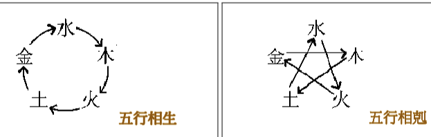
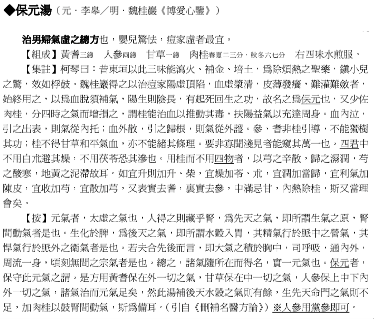
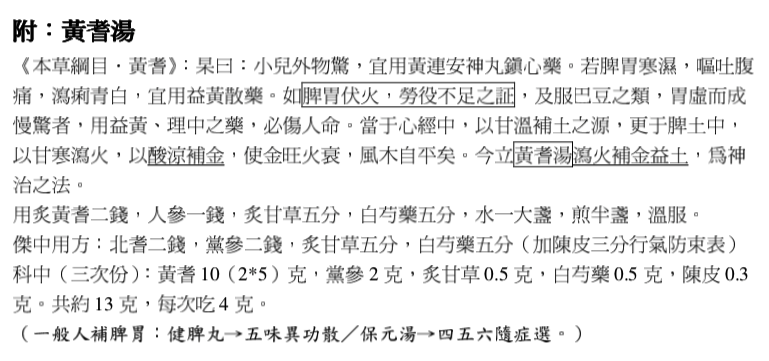
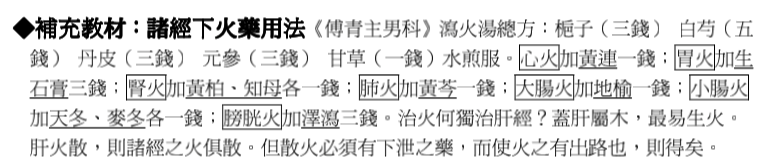
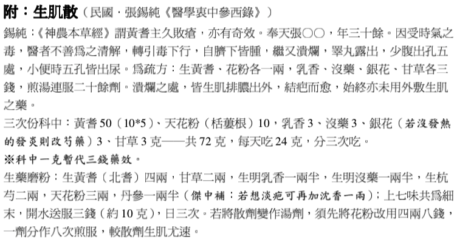
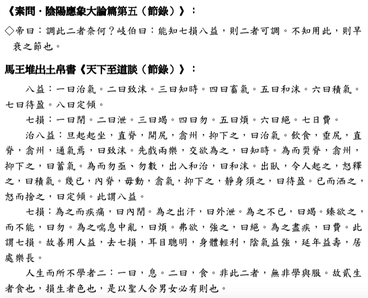
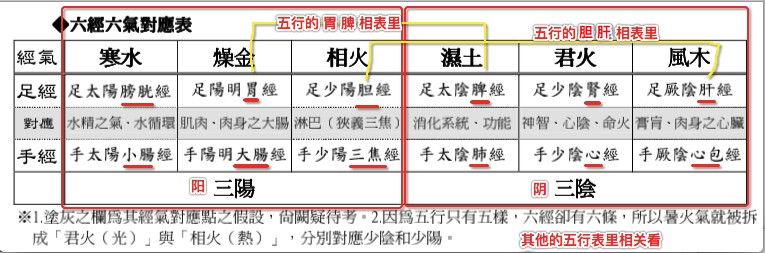

# JT中医基础理论 笔记
>版本纪录：JT叔叔的文科教室，`2006`年古老的中基课

* **注意**
	* **对于每一章节有什么需要补充或是删除的知识点，欢迎补充！提炼精髓🤝**
	* 欢迎加群：`523885820`，实时关注最新动态
	* 该笔记第四遍提炼：已完成，后续`1～6`讲基本不再复读
	* 文中“⚠️”符号或者删除线注明没有听清的地方，望各位能够提出意见
	

* [前言](#前言)
* [一讲](#一)
	* [**`观念今昔(关于生冷)`**](#观念今昔(关于生冷))
	* [**`中医基本守则(一):物心不二(佛家：色心不二)`**](#中医基本守则(一):物心不二(佛家：色心不二))
	* [**`情志的影响力（了解）`**](#情志的影响力（了解）)
	* [**`什么叫阴、什么叫阳（了解）`**](#什么叫阴、什么叫阳（了解）)
	* [**`中医基本守则(二):体用合一`**](#中医基本守则(二):体用合一)
	* [**`妄言杂说:中医的起源`**](#妄言杂说:中医的起源)
	* [**`为什么要选择中医`**](#为什么要选择中医)
* [二讲](#二)
	* [**`人体的共时性(感应)`**](#人体的共时性(感应))
	* [**`怎么学中医`**](#怎么学中医)
	* [**`先天之气与后天之气的重要性`**](#先天之气与后天之气的重要性)
	* [**`天人合一的养生观（`**](#天人合一的养生观（)
	* [**`气是什么?`**](#气是什么?)
* [三讲](#三)
	* [**`春夏养阳，秋冬养阴`**](#春夏养阳，秋冬养阴)
	* [**`夏天补气，秋冬滋阴`**](#夏天补气，秋冬滋阴)
	* [**`浅谈痛风的疗法`**](#浅谈痛风的疗法)
	* [**`一天的周期`**](#一天的周期)
	* [**`生脉散`**](#生脉散)
	* [**`真正锻炼心肺的运动—散步`**](#真正锻炼心肺的运动—散步)
	* [**`高山症`**](#高山症)
	* [**`中暑(被晒到头昏想吐):`**](#中暑(被晒到头昏想吐):)
	* [**`阴阳应象大论`**](#阴阳应象大论)
	* [**`壮火食气`**](#壮火食气)
	* [**`药物的阴阳`**](#药物的阴阳)
* [四讲](#四)
	* [**`再阴平阳秘谈生脉散`**](#在谈生脉散)
	* [**`左阴右阳，腹阴背阳`**](#左阴右阳，腹阴背阳)
	* [**`阳密乃固`**](#阳密乃固)
	* [**`阴阳虚实(疾病传变、人体劣化过程)`**](#阴阳虚实(疾病传变、人体劣化过程))
	* [**`气能生水(阴阳两虚先补阳)`**](#气能生水(阴阳两虚先补阳))
	* [**`阴平阳秘`**](#阴平阳秘)
	* [**`肝不能郁`**](#肝不能郁)
	* [**`再说阳平阴秘`**](#再说阳平阴秘)
* [五讲](#五)
	* [**`中医大概历史`**](#中医大概历史)
	* [**`当归补血汤`**](#当归补血汤)
	* [**`川芎茶调散`**](#川芎茶调散)
* [六讲](#六)
	* [**`补充中医历史`**](#补充中医历史)
	* [**`保元汤`**](#保元汤)
	* [**`生脉保元汤`**](#生脉保元汤)
	* [**`黄芪汤/黄耆汤`**](#黄芪汤/黄耆汤)
	* [**`吃补药时应该注意哪些？`**](#吃补药时应该注意哪些？) 
* [第七讲](#七)
	* [**`补药注意补充`**](#补药注意补充)
	* [**`生肌散`**](#生肌散)
	* [**`七损八益`**](#七损八益)
	* [**`五行浅浅说`**](#五行浅浅说)
	* [**`中医不可妥协的五与六（一）`**](#中医不可妥协的五与六（一）)
* [第八讲](#八)
	* [**`中医不可妥协的五与六（二）`**](#中医不可妥协的五与六（二）)
	* [**`心脏病其实是『心包络病』`**](#心脏病其实是『心包络病』)
	* [**`五行的运化`**](#五行的运化)

##资料

>* [人体解剖图](http://www.360doc.com/content/15/0516/19/9986257_471053471.shtml)
>* [人体经络图](http://www.xuewei360.com/rentijingluotu.html)
>
>
>* [某博客](http://blog.sina.com.cn/s/articlelist_1638933722_0_1.html)：内容交多，参考查阅
>	* [医道课2013.03](http://blog.sina.com.cn/s/blog_61b024da0102xttb.html)：文章目录
>* [JT博客](http://blog.sina.com.cn/s/articlelist_5723292373_0_1.html)
>
>* [周易世家](http://www.zy4.cn)
>* [中医世家](http://www.zysj.com.cn/index.html)：查古籍，药材，方剂等
>	* [《医宗金鉴》](http://www.zysj.com.cn/lilunshuji/yizongjinjian/index.html)
>		* （公元 1742 年）清．吴谦（六吉）等编。九十卷。包括《订正伤寒论注》、《订正金匮要略注》、《删补名医方论》及“四诊”、“运气”、“伤寒”、“杂病”、“妇科”、“幼科”、 “痘疹”、“种痘“、“外科”、“刺灸”、“眼科”、“正骨”等心法要诀。各分子目，有图说方论，此较简明易学。
>	* [《伤寒杂病论》](http://www.zysj.com.cn/lilunshuji/shanghanzabinglun512/index.html) = [《金匮要略》](http://www.zysj.com.cn/lilunshuji/jinkuiyaolvfanglun/)+ [《伤寒论》](http://www.zysj.com.cn/lilunshuji/shanghanlun/98-3-1.html)
>		* （公元 219 年）汉．张机（仲景）着。十六卷。总结三世纪以前的临床经验，包括治疗伤寒和杂病两部分。在辨证施治方面有着突出的成就。 原本在西晋前已散失。
>	
>
><table width="100%"><tbody><tr><td width="51"><p><strong>方位</strong></p></td><td width="38"><p><strong>五行</strong></p></td><td width="35"><p><strong>五气</strong></p></td><td width="30"><p><strong>五色</strong></p></td><td width="31"><p><strong>季节</strong></p></td><td width="40"><p><strong>脏(</strong><strong>里)</strong></p></td><td width="49"><p><strong>腑(</strong><strong>表)</strong></p></td><td width="37"><p><strong>五充</strong></p></td><td width="37"><p><strong>五华</strong></p></td><td width="30"><p><strong>开窍</strong></p></td><td width="37"><p><strong>五志</strong></p></td><td width="35"><p><strong>藏神</strong></p></td><td width="58"><p><strong>脉象</strong></p></td><td width="36"><p><strong>五味</strong></p></td><td width="26"><p><strong>五臭</strong></p></td><td width="26"><p><strong>五液</strong></p></td></tr><tr><td width="51"><p><strong>南</strong></p></td><td width="38"><p><strong>火</strong></p></td><td width="35"><p><strong>暑</strong></p></td><td width="30"><p><strong>赤</strong></p></td><td width="31"><p><strong>夏</strong></p></td><td width="40"><p><strong>心</strong></p></td><td width="49"><p><strong>小肠</strong></p></td><td width="37"><p><strong>血</strong></p></td><td width="37"><p><strong>面</strong></p></td><td width="30"><p><strong>舌</strong></p></td><td width="37"><p><strong>喜</strong></p></td><td width="35"><p><strong>神</strong></p></td><td width="58"><p><strong>夏洪</strong></p></td><td width="36"><p><strong>苦</strong></p></td><td width="26"><p><strong>焦</strong></p></td><td width="26"><p><strong>汗</strong></p></td></tr><tr><td width="51"><p><strong>东</strong></p></td><td width="38"><p><strong>木</strong></p></td><td width="35"><p><strong>风</strong></p></td><td width="30"><p><strong>青</strong></p></td><td width="31"><p><strong>春</strong></p></td><td width="40"><p><strong>肝</strong></p></td><td width="49"><p><strong>胆</strong></p></td><td width="37"><p><strong>筋</strong></p></td><td width="37"><p><strong>爪</strong></p></td><td width="30"><p><strong>目</strong></p></td><td width="37"><p><strong>怒</strong></p></td><td width="35"><p><strong>魂</strong></p></td><td width="58"><p><strong>春弦</strong></p></td><td width="36"><p><strong>酸</strong></p></td><td width="26"><p><strong>臊</strong></p></td><td width="26"><p><strong>泣</strong></p></td></tr><tr><td width="51"><p><strong>中</strong></p></td><td width="38"><p><strong>土</strong></p></td><td width="35"><p><strong>湿</strong></p></td><td width="30"><p><strong>黄</strong></p></td><td width="31"><p><strong>长夏</strong></p></td><td width="40"><p><strong>脾</strong></p></td><td width="49"><p><strong>胃</strong></p></td><td width="37"><p><strong>肌</strong></p></td><td width="37"><p><strong>唇</strong></p></td><td width="30"><p><strong>口</strong></p></td><td width="37"><p><strong>思</strong></p></td><td width="35"><p><strong>意</strong></p></td><td width="58"><p><strong>四季和</strong></p></td><td width="36"><p><strong>甘</strong></p></td><td width="26"><p><strong>香</strong></p></td><td width="26"><p><strong>涎</strong></p></td></tr><tr><td width="51"><p><strong>西</strong></p></td><td width="38"><p><strong>金</strong></p></td><td width="35"><p><strong>燥</strong></p></td><td width="30"><p><strong>白</strong></p></td><td width="31"><p><strong>秋</strong></p></td><td width="40"><p><strong>肺</strong></p></td><td width="49"><p><strong>大肠</strong></p></td><td width="37"><p><strong>皮</strong></p></td><td width="37"><p><strong>毛</strong></p></td><td width="30"><p><strong>鼻</strong></p></td><td width="37"><p><strong>悲</strong></p></td><td width="35"><p><strong>魄</strong></p></td><td width="58"><p><strong>秋毛</strong></p></td><td width="36"><p><strong>辛</strong></p></td><td width="26"><p><strong>腥</strong></p></td><td width="26"><p><strong>涕</strong></p></td></tr><tr><td width="51"><p><strong>北</strong></p></td><td width="38"><p><strong>水</strong></p></td><td width="35"><p><strong>寒</strong></p></td><td width="30"><p><strong>黑</strong></p></td><td width="31"><p><strong>冬</strong></p></td><td width="40"><p><strong>肾</strong></p></td><td width="49"><p><strong>膀胱</strong></p></td><td width="37"><p><strong>骨</strong></p></td><td width="37"><p><strong>发</strong></p></td><td width="30"><p><strong>耳</strong></p></td><td width="37"><p><strong>恐</strong></p></td><td width="35"><p><strong>志</strong></p></td><td width="58"><p><strong>冬石</strong></p></td><td width="36"><p><strong>咸</strong></p></td><td width="26"><p><strong>腐</strong></p></td><td width="26"><p><strong>唾</strong></p></td></tr></tbody></table>
>
>
>
>>####历代衡量与市秤对照表
>>
>><table cellspacing="1" cellpadding="1" width="100%" summary="" border="1"  align="center">
<tbody>
<tr align="center">
<td>时　代</td>
<td>古代重量</td>
<td>折合市制</td>
<td>古代容量</td>
<td>折合市制</td>
</tr>
<tr align="center">
<td>秦　代</td>
<td>一两</td>
<td>0.5165市两</td>
<td>一升</td>
<td>0.34市升</td>
</tr>
<tr align="center">
<td>西　汉</td>
<td>一两</td>
<td>0.5165市两</td>
<td>一升</td>
<td>0.34市升</td>
</tr>
<tr align="center">
<td>新　莽</td>
<td>一两</td>
<td>0.4455市两</td>
<td>一升</td>
<td>0.22市升</td>
</tr>
<tr align="center">
<td>东　汉</td>
<td>一两</td>
<td>0.4455市两</td>
<td>一升</td>
<td>0.22市升</td>
</tr>
<tr align="center">
<td>魏　晋</td>
<td>一两</td>
<td>0.4455市两</td>
<td>一升</td>
<td>0.21市升弱</td>
</tr>
<tr align="center">
<td>北　周</td>
<td>一两</td>
<td>0.5011市两</td>
<td>一升</td>
<td>0.21市升弱</td>
</tr>
<tr align="center">
<td>隋　唐</td>
<td>一两</td>
<td>1.0075市两</td>
<td>一升</td>
<td>0.58市升强</td>
</tr>
<tr align="center">
<td>宋　代</td>
<td>一两</td>
<td>1.1936市两</td>
<td>一升</td>
<td>0.66市升强</td>
</tr>
<tr align="center">
<td>明　代</td>
<td>一两</td>
<td>1.1936市两</td>
<td>一升</td>
<td>1.07市升强</td>
</tr>
<tr align="center">
<td>清　代</td>
<td>一两</td>
<td>1.1940市两</td>
<td>一升</td>
<td>1.0355市升</td>
</tr>
</tbody></table>
>
>>####注：
>1. 中药药材一律以市秤计算，即十厘为一分，十分为一钱，十钱为一两，十六两为一斤。
>2. 本表引自南京药学院`1860`年版《药剂学》。
>
>*  **`参考`**：`2钱=10克 、10钱=1两 、1两=50克 `
>	* 张仲景古方的那个三两差不多是现在一两
>

##<a name="前言"></a>前言[↩](#)
>* **经验：**<mark>最基本的东西，其实是最重要的.</mark>
>	* 有的时候想不通，或是遇到瓶颈时，回头读一些最基础的经典，才会豁然开朗。
>* 如果要拿西方的化学去看待中医的种种事情，其实会很受挫的。
>
>	* `如`：用龙骨、牡蛎可以安神，是因为它含有大量的钙质！钙质可以安神!
>		* 可是每天吃小鱼干，含很多钙，好像并没有怎么安神?
>		* 所以，在钙质之外，一定还有别的理由才对
>	* `如`：[白萝卜](https://baike.baidu.com/item/白萝卜/928021?fr=aladdin)，外号「人参的天敌，补药的克星」。
>		* 即使成分极近似，三年才长两根须须的[人参](https://baike.baidu.com/item/人参/6226?fr=aladdin)，和三个月就长小腿大一根的白萝卜，药性就是不会一样，甚至会相反。
>* 真正在研习中医的时候，我们所依循的观念，是中国人非常传统的观念：**巫术**
>	* 一个所谓的「气」的世界的观念，可以说是「形而上」的。(_形而上：后面有介绍_)
>	* 不要以为“气”不科学，不要以为肉眼看得到的才叫科学!
>	* 中医像是给身体一个「讯息」或是「能量」
>* **经脉**：就是一种「当你活着的时候，用电阻测量器，会测量得出你身体某两个点之间电阻特别小，特别容易让电流流过」的现象，那就是经脉。
>	* 经脉是跟着他的灵魂离开的，在这个肉身之中，其实找不到它真正的存在。
>
>* 中医的基础概念，就是说一件事：**_人有灵魂_**
>	* 要医一个人的病，你为什么一定要用化学物质去医？如果你有一种方法能够去疏导灵魂上面的管道，是不是就可以产生某种疗效呢?
>		* 是的，而且往往更有效。
>	* 所以中医才能够依照《伤寒论》的方子去医感冒，一场很严重的感冒，药吃下去，二十分钟就好，完全没病的那种
>* 病毒的基因排列本身就像是把声音录上录音带上一样，它有有形的部分，可是它更有无形的部分
>	* 你可以把它「消磁」消磁之后，这个病毒就完全瓦解了。
>* 《庄子》有一句话，叫做「内外不相及」
>	* 我们用有形世界的观点去看一些事情，是一种观念；而用另一个视角，又会看到不同的东西。而两方是彼此无法对话的。
>	* 中医有一些眼光是注视着无形的世界的，于是乎，看到的东西，大家就觉得非常神怪、非常玄幻
>	* 所以中医之所以「玄」，是因为没有人要讲「真传」，因为讲真传，有人说你是神经病、
你是巫医。
		* 于是就变成现在这个样子，用一大堆西医科技术语在讲中医，理论没有几句是合乎逻辑的，头脑正常的人当然也就没有可能听懂了。
>* 本草理论
>	* 凡是树木的「根」用了以后，这个药性多半会往上头跑；用了树木的果实，药性多半会往下面跑!
>	* 中药的作用点不是化学，因为化学是全身均匀散布的才叫化学成分，可是中医不是，你用了根，因为根要把水分输到树顶上去，所以那个药性往往会作用到上头；你用了果实，因为果实很想落地，你吃了以后那个药性多半会往下面跑。
>	* 中医、中药，要考虑你吃进去的那个药味，它的灵魂（死掉的生物也不能说『灵魂』了，中医称之为『气性』）处在什么样的状态，就像我们有一味药，吃了大便就一定会往下面坠的，就是[枳实](https://baike.baidu.com/item/枳实/1652417?fr=aladdin)，就是枳树的果实。
>	* 要用中药，一定要用这种观念，你才知道这个药你开了会去到手指尖还是到头顶。如果你没有这个观念的话，你开药就只有「化学成分」
>	* <u>每一种动植物甚至矿物的生态，都会变成那个药性的一部份</u>，但每味药的药性都不全一样的
>* （_以下内容仅供参考_）
>
>>* 课堂守则(1)：**想睡就睡**!
>>	* 上课上得舒爽，才能持久
>>* 课堂守则(2)：**要做刁客!**
>	* 凡是人刻意去记得的事情，一定会忘记，这就是人的无奈
>* 学到能够「问」是非常重要的。
>	* 「我们人一定要知道自己不知道。」当你有这样的感觉出来的时候，你才会想要知道多一些，那个灵魂 才会有一种饥渴的感觉
>	* 人智有三个层面:
>		* 「我知道我自己知道」 的部分最小;
>		* 「我知道自己不知道」的这部分更多;
>		* 「我不知道我自己不知道」的，这部分最多
>	* 我们从小被教育成要当个无懈可击的人，被制约得都成了毒瘾了，变成当我们有一点点未知的时候，我们就好难过好难过，一定要赶快有一个答案出来才行，如果真的没有，捏造一个也可以，即使是完全不符合现实的答案，也可以稍稍使自己安心。人多半都是这样子在活的，所以才会形成或对或错的「观念」。
>	* 学，就是做学「问」，什么东西都非要有立即的答案，你就傻了
>	* 当你保持一个你不知道的状态的时候，你的身体会产生一种几乎像是黑洞一 样的吸力，在你人生的每一个片刻、每一个点滴，在吸收那个答案。
>	* 重要的不是你问我问题能让我当一个伟大的老师，而是当你很喜欢问问题的时候，你的心是那种很敞开，很有空虚感的状态，这是非常重要的心情。

##<a name="一"></a>第一讲
>
>###<a name="观念今昔(关于生冷)"></a>观念今昔(关于生冷)[↩](#)
>* 真正基础的中医，跟你在外面听那些中医生讲的，以及中医学院的学生在学校学的，都不一样。
>* <u>古时候的医书</u>可能会讲:
>	* <u>你吃这个药，就不要吃太多青菜水果，免得青菜水果比较湿润寒凉的药性把这个药性洗掉了。</u>
>	* 跟茶相抗的，我晓得的只有两味药，其中有一种药叫作**[土茯苓](https://baike.baidu.com/item/土茯苓/1537151?fr=aladdin)**，土茯苓在一般中医的方子里面是去湿热的，但它同时也是[梅毒](https://baike.baidu.com/item/梅毒)的特效药。
>* <u>现在的中医</u>，西方的学说都引进来了，说茶叶里面有什么叶酸还是叶碱的，会分解药物的分子!
>	* 很多人吃中药，他会觉得:「我身体已经不好啦，要调理，更需要补充纤维质跟维他命C!」于是就大力吃水果，排毒又健康！然后，就把药性洗得干干净净。
>* 像这种水果类的、生冷类的，甚至很可怕的牛奶，对于很多补药，都有很强大的破坏力，然后，医生们就会发现到:「补药开出去， 好像都没什么效?」，药效都破解完了。
>* 现在外面医生有很多事情不会告诉你，他告诉你的，都是能够迎合你的观念的，这样两边才不会斗嘴。最好你说什么好，他也说什么好，这叫「开业术」，不是「医术」，是「开业术」，大家都要养活自已。
>
>###<a name="中医基本守则(一):物心不二(佛家：色心不二)"></a>中医基本守则(一):物心不二(佛家：色心不二)[↩](#)
>* 中医的第一个观念就是:「人，是有灵魂的。」
>
>>* ==基本中的基本：**_「物心不二」_**==
>>	* 就是说，有形的这个物质的世界，跟无形的内在心灵与能量的世界，其实是连结在一起的，是我们共同混同拥有的这个宇宙。
>>* 佛家：「色即是空，空即是色」
>>	* 「色」是一个代表词，代表你五官能接触感受到的种种，桌子、椅子、身体，这些叫作「色」。五官能感知到的东西，跟五官感知不到的东西「空」，其实是一个整体，所以说:「色即是空 空即是色」。
>
><a name="tu"></a>
>
>```swift
>-------------------------------------
道玄牝虚无空 
=================================心== 
神
---------------------------------的--
八脉
---------------------------------世--
六经
---------------------------------界--
五脏之精气 
===================================== 
肉身.形躯 						物的世界 
-------------------------------------
// 暗物质
//就是这个宇宙中，有很大一块宇宙，是我们完全不能观察也不能测量
//的。他们计算这个宇宙的总质量的时候，得到一个很惊人的结论，就是:
//我们看得到摸得到，可以用宇宙飞船探索可以用望远镜观察到的宇宙，只
//占真正的宇宙的「百分之四」，有百分之九十六的宇宙，是我们的肉眼所不能观
//测的(这就是「形而上」).
>```
>
>* 在我们知道的这个宇宙之上，有百分之九十六的宇宙，是我们现在肉体五官的感知力所感知不到的，却是确确实实存在的宇宙，跟我们这个宇宙重迭在一起。
>* 我们的肉体活在这个有形的世界，我们的灵魂也活在那个跟我们现世迭合的另外一个向度的宇宙。
>
>>* 辨证系统有所谓的「==五脏辨证==」、有所谓的「==六经辨证==」，甚至还有「==八脉辨证==」。(**_观点和角度逐渐和肉体脱开_**)
>
>>* **五脏辨证**
>	* `如`：肝阴虚，就是肝血不足，西医院验个指数，也有可能验到说，这个肝藏血量如何如何、肝功能如何如何
>		* 用五脏去辨证的时候，你还有一点物质的基础可以看。
>>* **六经辨证**
>	* 六经的方子，它的运行偏在能量的世界，药效通常比五脏的方子快些。
>
>>```swift
>// 医案(盲肠炎)「手脚冰冷、脉细欲绝」-- 当归四逆汤
>一个人发盲肠炎，痛得在地上打滚，去给中医师一看:
>这个人盲肠炎，可是他「手脚冰冷，脉细欲绝」。
>这个手脚冰冷、脉细欲绝，在中医六经辨证的观点里面，有一条足厥阴肝经在这边(侧腹)
>当它充满了不好的能量的时候，有可能会产生「手脚冰冷、脉细欲绝」的现象。
>而肝经刚好经过盲肠上面，于是我们就开一帖疏通足厥阴肝经的方子，叫作「当归四逆汤」
>那些药物都是大热大通的药
>人在发炎，怎么可以开大热大通的药呢? 用寒凉药泻火消炎都来不及了?
>可是他发炎痛得他「手脚冰冷、脉细欲绝」。
>所以说，这个人，他的灵魂上的足厥阴肝经有坏能量，于是我们就用张仲景的《伤寒杂病论》照足厥阴肝经受邪的方法，
>去开一帖当归四逆汤，喝下去两个小时之后，那个盲肠炎的
病人，起来走路出去了，完全好。这是真的医案哦，从前台南经方家朱木通的案例。
>```
>
>>* **八脉辨证**
>	* 一个人六经虚损太久之后，他会连带到八脉也虚损
>	* 基本上，一般人的奇经八脉，也没有什么气在流通，八脉，是练功的人元气充沛到十二经都已经盈满了，那是给你能量更上一层的时候用的，人一旦进步得够，就连灵魂也会形成新的架构。
>>* 到了六经，你就知道：你已经在灵魂的网络上做事情了，你的开药手法，医疗，看诊，都脱离肉体的身体，而开始走那灵魂上的经脉了。
>	* `如`：要看这个人少阳经有没有邪，你就问说：嘴巴苦不苦啊？咽喉干不干啊？耳朵痛不痛啊？身体侧边压了痛不痛啊？然后就会知他这条少阳经有没有邪气，再开出药把他医好， 因为，[少阳经](http://www.xuewei360.com/rentixuewei/jingluoxuewei/2013-07-06/14887.html)走在这几个部位
>
>* **六经辨证**，是我们目前医「病毒性疾病」以及医「红斑性狼疮」、「癌症」最有效的一条路。因为癌症的能量会沿着六经传，你能够把癌症的那个灵气破坏掉的时候，癌症在你身体里面就会停止生长，它会变成像死掉的癌细胞一样。
>	* 病毒跟癌症，都会沿着人的十二经脉走，所以只要用六经辨证的方法找出它在身体的哪一条经脉上，一开药就可以抵制住。
>	* 不必碰肉身的，直接拿它的 灵魂开刀。
>* 医感冒，是一个人医术要提升的基本功，因为人都常常在感冒。如果你依[《伤寒论》](http://www.zysj.com.cn/lilunshuji/shanghanlun/index.html)学会医感冒，越医越熟，药越开越准，把六经辨证的感冒，医到很熟练之后，五六年后的某一天，你会忽然晓得癌症要如何医了，因为道理相通。
>	* 中医治感冒，看你感冒的邪气走在那条经，就把它克制住、把它对消，然后你全身的病毒就不见了
>* 红斑狼疮之类的病，是六经经气之绝。有一条经叫作[足厥阴肝经](http://www.xuewei360.com/rentixuewei/jingluoxuewei/2013-07-06/14889.html)，从腮腺旁边通到睾丸，经气已经虚到极点，才会一路死下来，从死腮腺开始，一直死到死睾丸，最后你的身体发现你的睾丸已经是死的了，就派出白血球把它分解掉
>	* 西医说：「自体免疫失调，你的免疫系统在攻击你自己。」
>	* 不是免疫系统在攻击，是你的组织先死掉，它才攻击的。所谓「死掉」，也不用完全死，是指在身体里面，它的生命力已经不能和全体到达调和的状态，我们的免疫机能就会把它认作「异类」来攻击。
>* 扁桃腺是[足少阴肾经](http://www.xuewei360.com/rentixuewei/jingluoxuewei/2013-07-06/14885.html)的一头，那你会扁桃腺乱发炎，就是因为少阴经开始虚了，就一直虚虚虚虚到底，然后就肾丝球坏死。所以是完美的六经辨证图像。
>
>###<a name="情志的影响力（了解）"></a>情志的影响力（了解）[↩](#)
>* **_一个人会肾经绝、会肝经绝，若不是吃太多西药被毒成的，他一定是长期活在某种不良情绪之中_**
>	* 肾经要绝，一定要那个人同时一天到晚在害怕一些事情，而且又活在一个他完全不甘愿待的工作或着生活岗位上，这样肾经才会绝。
>	* 很「好辩」的人，肝经就没有，因为最伤肝的事情就是对事物的强烈控制欲，它的发作就是人会生气。
>* 要补肾经、肝经，需要那个人变成一个从内心世界都不会跟任何人有意见冲突的人，然后在生活处境中，又完全不会害怕、不用紧张，不必活得郁郁不得志。
>	* 这种病，它包含着整个情绪系统在里面的，五脏跟情志的问题
>* <u>很多病都要身心双管齐下，「心」的部分实在是太重要了。</u>
>* **[图中](#tu)这个「八脉」，什么「神」的，那又是什么东西?**
>
>	* 「练精化气，练气化神，练神还虚」，这三个步骤，叫作「三花聚顶」
>
>		* 经过一番修练，把你肉身里面那些物质的储存的能量，转化成「气」的能量，这叫「练精化气」。
>		* 然后再把气的能量，再提升它的内容，使它变成一种类似灵魂一样的东西，那后那个灵魂可以离开身体出来散步，这是「练气化神」。
>		* 然后，在这个宇宙，还有一个支撑这个宇宙能够存在的法则存在， 那个法则，不知道叫什么，老子称它为「玄牝」，修道者还要让自已变得跟宇宙赖以存在的那个法则合而为一，然后，自已的「我觉得怎么样」的那个 「我」消失掉，变成一切以宇宙的公道为公道，到那个时候，一个人的「我」就没有了。
>			* 「玄」就是黑摸摸看不到，「牝」就是一头母牛，也就是生出这个宇宙的那个子宫
>		* 只要告诉你：物质世界，是百分之四：上面这一块，百分之九十六：那个生出百分之九十六的背后那不知道是什么东西的「玄牝之门」到底有多大？没有人晓得。
>		* 人体，也就是一个小宇宙，所以人体也是这样子的存在
>* **中医基础教材一开始就要跟大家讲人体怎么样跟天地互动。**
>
>###<a name="什么叫阴、什么叫阳（了解）"></a>什么叫阴、什么叫阳（了解）[↩](#)
>* **_有形的物质的东西，我们称它为「阴」；无形的能量的东西，我们称它为「阳」。_**
>* 比如说
>	* 如果血是「阴」的话，那运化你全身的气就是「阳」
>	* 如果你的肉身是阴的话，那你的灵魂就是阳
>* 阴阳是一种「表记法」，用来表记东西的象征符号，就像我们中国人会用《易经》来表记这个宇宙，宇宙中每一个现象给它一个阴阳的二元计算机符码，可是它都是表记法，不是「绝对」，是「相对」的。
>* 因为，我们现在活在这个百分之四的世界，我们有什么资格讲「绝对」？我们在这个世界划分出来的阴阳，一定不会是那个完整的宇宙的阴阳
>
>###<a name="中医基本守则(二):体用合一"></a>中医基本守则(二):体用合一[↩](#)
>* **_「体」就是理论，「用」就是实效。_**==体用合一，「理论」与「实证」的结合==
>* 中医之所以很科学，是需要各位作病人的「尽全力当刁客」才能显现它的科学性
>* 中医的理论要以临床来检证。
>	* 你自已要去观察它临床上是不是真正地有效，如果不能有效，我们就要来反省我们的理论是不是有错，因为**_中医历代留了下非常多不同的看法跟观点，我必需靠着病人的实际状况来检证自已的观点_**，我是以一个学习者的身份在教中医的。
>* 我们以「体用合一」的观点，再回头说说「物心不二」，「天外之天」是怎么一回事？
>	* 宇宙不但有定律，这个定律，还在不断地改变、更新！所以我们何必认为一千七百年前的某个中医观点一定是绝对呢?
>	* 宇宙中是有法则存在着的。我们能够模索到多少就算我们有「福报」或是说有「善缘」。
>		* 关于宇宙的法则，我们能够实践、体验越多，我们的人生会越幸福。
>	* 当你对于很多很多的真相有进一步的认识的时候，你就会活得很快乐
>* 天人合一，物心不二
>	* 你不要以为物质跟能量是截然不同的两个世界
>
>###<a name="妄言杂说:中医的起源"></a>妄言杂说:中医的起源[↩](#)
>* 众说纷纭(都是推测)
>* [《黄帝内经》](https://www.gushiwen.org/guwen/huanglei.aspx)的奥秘，张仲景[《伤寒杂病论》](https://so.gushiwen.org/guwen/book_37.aspx)的奥秘，到今天为止，没有一个医生可以追过那个境界的。
>
>###<a name="为什么要选择中医"></a>为什么要选择中医[↩](#)
>* <u>目前为止我们拥有的中医，《伤寒杂病论》，《黄帝内经》，真的不是人智可以到达或感知的东西!</u>
>	* [《庄子》](https://www.gushiwen.org/guwen/zhuangzi.aspx)中的心理学，也至少比现代的心理学进步好几百年......
>* 西医是一种开发中的医学，第三世界等级的科技，三十年前的仙丹是三十年后的毒药
>* 中医，早在两千年前，所有的副作用都已经记载得很清楚了。
>* <u>以一个安全的角度，当然要选择这种在两千年前就已经发展圆熟的医学啊。</u>

##<a name="二"></a>第二讲
>###<a name="人体的共时性"></a>人体的共时性(感应)[↩](#)
>* 本章主要讲_人类生命所共同拥有的一个生命周期_
>	* 而「共时性」，就是中国人说的「感应」。
>	* 中医认为，如果你哪里化脓，那个擦了你的脓的纸，全部都要放在一个竹篓子，放在屋檐底下阴干等到你的伤口全部复原之后，再一起拿去丢掉或者烧掉。如果在你的伤口还没有复原之前，你的擦脓的纸，被太阳晒到，伤口就会很容易发炎；如果丢到臭水沟，就会很容易腐烂。即使是离开你身体的脓，都仍与你的身体有一定的共鸣存在。
>
>* 这是中医的一种传统观念，是一种「感应」。不过这里只介绍一些人体跟大自然周期之间的规律性。
>
>###<a name="怎么学中医"></a>怎么学中医[↩](#)
>* 一开始学中医，你要百发百中，你就得学《伤寒论》，因为张仲景这部书是临床验证的东西，所以几乎没有瑕疵，到达绝对的领域。
>	* 往往会把《黄帝内经》当作是我们学习中医的最后一块糖果，留待最后再来品尝它的味道。
>	* 等到你把《伤寒论》跟它的另外一半[《金匮要略》](https://so.gushiwen.org/guwen/book_193.aspx)，这两本书学完了、用熟了、有医术了，这个时候你再去看《黄帝内经》，你才能够从里面发掘出它真的能够启发你的部分。否则的话，就算《黄帝内经》整本背下来，其中仍有许多话语是我们不能理解的。
>	* 《黄帝内经》，其实比较像是一个档案库，把那个时代中国人拥有的医学知识，收集起来，而编成这样一本书。不见得是一人一时一地之作。
>
>>* 先来看看《皇帝内经》两篇不一样的定义，从中认识一些我们非常基本的学理论证。
>>
>>```swift
>//《黄帝内经》- 素问 - 上古天真论篇第一(节录)》:
帝曰:人年老而无子者，材力尽邪?将天数然也?
岐伯曰:
	女子七岁，肾气盛，齿更发长;
	二七而天癸至，任脉通，太冲脉盛，月事以时下，故有子;
	三 七肾气平均，故真牙生而长极;
	四七筋骨坚，发长极，身体盛壮;
	五七阳明脉衰，面始焦，发始堕;
	六七三阳脉衰于上，面皆焦，发始白;
	七七任脉虚，太冲脉衰少，天癸竭，地道不通，故形坏而无子也。
		丈夫八岁，肾气实，发长齿更;
		二八肾气盛，天癸至，精气溢写(泻)，阴阳和，故能有子;
		三八肾气 平均，筋骨劲强，故真牙生而长极;
		四八筋骨隆盛，肌肉满壮，五八肾气衰，发堕齿槁;
		六八阳气衰竭于上面焦，发鬓颁白;
		七八肝气衰，筋不能动，天癸竭，精少，肾藏衰，形体皆极;
		八八则齿发去。肾者主水，受五藏六府之精而藏之，故五藏盛乃能写。
		今五藏皆衰，筋骨解堕，天癸尽矣，故发鬓白，身体重，行步不正，而无子耳。
帝曰:有其年已老而有子者，何也?
岐伯曰:此其天寿过度，气脉常通，而肾气有余也。
	   此虽有子，男不过尽八八，女不过尽七七，而天地之精气皆竭矣。
帝曰:夫道者，年皆百数，能有子乎? 岐伯曰:夫道者，能却老而全角，身年虽寿，能生子也。
>>```
>>
>>* 〈上古天真论〉一开始是讲:
>>	* 远古时代的人，没有像我们现代的人那么多烦恼，所以都活得很久，现代的人心情都很差了，心灵保养不好，所以身体保养也很烂，于是，顶多活一百岁就算了不起了。我们现在是已经堕落的人种，于是，人体观也就得重新洗牌，这个世代的人类，生命周期不再与古人一样。古时候那种活几百岁甚至千岁的人类，已经不复存在了。所以需要教一个现代(黄帝时代)的新版本
>>* 黄帝问岐伯:「人老了生不出孩子，是怎么回事啊?」
>>* 岐伯就回答:「那是因为人的生命有个普遍性的周期，过了那个周期，人体的某些机能就停止了」于是，他就举出女子跟男子的生命周期:
>>	* <u>女生的生命周期，基本上以七年作一个单位;
>>	* 男子的生命周期，以八年当成一个单位。
>>	* 所以男生的青春期，比女生的晚两年，是正常，因为女生的生命周期跟男生的不一样。</u>
>>* 他说:「女孩子七岁的时候，因为肾气比较旺盛，所以，她可以把乳牙丢掉，再长新的，这是因为她的肾气开始活动了。」
>>	* <mark>「肾气」基本的观念</mark>：_「肾气」好像是你这一辈子来到世上，随着你的灵魂来到你的肉身，带着的一个类似电池的东西，让你能够在这一辈子里面，把那里面的能量慢慢拿到肉身来用。这个能量，是不属于这个人世间的，是你的灵魂带来的_
>>	* 如果小孩子在怀胎的时候，妈妈太不保养，这小孩子先天不足，那他肾气会比较弱。
>>	* 肾养得好的人，即使是中风都有办法长回来，因为肾上腺中的干细胞可以支持你的脑细胞去修复它自己。可是一般人会中风的时候，肾已经很差了
>>* 女人二七，就是十四，天癸至。
>>	* <u>癸，「甲乙丙丁戊己庚辛壬癸」之中，壬癸属水。这个「天癸 就是「天上的水」</u>
>>	* 在这个时候，上天又帮你灌溉了一次了，于是，你的任脉通了。
>>	* [任脉](http://www.xuewei360.com/rentixuewei/jingluoxuewei/2013-07-06/14890.html)就是身体前面这一条，从舌尖到下体。太冲脉，是人体里面在正中间的那条脉。当这两条脉开始通的时候，女性的朋友就会开始有月事了。
>>* 二十一岁，肾气已经均匀分布了，肾气稳定了以后，就会长智齿，「真牙」是智齿。 
>>* 四七二十八岁，这个时候，是身体最壮的时候。
>>* 五七三十五岁，就很可怜了
>>	* 人的[足阳明胃经](http://www.xuewei360.com/rentixuewei/jingluoxuewei/2012-04-13/428.html)，走在人的脸部，是关系到人的美容最重要的经，因为它在脸颊上绕得最多。那如果你的脾胃开始衰了
>>	* 其实西医的研究也说，人的衰老，是从消化器官开始老，因为消化器官的耗损最大，当你消化器官的力量不够好的时候，你的足阳明胃经的脉气就不够啦，不够的时候，就变「黄脸婆」，脸开始枯黄了。
>>* 六七四十二岁的时候，那不只足阳明脉衰，三阳脉都衰了。
>>	* 三阳脉是[阳明](http://www.xuewei360.com/rentixuewei/jingluoxuewei/2012-04-13/428.html)、[少阳](http://www.xuewei360.com/rentixuewei/jingluoxuewei/2013-07-06/14888.html)跟[太阳](http://www.xuewei360.com/rentixuewei/jingluoxuewei/2013-07-06/14884.html)
>>	* 头部越来越失去了美艳动人的光泽。因为人的手足六条阳脉都会上到头，所以当阳气不太能通到头的时候，你的头自然就看起来没有那么漂亮了
>>* 七七四十九岁的时候，比较根本的任脉跟冲脉都不够了，于是她的月经就没有了。
>>* 男生也是一样
>>	* 十六岁的时候开始具有生殖的能力;
>>	* 二十四岁的时候，身体比较强健，然后长智齿;
>>	* 三十二岁的时候最壮;
>>	* 四十岁的时候肾气衰，男生的话不注重美貌，某方面不行了，于是就说他牙齿跟头发不行了;
>>	* 六八四十八的时候，就更难看了;
>>	* 七八五十六的时候，肝气衰
>>		* _肝主筋，筋就是那种好像肌肉之外像是橡皮筋一样勒在你身体的东西，都松了_。
>>	* 八八六十四肾脏衰，然后就整个人都不行了。
>>* 「肾者主水，受五藏六府之精而藏之，故五藏盛乃能写(泻)。」
>>	* 肾这个东西就等于是你其它的脏的银行，所以你的人从开始机能旺盛到机能完全衰退掉，主导权都在你的肾。
>>* 那有些人，七老八十，还生出孩子，那是怎么样?
>>	* 凡事，总是有例外的。
>
>###<a name="先天之气与后天之气的重要性"></a>先天之气与后天之气的重要性[↩](#)
>* 讲上一篇古文的意义：
>	* **一**：_从生到死，支撑你生命的力量，是你的天葵，也就是你的肾气。_
>		* <mark>补肾是很重要的。</mark>
>		* 肾的力量很关键，<u>「先天之气」</u>带动了整个人的荣盛跟衰萎。
>		* <u>「后天之气」</u>就是脾胃之气，也就是你消化吸收营养所得到的东西，那是出生之后才开始摄取而得到的，所以我们称为「后天」之气。
>			* <u>人会变成黄脸婆，就是因为消化系统的衰弱显现在经脉上面。</u>
>			* <u>男人老了最代表性的特征，就是「啤酒肚」</u>
>			* 脾胃是要把营养输布到它该去的地方，如果你脾胃的能量差了，营养就不能够好好地送到该去的地方，于是，该长肉的地方不长肉，不该长肉的地方，肥油堆在那边。
>		* **先天之气的肾，和人的身材有没有关联?**
>			* 男生的肌肉，有两块肌肉是练不到的，就是刚好在肾脏侧边这两块肌肉。
>			* 后腰这两块肉是肥肥的，这就代表他「外强中干」，他虽然营养很好，而且也很努力运动乍看很强健，可是其实他肾气是不够的。
>		* <mark>人「阳虚」才会肥胖。那些多出来的肉，其实都算得上是一种「阴实」了。</mark>
>		* _清朝陈士铎的[《石室秘录》](https://baike.baidu.com/item/石室秘录/1303405?fr=aladdin)里有个治肥的方，叫「[补气消痰饮](https://baike.baidu.com/item/补气消痰饮/3328086)」，都是些补脾补肾阳的药._
>	* **二**：人的身体，是有一个自然的周期存在的
>		* 女生的月经，如果你是一个正常的人，差不多四十九岁收工。如果你五十四岁五十五岁还有月经？
>			* 第一个可能性，是你先天肾气非常旺，
>			* 另外一个就是可能身你体里面有长东西。因为有长东西的人，他的周期会被凝滞住，会变得比较慢，有可能是肿瘤。
>		* 这种周期也是有例外的：
>			* 很多
>			* 傅青主的医书里面有讲过一种女性，叫作「有仙人骨」的女性，就是天生是练武奇才那种有慧根的女性。那样的女人月经来了之后，会以「季」为单位，一年只有四次.
>		* **小总结**：一方面是在讲**「周期有例外」**这件事；一方面是讲，中国人的医术还真是了不起，有很多很多特殊的案例，都写在书里。
>			* `如`：**「中国人医咳嗽有五十几种方法?」**
>				* 要看这个咳嗽是哪一脏受什么气造成的
>				* 比如说，是肝受风还是肝受寒，还是肝受湿......五脏跟六腑加起来，然后各 乘以五(风暑湿燥寒火六气，中暑不算，扣掉，剩五种)，像九九表一样，非常的复杂。
>			* 中医可以辨证到极精确，把它分类分到非常细
>
>* **从汉朝到今天，这个周期，是不是还会有所改变呢?**
>	* 当然在变。黄帝的时候在感叹「人心不古、人肉不古」
>	* `如`：<u>人体气的部分叫「气分」，血的部分叫「血分」</u>
>		* 古代女人血比较多气比较少。因为古时候的女人，都是一天到晚关在房子里面，都没有出来运动的机会，全身的血都凝滞在那边，所以女人的病都在血中找病因，开药也在血中找应该用 什么药去医。(🤔️**现在很多上班族好像差不多**)
>		* 古时候用于女性的药，因为女性多半是阴寒凝结，所以我们都要用一些川芎、桂枝、香附、当归这种辛热走窜的药帮她活血，可是，现在的女生，你再开这些药，就会把人烧干掉。因为她已经没有那么多血了，相反的却是气比较多。
>		* 古时候的女人是血太多、气不足；后来，民国以来，血变得少了，气显得相对而言的多了；然后现在我们又用冰凉饮料把那个气冲刷掉了，剩下来的女人就是一个很虚的，既没有气、也没有血的女人。
>			
>
>>* 讲该篇的意义：
>>	* 一方面是说，我们思想不要那么狭隘，对同一件事，是可以有很多不同角度的看法的;
>>	* 另外一方面也是在说:《黄帝内经》里面同一件事物还会有不一样的看法!
>>
>>```swift
>//《黄帝内经》《灵枢.天年篇第五十四(节录)》:
>人生十岁.五藏始定.血气已通.其气在下.故好走.
>二十岁.血气始盛.肌肉方长.故好趋.
>三十岁.五藏大定.肌肉坚固.血脉盛满.故好步.
>四十岁.五藏六府.十二经脉.皆大盛以平定.
>		腠理始疏.荣华颓落.发颇班白.平盛不摇.故好坐.
>五十岁.肝气始衰.肝叶 始薄.胆汁始减.目始不明.
>六十岁.心气始衰.善忧悲.血气懈惰.故好卧.
>七十岁.脾气 虚.皮肤枯.
>八十岁.肺气衰.魄离.故言善 .
>九十岁.肾气焦.四藏经脉空虚.
>百岁.五皆虚.神气皆去.形骸独居.而终矣.
>>```
>>* 人，十岁的时候，五脏才算是长好，血气已通.
>>	* 十岁以下的小孩， 你几乎没办法把脉，因为他的五脏没有分化完整，心肝脾肺肾你在脉象上很不容易看出来
>>* 「其气在下」.
>>	* _当你的阳气凝聚在下半身的时候，代表你的阳气很旺，因为**越虚的阳越会往上面浮脱，越高密度的阳越会往下面沉。**_
>>	* 所以中国人练气功才会用「铅」「汞」这种字眼，因为凝聚的阳气都是很重的，不是很轻的。
>>	* **有许多人持反论，认为高血压是阳亢，其实高血压通常百分之九十以上的是阳虚.**
>>		* 第一点，老了才高血压。
>>		* ==**古中医的理论**： <u>虚的阳才会往上面冲，凝聚得很好的阳都是往下面沉的</u>==
>>		* 阳旺的小孩非常活泼，很容易流鼻血，但阳旺流鼻血，跟阳虚高血压，是不同向度的事情.
>>		* 小孩子，阳气都是凝聚在下半身的，于是乎，会很喜欢跑步
>>		* 那个时代的「走」 字是「跑步」的意思
>>	* **也有人说年纪大了高血压是「阴虚」**
>>		* 或许是因为[《内经.素问》第五篇](http://www.zysj.com.cn/lilunshuji/huangdisuwen/100-3-5.html)中也有「_年四十.而阴气自半也_」这句话
>>		* 阴不足以摄阳造成的。这种病人，还是有的，但现在不很多。
>>		* 这种阴虚的所谓「原发性高血压」患者，用民国初年张锡纯的「[镇肝熄风汤](https://baike.baidu.com/item/镇肝熄风汤/4300394?fr=aladdin)」有很好的疗效，他的书你们可以自己去看，叫[《医学衷中参西录》](http://www.zysj.com.cn/lilunshuji/yixuezhongzhongcanxilu/)，里面有讲他如何在摄阳的疗程中克服肝气反动的问题，那是很值得人尊敬的研究
>>		* <mark>如果你是阳虚的「水毒型高血压」</mark>，用了镇肝熄风汤，才改善一点点，就会觉得全身、胃部发重发沉，好像鬼压床，药再也喝不下去了，那时就要用香港前辈[谭述渠](https://baike.baidu.com/item/温补学派/3818083?fr=aladdin)的「[附子](https://baike.baidu.com/item/附子/682839?fr=aladdin)破极限」超大剂真武汤.(<u>具体《伤寒论》再说</u>)
>>* 二十岁，气已经开始弥漫到全身，于是他就喜欢<u>「趋」，喜欢快走</u>。
>>* 三十岁，喜欢以普通的速度走。
>>* 四十岁，喜欢坐着。
>>* 五十岁，眼睛开始花花的。
>>* 六十岁，开始喜欢躺着。
>>* 七十岁，皮肤都皱掉了。
>>* 八十岁的时候，他的元气都已经开始离体而去了，于是他<u>「言善 」，就是开始容易讲错话了</u>
>>	* 其实现在很多人二十岁就已经「言善 」
>>* 九十岁的时候，「肾气焦，四藏经脉空虚」。
>>* 百岁，就是已经剩下一个空壳子了，元气已经都不在人体里面了，所以你死不死已经没有太大差别了。
>>* ==**告诉我们**==:
>>	* 肉体运作状况。在《黄帝内经》的审核标准里面，你就是几岁的人。
>
>>* 要糟蹋自己的生命力，要在气的层面老衰，其实很容易的
>	* 因为天气热，所以一天到晚在吃冰，所以元气剩下的存量就是七老八十的人的等级，所以一把脉就觉得已经阳虚到如同老人家一般。
>	* 放眼望去，就是找不到「实者」。你们之前已经用了很多年的岁月来泻了，都泻得很干净了，所以就变这样子，一面倒。「予岂好用补药哉?予不得已也」
>	* ==要用泻药，必须那个人有些实证==
>		* 现在，要找到符合古时候关于实证的叙述的人，还真不容易。偶而才遇得到一个，而四个里面又有两个是正在发阳明经高烧才变成实证的。
>
>###<a name="天人合一的养生观（_阴阳与养生_）"></a>天人合一的养生观（_阴阳与养生_）[↩](#)
>>* 「阴阳与养生」除了讲阴阳。其实是在讲人体跟天地之间，有一些同进退的相通关系。
>>	* 《素问》的第二篇的〈[四气调神大论](http://www.zysj.com.cn/lilunshuji/huangdisuwen/100-3-2.html)〉
>>
>>```swift
>//《素问.四气调神大论篇第二(节录)》:
春三月，此谓发陈。天地俱生，万物以荣，夜卧早起，广步于庭，披发缓形，以使志生，
		生而勿杀，予而勿夺，赏而勿罚，此春气之应，养生之道也。逆之则伤肝，夏变为寒，奉长则少。
夏三月，此之谓蕃秀。天地气交，万物华实，夜卧早起，无厌于日，使志无怒，使气得泄	,
		若所爱在外，此夏气之应，养长之道也。逆之则伤心，秋为咳疟，奉收则少，冬至重病。
秋三月，此之谓容平。天地以急，地气以明，早卧早起，与鸡俱兴，使志安宁，以缓秋刑，
		收敛神气，使气秋平，无外其志，使肺气清，此秋气之应，养收之道也。逆之则伤肺，冬变为 飧泄，奉藏则少。˜
冬三月，此之谓闭藏。水冰地坼，无扰乎阳，天地俱生，早卧晚起，必待日光，使志若伏若匿，
		若有私意，若已有得，去寒就温，无泄皮肤，使气亟夺，此冬气之应，养藏之道也。
		逆之则伤肾，春为痿蹶，奉生则少。
>>```
>>* ==春天的气叫作「发陈」，夏天的气叫作「蕃秀」，秋天的气叫作「容平」，冬天的气叫作「闭藏」==
>>	* 有个印象，后面需要从这些字去慢慢找出五行的能量是怎么运作的
>>	* ==中国人用字，其实是非常精准的，每个字都有它的意义存在。==
>>* ==春天==的气叫作「发陈」
>>	* 「发陈」就是一个老树干，到了春天，发出新芽了，从「陈」旧里面又「发」出新的生命力
>>	* 这个时候，天地之气就像从没有到有，万物的活力都开始渐渐恢复
>>	* 我们应该晚一点睡、早一点起来。然后早上起来在院子里散步，慢慢地走，而且要把头发披散。
>>	* _因为气开始流畅的时候，你身体需要有一种慢慢把它疏导的准备动作；从不动到开始动，要有点准备动作，就像有些人下水游泳前也要拉半天。_
>>* 「生而勿杀，予而勿夺，赏而勿罚」
>>	* 讲的是这个季节，你的「个性」该如何调理
>>	* 对人要尽量宽厚，要尽量大方，因为春天是生机绽放出来的时候，你的心、你的行为，要合乎这个环境的动向，肝气才不会郁结住。
>>* ==夏天==：「无厌于日，使志无怒，使气得泄，若所爱在外」
>>	* 「_无厌于日_」：一整天在那做什么活儿也不要讨厌，因为这个时候天地之间阳气特别旺，所以天地会顶住你，
>>	* 当它们会挺你的时候，你就可以让气尽量发泄，
>>* 「所爱在外」，所以你夏天可以去追求外在的事物
>>* ==秋天==的时候，气已经开始收敛了，这个时候如果你不晓得收敛的话，你的气就会耗损
>>* 「使志安宁，以缓秋刑」
>>	* 因为秋天气越来越少了，如果你还不让自己静下来的话，你就会耗散太多的气了。
>>* 「无外其志，使肺气清」
>>	* 如果你那个时候还一天到晚在想东想西，追求外在的事情，那你肺里面气就不够调和了，身体就会变得比较不好，所以你要开始收敛你的种种作为了。
>>* ==冬天==：「若伏若匿，若有私意，若已有得」
>>	* 如果你有个东西想要去买，你就当作你已经买到了。如果今天早上起来，肚子饿，想要吃个烧饼，那就当作你已经吃了，翻个身继续睡。
>>* 「去寒就温，无泄皮肤，使气亟夺」
>>	* 冬天的时候，要靠到温暖的地方，但不要出大汗，因为冬天的汗从人体里面排到人体表面，是很耗体力的。如果你糊里胡涂就让自己出大汗的话，那你的身体就会受损。
>>* **四季比较分明的地方，生活就会有这样的周期出现**
>>
>>* _人应该跟天共进退才对_
>
>* 🤔思考的问题：「人法地，地法天，天法道，道法自然」
>	* **误解**：人要「自然」，爱怎么样就怎么样
>	* **道跟自然都是非常严厉的东西，在每个片刻，你的律己都要做得很小心**
>		* `如`：一辈子有很多事情会活得不快乐，什么小事都会有报应，你今天跟人家多口讲一句什么话，然后那个人听成什么，然后去跟谁讲，然后接下来就有人跟你翻脸了。
>
>>```swift
>//《素问.太阴阳明论篇第二十九(节录)》:
>帝曰.脾不主时.何也.
>岐伯曰.脾者土也.治中央.常以四时长四藏.各十八日寄治.不得独主于时也.
>脾藏者.常着胃.土之精也.土者生万物而法天地.故上下至头足.不得主时也.
>>```
>>* <u>==春天==对应<mark>肝脏</mark>，
>>* ==夏天==对应<mark>心脏</mark>，
>>* ==秋天==对应<mark>肺脏</mark>，
>>* ==冬天==对应<mark>肾脏</mark>，
>>* 脾脏之气是所谓的「土」气，土气是`金`、`木`、`水`、`火`四气交融之气，所以土气是出现在季节与季节之间的交替地带，所以就没有单独一个季节算是<mark>脾脏</mark></u>
>
>>* 它虽然有告诉你一些生活起居要注意到的事情，四季保养，可是它**_更花力气在教你如何运作自己的==情绪==_**
>	* _如果不知道怎么调理你的心情，你的身体大概很难好起来。_
>	* _当我们遇到一件事，心里头不能放开，执着于它的时候_，我们往往就会为了它拼死拼活，在那个过程里面，我们的气也就动乱了，身体也就受伤了。
>
>>* 除此之外，它又用四季来重申一次**「天人合一」**的概念。
>>	* 人是跟自然周期是同进退的
>>	* `如`：**四季脉象**
>
>>```swift
>//《素问.脉要精微论篇》就说:
>春日浮.如鱼之游在波.
>夏日在肤.泛泛乎万物有余.
>秋日下肤.蛰虫将去.
>冬日在骨.蛰虫周密.君子居室.」
>>```
>>* <u>人的脉象，就会随着四季而换季</u>
>
>
>###<a name="气是什么?"></a>气是什么?[↩](#)
>* 中国人的「气」是一个非常简单的概念，
>	* 就是说：有一样东西，我不知道它是什么东西，就称为「气」。
>	* 凡是不能定义的东西，就留在「气」这个字的名目底下;能够定义的东西就拔出去。
>* 人身上，是什么叫作「气」?
>	* 在肉身跟灵魂之间，假设它有一种接口，这个接口我们也不知道是什么东西，就当它是一种媒介，在我们的肉身跟灵魂之间往来许多讯息的。
>		* 灵魂，在这里我是指情绪跟思考的中心的那个灵魂，意识，
>		* 现在的哲学会有心物二元论，中国人是三元论，就是「**心、气、物**」三元论。
>	* 在心与肉身之间，不断地在交流，不断地有情报在互动
>	* 中医在讨论的「气」，就是在灵魂与肉身之间的接口
>* 「气」是一个「泛指未确认物体」的集合名词，所以我们不要傻傻地去定义死 「什么是气」。
>* 宇宙间真正存在的那个东西是什么？
>	* 其实我们不知道，所以有人从这个角度去观察它而形成这样的论点，有人从那个角度观察它而形成那样的论点。
>* 举例子、使用象征物，就是要把一件事模拟得浅白一点，使人容易明白，这是基本的意图。
>	* 「气」的观念要搞清楚，一旦你看到中国人说的「什么什么气」，就是我们现在仍然没有人知道真相是什么。所以可能会有很多的论点，用来作为逼近真相的假设。
>	* 有些，反而把一件事说得更「玄」了，这样就失去文学表现力领域的「举例借喻」的目的了。讲出「黑话」
>	* 中医虽然是极不简单的东西，但，由真懂的人讲出来，听起来应该不会「玄」才对的
>	* 任何专业领域，只有懂的人，才能讲到别人懂。

##<a name="三"></a>第三讲

>###<a name="春夏养阳，秋冬养阴"></a>春夏养阳，秋冬养阴[↩](#)
>
>>```swift
>>//《黄帝内经》- 四气调神大论
>...夫四时阴阳者.万物之根本也.
>	所以圣人春夏养阳.秋冬养阴.以从其根.故与万物沉浮于生长之门
>...是故圣人不治已病.治未病.不治已乱.治未乱.
>	此之谓也.夫病已成而后药之.乱已成而后治之.譬犹渴而穿井.斗而铸锥.不亦晚乎.
>>```
>>* 「夫四时阴阳者，万物之根本也，所以圣人春夏养阳，秋冬养阴以从其根。」
>>	* 天地的气的浮沉其实就是人类之气的根本，既然春夏是阳这样发出来，秋冬是这样收进去，那你当然要春夏养阳秋冬养阴，来从其根。这样子的生活规律跟周期，才能跟你生命赖以维持的这个大自然连结在一起。
>>* 「与万物浮沉于生长之门」
>>	* 跟地球同进退，这样子的养生，才是《黄帝内经》里面最宝贵的。
>>* 「圣人不治已病，治未病。不治已乱，治未乱」
>>  * 你一开始生活中种种该注意到的地方都要注意到，要相信我们是活在非常严苛而残忍的宇宙、这个自然是从来也不可以让我们掉以轻心的，相信这个事情，然后把自已好好地调理到不要生病。
>>	* 如果你弄到已经病了的时候，才去治它的话，就好像，口渴才开始挖井，然后，要跟人家打架了才开始去铸造扁钻，那都已经来不及了。
>>* 我们到达一个大病之前，有好长一段时间是它的酝酿期，如果你能够在那个酝酿期刚开始的时候，就把它调理好的话，你就一辈子不用吃那个苦了。
>
>###<a name="夏天补气，秋冬滋阴"></a>夏天补气，秋冬滋阴[↩](#)
>* 「春夏养阳，你就尽量做运动练身体；那秋天就不要动，就是保养自已。
>	* **_根据环境做一点修正_**：如果你的夏天，是平均温度 24 度的夏天，那你真的可以多做运动。可是夏天是 36 度，那 36 度的夏天，要「养阳」就是要==吃补气药==。
>	* 养阳当然就是补气
>	* 人在不断出汗的过程，都会有元气的损耗，那当天气太热的时候，随着你汗水的一直 流失，元气也在一直流失。
>	* 那我们都说，物质的东西是阴，能量的东西是阳，那当你的气随着汗，随着呼吸，元气不断在流失
>* **秋冬养阴的「养阴」是怎么回事呢?**
>	* 秋冬不要笨到去跳有氧运动跳到出大汗，这是基本的。所有那些会令你出汗的运动，秋天、冬天不要做，
>	* 因为秋冬你的血脉都密藏在你体内比较深的地方，你要让它再扩张把汗挤出来，本身就已经很耗血耗气;
>	* 然后汗孔开了，外面的空气又很冷，你就很容易受风受寒，累积成病根。
>* **一位老师的话**：要做『运动』，但是不要做『劳动』
>	* **『运动』**：你做完之后会觉得身体更好，更健康，更有力量;
>	* **『劳动』**：做完之后觉得身体很疲倦很虚的。
>	* 至少这「运动」你做了一个礼拜，你要觉得你过了这一个礼拜后，你的肉体机能、精神状态都比之前好。
>	* 如果运动做到让你下一个礼拜活得很萎靡的话，代表这种运动对现在的你来讲，还是「劳动」。
>	* 或许可以当作我们作运动的一个指标。随着你的肉体机能的改善，去慢慢调节。所以它并不完全在于运动的种类，而在于你自已跟那个运动调和的能力
>* **「秋冬养阴」，滋阴要怎么滋?**
>	* 大鱼大肉
>	* 阴，就是物质层面的营养，肉质挑好一点的，不要挑那些不新鲜的肉或罐头、腌制品、有添加剂什么乱七八糟的，那其实就是在养阴了。
>	* 先决条件当然是中国人古时候平常没有那么多肉吃，所以必须排一个身体特别能够吸收营养的时间点，然后好好地让那些营养素都能够到身体里面被你利用。
>	* _现在的人吃肉太多的话， 可能就不需要太关注滋阴了_
>* _当然秋冬不要动得太多，也是一种养阴的方法，主要就是秋冬吃好睡好，夏天做适度的运动，然后不可以耗散你的元气_
>
>###<a name="浅谈痛风的疗法"></a>浅谈痛风的疗法[↩](#)
>* 《伤寒杂病论》里面写到痛风的理论，跟后代很多医家讲的都不一样。
>* 后代的医家，会说痛风是风寒湿之气侵入人体以至于怎样怎样
>* 《伤寒杂病论》对痛风的整个论点就是说：
>	* 如果你的肾虚而肝血又不够的时候，你整个身体里面的循环机能就会变得很差，循环机能变得很差的时候，淋巴系统的流动也会坏掉，两个系统的凝滞不通加在一起，才会凝结出那什么我们一般人说的尿酸的结晶.
>	* _里面虽然有那种临时治标的药_：痛风一发就立即可以产生碱性体质把尿酸溶掉的桂枝芍药知母汤、风寒湿庳一下就赶跑的<u>**[甘草附子汤](https://baike.baidu.com/item/甘草附子汤/1567646?fr=aladdin)**</u>
>	* _理论上，是告诉你：_你要帮他补肝跟补肾。
>	* 补肝的药跟补肾的药，<u>**小建中汤和肾气丸**</u>
>* ==中医的学理是很深奥的要「悟」的==，中医的败类，很可能比例上比西医的败类更多更多，专科毕业的人，基础大部分都很差。
>* _所以，自己学好一点！「你家的事，最好你自己 收摊!」你的身体是你自己搞坏的，那你就自己把它搞好，怎么会是要我买单呢?_
>* 如果有一个医生，心底深处很怕病人跑掉、很想留住病人这种念头具象化了之后，他的医术很容易妖魔化的，无论中医西医。
>
>###<a name="一天的周期"></a>一天的周期[↩](#)
>
>* 「一天」之中人体五脏的周期
>	* 清晨是气刚发升的时候，刚好就跟人的==肝==的气是相通的;
>	* 中午太阳最大的时候，跟人的<mark>心</mark>的气是共通的，
>	* 傍晚是跟<mark>肺</mark>;
>	* 半夜是跟<mark>肾</mark>。
>		* 清晨会肚子痛，有很大的可能是他的肝不好，所以他在那个时间点，跟肝起共鸣的时候，他身体的不舒服最大。
>	* 这是单就五脏讲。如果是之前讲过的，专门运作于六经的病，那就要看十二经脉的循行时间
>* 诊病其实有分类的，要把五脏和六经分割开来看：哪一种病比较存在于六经？哪一种病比较存在于五脏？
>	* 要先把五脏学稳，再来讲六经，不然的话，全部都会混成一团。如果心肝脾肺肾的那些生克都没有搞清楚，我现在再把六经的系统扣进来，你们会混成一团
>* 五脏
>	* 肝胆相表里属木，
>	* 肺跟大肠相表里属金，
>	* 心跟小肠相表里属火，
>	* 脾胃相表里属土，
>	* 肾跟膀胱相表里属水。
>* 六经的世界，这些对应关系又会完全重新洗牌，重新安置：
>	* 太阳寒水气是膀胱和小肠经，
>	* 阳明燥金气是胃和大肠经，
>	* 少阳相火气是胆和三焦经;
>	* 太阴湿土气是脾和肺经，
>	* 少阴君火气是肾和心经，
>	* 厥阴风木气是肝和心包经。
>* _因为它们都对，所以医疗的效果才会那么好，因为就是有这两个不同的系统，彼此呼应，人才能够活，少掉任何一个系统，人体都会失去平衡。_
>
>###<a name="生脉散"></a>生脉散[↩](#)
>>```swift
>// ◆生脉散(唐.孙思邈/金.张元素)
生脉散(生药):  麦冬 15，人参 10，五味子 6(※台湾地区要改用粉光参，也就是西洋参、花旗参)
15:10:6 的比例
生脉散(科学中药):依上比例，但人参不用科中，直接用粉光参粉即可。每服 2 克。
>```
>>
>>------
>>
>>* **讲义**
>>
>>
>>
>>-----
>
>>* 中国人认为「百脉朝肺」，所有的脉都要朝肺脏去的
>* **有没有一种药，能让你夏天过得很舒服呢?**
>	* 答案是有的。
>* 中国唐代药王孙思邈，首先提出这个方，后来金朝的张元素也再次提出这个方子
>	* 这个方子，麦冬比较多，人参少一点，五味子再少一点，以这三味药当作一个主轴。
>>* 麦门冬
>	* 一种润肺又清凉的药
>>* 人参或是粉光参
>	* 人参这种药，在台湾一般日常开药几乎用不到，尤其是红参，太热，而且那个热是闷在里面的热，所以在台湾用生脉散，我们就把它改成用粉光参，也就是西洋参、花旗参。
>	* 都是一种补肺然后又不会让肺太热的药，现在人参会太热，所以我们把它换掉，粉光参就很补气又不会让肺太热。 
>>* 五味子
>	* 是一种很酸的药，它会把你的气收住，它会从肾跟肺这二个作用点把你的气抓住
>* _麦门冬去买那种浓缩的科学中药，五味子也用科学中药，粉光参就用粉光参磨的粉， 就不要用科学中药，依这个`15:10:6` 的比例来配。_
>* 吃了生脉散，
>	* 麦冬会作用在你的肺，让你的肺又凉又润，然后里面的气再用参给你补一点，然后，用五味子把这个气抓住，让这个气不要耗散。
>	* 夏天就变得比较不会累，因为它把你的肺中之气守住了。
>	* 在中医的五脏表里关念里面，肺主皮毛，其实肺跟皮毛根本就是一体的
>	* 人用肺呼吸，人更用皮肤呼吸，你把皮肤全部涂油漆人就死掉了，就闷死了
>	* 所以在皮肤损耗的气都等于是肺的系统损耗的气，你补在肺里的药也同样会补在皮肤。
>	* _吃生脉散的人，你感觉到的温度会比别人低五度，是可以吃的冷气机。一次吃二克，可以维持二个小时左右的药效，吃生脉散的期间就很不
 容易因为暑热让你的气散掉。_
>
>>* ==抗暑的药效，要自己用粉光参配才能显出力道，一般科学中药成方的生脉散用的参太热了，吃了没什么用。==
>>* 粉光参，即使都是真品，药性从微凉到颇寒的都有。
>>	* 一吃生脉散会冒冷汗头昏。最好粉光参你能先试吃一两克，确定没这种反应，再拿去配药
>
>###<a name="真正锻炼心肺的运动—散步"></a>真正锻炼心肺的运动—散步[↩](#)
>* _人的心肺是不可以锻练的，可以锻练的东西叫做「肌肉」_
>* **那为什么心肺不能锻练呢?**
>	* 一、肺没有肌肉;
>	* 二、可以锻练的肌肉都是你要把那个肌肉操练到它的细胞有所破坏，使它长出更强的细胞，这样子它的肌肉才会更强。而肌肉可以被破坏而长得更强的条件是:「肌肉是可以休息的」 
>		* 心脏，这种肌肉不可以锻练，练了就会害它寿命缩短！锻练出肌 肉的心脏叫做心肌肥大，那是病，会早死。
>* 一般说在「增强心肺功能」的运动，都是在锻练全身「心肺以外」的肌肉
>* 我们全身上下都有一副好肌肉，一旦我们运动，我们可以动用那些肌肉里面的能量，而不需要动到太多心肺的补给
>	* 让肺脏不需要疯狂地从空气里面抓氧气、然后再用心脏打出去给全身
>	* 全身你的「心肺以外」的肌肉练得越好，你的心肺功能就越能够「节省」，这叫做「增强心肺功能」，绝不是去狂操猛练你的心跟肺，千万不要以为你弄到心跳加快喘大气那样叫做增强心肺功能!
>* `慢跑`：特征就是，全身的肌肉都不会因为它而质量变好，却只有心脏在狂跳、肺在喘。所以慢跑是一种非常伤心脏的运动
>* **那真正心肺的锻练，我们中国人要什么?**
>	* 「龟息大法」
>	* 心脏到死不能休息的东西，让它跳得越慢越好，打坐练气之类的，使它越慢越好。
>	* 所以这同样也是运动的基本原理：
>		* 任何运动，你能不要操到心肺就不要操到心肺。因为心脏 很可怜，它到死不能休息，不能再给它加负担；而肺脏很柔脆，一操就伤。
>* ==走路散步这种功夫，是很可以调匀全身的肌肉的。而且，如果人连续慢慢走三个小时，很多湿气寒气都会散掉，当天睡觉时脚一定都暖暖的。==
>
>###<a name="高山症"></a>高山症[↩](#)
>* 生脉散，我们说它可以取代心肺功能?
>	* 你到藏边高原发高山症，生脉散一吃就好了，你就会知道什么叫作**「取代心肺功能」**。
>* 中医好像跟我们的生活实在是脱节到有一点陌生，所以这么好用的东西人却忘记它的存在。
>
>###<a name="中暑(被晒到头昏想吐):"></a>中暑(被晒到头昏想吐):[↩](#)
>
>```swift
>//六一散:
>每次 1.5 克
>若无效，用白虎加人参汤三克，日三次，好就停。
>```
>
>* [六一散](http://www.baike.com/wiki/六一散)
>	* 滑石加甘草，有些卖青草茶的地方也会煮这个东西，这个东西，没有中暑的人不要喝
>* 六一散，是「白虎加人参汤」的缩小版。
>	* 白虎汤会把人的身体里面淤积的热气，赶快排除掉，然后再用人参去补元气、补津液，免得你被晒干晒伤。
>	* 白虎加人参汤是比较严重的中暑用的药。
>* 平常就是晒得头微微一昏、 开始有一点点恶心的感觉，就不用吃到白虎加人参汤，就吃六一散就好了。
>	* 因为白虎汤里面是加大量的石膏来清你的热，而六一散里面是用少量的滑石，滑石跟石膏是很同类的东西，吃的时候一样会把你身体里面的热带出来。而人参补气生津的功用，甘草也可以做到一些些，这样就解决了。
>
>* _生脉散还可以加[炙甘草](https://baike.baidu.com/item/炙甘草/5143364?fr=aladdin)和[五味子](https://baike.baidu.com/item/五味子/304918?fr=aladdin)，凑成所谓的[生脉保元汤](https://baike.baidu.com/item/生脉保元汤/720880)。_
>
>###<a name="阴阳应象大论"></a>阴阳应象大论[↩](#)
>```swift
>//《素问.阴阳应象大论篇第五》(节录): 
>◇积阳为天;积阴为地。阴静阳躁，阳生阴长，阳杀阴藏......
◇阳化气;阴成形...... 
◇故清阳出上窍;浊阴出下窍。清阳发腠理;浊阴走五藏。清阳实四支;浊阴归六府......
◇水为阴;火为阳。阳为气;阴为味......
◇阴味出下窍；阳气出上窍。味厚者为阴，薄为阴之阳；气厚者为阳，薄为阳之阴。
		味厚则泄，薄则通；气薄则发泄，厚则发热。
◇壮火之气衰，少火之气壮。壮火食气，气食少火，壮火散气，少火生气。
◇气味辛甘发散为阳，酸苦涌泄为阴。
◇阴在内，阳之守也;阳在外，阴之使也。
◇形不足者，温之以气;精不足者，补之以味。
>```
>
>* 「积阳为天，积阴为地。阴静阳躁，阳生阴长，阳杀阴藏......」
>	* 大体上来讲，就是比较属于能量、比较动态的是「阳」；
>	* 比较属于静态、比较固着在那边的东西叫做 「阴」。
>	* 把一切大约作一个二元的归类，来形成阴阳的基本定义。
>	* 阴阳是一个相对的概念
>		* 「五脏」和「六腑」相比，六腑是阳，五脏是阴。
>		* 四肢跟六腑相比，四肢的动态大于六腑，于是六腑就变成是阴， 四肢是阳
>	* 就像这样子，一种表记法的概念。定义上不说「绝对」。
>* 「阳化气，阴成形」
>	* 中国医学是一种「气化」的观念。
>	* _气化就是有很多东西，我们知道它存在，可是透过肉眼或现有科技不能观察；可是，虽不能观察，却可以验证。_
>	* 承认这个世上有我们看得见的有形的东西，同时也承认这个世上有我们看不见的无形的事物，不会因为看不到、不能观测，否定它的存在。
>* 清阳出上窍；浊阴出下窍。清阳发腠理；浊阴走五藏」，
>	* 这话不是指人的阳气，它是指人吃进去的东西。
>	* 只是一个概略性的论点。
>* 什么叫阳?
>* 气味辛甘发散为阳， 酸苦涌泄为阴
>	* 如果你吃了这个食物是又甜又辣的，那这个药性就是比较属于动态的。
>	* 为什么辣是比较动态的?」
>		* 因为它动态，所以你吃起来会觉的它是辣的。
>		* 也就是说，人的味觉是这样子形成的，不是辣的东西就有动态，而是我们人类身体用味觉在归类东西。
>	* 所以绝大部分的泄火药都是苦的，因为，任何会损耗你元气的东西，身体都要有一个警戒讯号，所以你会感觉成苦味。
>	* 药的「气味」的「气」这个东西，可以分两个层面来说，
>		* 一个是它温凉寒热的药「性」， 
>		* 另一个是指它「闻起来的味道」，你会闻得到它的味道，代表它的分子比较活泼，能够跳跃到空气中，这种的成分，当然就具有较高的动态，比较偏「阳」。闻起来气味比较芳烈的的东西， 比较会往上面走；吃起来味道比较重的，比较往下面走。
>	* 除了上下之外，还有所谓的「清浊之窍」
>		* 辣是一种「味」，所以它会走浊道，就是谷道；
>		* 大蒜味道会从小便出来，就是因为大蒜味道较偏在闻得到的气味，而不是尝的到的气味
>	* _每一种食物偏于气或是偏于味，对人体的作用点都是不一样的。_
>* 「浊阴走五藏，清阳实四支」
>	* 如果你吃的东西，它的气性比较属于阴而凝聚的，它比较会沉到身体的里层；
>	* 如果你吃的东西比较粗、比较有动态的气的话，它会比较往末端、往外走。
>* 「清阳发腠理，浊阴走五藏」
>	* **用腠理跟五脏来对举**
>		* 比如说我们感冒药多半是比较辛辣的药，它从体表发汗把病邪推出来;
>		* 而补药都是比较有味道的药，让它能够补进去。那我们说养阳、养阴也是这样子的。
>	* **四肢跟六腑相对来讲**
>		* 那当然比较阳的药偏四肢，比较不够阳的药偏六腑。
>	* **五脏跟六腑来相比**
>		* 比如说「黄芪」，平常用来补气的，吃了黄芪后，人会觉的比较容易饿，因为==胃是腑，脾是脏==，_黄芪的药性比较外浮，比较补在胃腑，相对补脾脏就弱些_。所以你会觉得容易饿，可是，吃了三天黄芪，胃口就开了。 可是你吃下去以后还是觉得消化能力不够好，因为它气味比较向外，比较偏腑不偏脏。
>
>		* 那你要补脾脏的话，可能要找那种比较柔润多汁、更有味道的，
>			* 比如说[「白朮」](https://baike.baidu.com/item/白术/1303724?fr=aladdin)， 它的药性就比较柔润多汁一点，还有人说再加一点点西瓜汁、甘蔗汁之类的柔润甜腻的东西， 或者有人会加一些地黄，反正就是比较阴浊浓厚的那种东西，让它比较能够补到脾里面去。
>* 除了分_「阴味出下窍，阳气出上窍」_，它又讲:_「**味厚者为阴，薄为阴之阳；气厚者为阳， 薄为阳之阴。**_
>	* 尝得到的味道是阴，如果这味道又很淡，那这样它还是属于阴，但它在阴分里面具有一种动态，是「阴中之阳」，会「通」。
>	* 你闻的到那种气味是阳，若它闻起来很淡，那它是走在阳，可是它阳里面又有一些轻飘飘的调子，就是「阳中之阴」，不像纯阳那么猛烈。_**不过这几句话也不能说是绝对，并不能涵括一切的药性，气性方面的温凉寒热还是占着主导的地位。**_
>
>###<a name="壮火食气"></a>壮火食气[↩](#)
>* _「壮火之气衰，少火之气壮，壮火食气，气食少火，壮火散气，少火生气。_
>	* 我们身体的整个机能，最好是处在「少火」的状态，不要处在「大火」的状态
>		* 没有火的称为死人，生命是在靠「阳」在运作的。
>	* 「少火」
>		* 就是说，最好你一年四季都能够手脚温暖，最好你五脏六腑都能够完满地运作，不要一点动力都没有，这样子维持它好好运作的动力，就称之为少火。
>	* 「壮火」
>		* 以西医的字汇来说，就是某个地方在「发炎」；在我们中医的讲法， 称之为「上火」
>	* 肝火很旺
>		* 脉象上面搭到一点尖尖的浮上来，就是发炎的脉
>		* 当某个地方在发炎的时候，那个地方就是有一大堆白血球、免疫细胞在那边大战争。战争会劳民伤财，只要你某个脏腑里面一直在上火，它就会一直消耗其中的种种质素，然后那个脏腑就会烧成阴虚。
>		* 阴虚
>			* 就是营养不良
>		* 阳虚
>			* 「累坏了」
>	* 「人的内脏为什么会老衰」？
>		* 不保养的人，他的内脏一直常年累月，处在一个「微微发炎」的状态，这个微微发炎的状态，年纪一到，最先坏掉的就一定是那个脏。一个脏腑长期微微发炎的话，那个脏腑的 生命力一定最先耗尽。
>	* 「壮火食气」
>		* _阳气越旺，旺到在发炎的话，它会把你的气消耗掉。_
>	* 「气食少火」
>		* ==内脏正常运动的那个动力，其实就是你的气的来源。所以，你要把你的内脏保养到都运作得很好、很调和，这样才会有「气」，元气才会出来， 调和的内脏是气的肥料。==
>		* 练内功练得太急的话。因为他内脏还没有练到可以生气的地步，就强迫让自己有气，那种气会把内脏都吃掉。也就是说，你内脏必需练成有「少火」的内脏，才能够拿去练气。
>	* **「壮火食气」，一个人长口疮痛得要命，上火，你说那个人的精神会很旺吗?**
>		* 不会的，口干舌燥牙龈肿嘴巴破，人会很没有精神。
>		* 因为光是这样上火，就会把你的元气耗掉了。
>* **基本的保养守则**就是:
>	* ==你要内脏的功能都很旺，但不可以燃烧过头到上火。==
>* **「阴在内，阳之守也;阳在外，阴之使也。」**
>	* 阴跟阳这个东西，在一个正常的人体内，其实是「阴阳互根」
>	* 阴阳互根
>		* 就是你有一具物质的肉身，你的灵魂，才能借着这个肉身产生现象。
>		* 你也要有这个动力，你的肉身才够做出行为，不然就是尸体。
>		* 灵魂固定在肉身上面就是「阴在内，阳之守也;阳在外，阴之使也」的一个面向
>			* 这是一个普遍化的通则，你可以说它是一具人体和一条灵魂的关系，也可以说是一点能量与一个细胞的关系，它是普遍性的
>* **「形不足者，温之以气；精不足者，补之以味。」**
>	* 又拿「形」跟「精」来对举
>		* 形跟精来对举的时候，形比较偏阳，精比较偏阴
>		* 形是我们的肉身「看起来的样子」，长得高不高、有没有精神之类的;
>		* 精是肉身里面储存的那些更深一层的营养。
>	* 如果你形不足:长得不壮、黄皮寡瘦、人没有力气，就要多吃补气药，多吃补气药才能够开胃开饭，才能够健壮起来。
>	* 如果一个人他的精不足呢?
>		* 这里的精不足比较是说五脏里面的营养都不够，要补之以味，就是比较滋「阴」的食物。
>	* 所以我们在有些时候要挑闻起来芳香的东西吃，有些时候要挑吃起来有味道(不是咸)的东西吃，看身体的需要。
>* **==这只是一个大原则，关于日常中怎么用，还有很多空白地带==**，后面通过学习再加深理解
>
>###<a name="药物的阴阳"></a>药物的阴阳[↩](#)
>* 一味药怎么分阴阳？
>	* 凡是这味药是中国人所谓的「滋阴药」的时候， 你送去做化学的检验，一定可以找得到它的「有效成分」。因为「阴」就是「物质成分」
>		* 滋阴药如「地黄」，地黄含有大量的铁质等补血;
>		* 吃大鱼大肉有很多蛋白质，补阴;
>		* 山药有女性荷尔蒙、甘草近似类固醇...... 
>		* 都有成分可以讲
>* 「测不出来」就是「阳」的部份:
>	* 这个药到底有多补气？吃了以后会增进几年功力？测不出来那个成分
>* 因为阳的部份是如此的暧昧，所以我们从化学成分的角度去看一味药就会不准。
>	* `如`：最代表性的美容药是「白芷」，敷了脸会白。
>		* 可是白芷的化学成分，验出来都是会促进黑色素生成的成分，所以仅看验出来的成分，你就会觉得中国人拿它来美白是一种不符合事实的迷信。可是它真的有效!
>		* 中国人的一些最代表性的美容药，都是疏通脸部经络的药，白芷、白附子是通足阳明胃经的药，藁本是通足太阳膀胱经的药
>		* 如果以治病而论，它们是头痛药、是治疗脸部中风的药。
>		* 但也因为它们能疏通脸部的经络，所以可以让人的脸部恢复活性、容光焕发。而这些，都是它们「阳」的部分，从化学成分是验不出来的。
>	* `如`：从前的附子，能够在冰天雪地里开花，有一股阳气稳固它的能量，吃了很补。
>		* 后来人工种植的附子，种到第三代，从前吃了说会补到七孔流血暴毙的大热药，现在的附子农煮了当洋芋在吃
>		* 当它失去了那个生长环境、生长周期，它的药性就已经不一样了。
>* 有两种水果是蛮伤身的，一种是**苹果**，一种是**草莓**。
>	* 它们的成分都很营养、都很好啊，可是它们是一种没有子房、直接从花托长成水果的东西，所以它在生长过程里面，就是缺了一段气。而少了那些气，就会变成：你吃它的时候， 你吃苹果一口，苹果也吃你一口，它会吃掉你的气(功力)。
>	* 中国历代本草书，你去查苹果 (林檎)，就会发现
>		* 再也没有水果比它更坏了，久服会「束百脉」、「细百脉」、「闭百脉」， 一身功力尽失，简直就是武侠小说中的「十香软筋散」
>	* _**很多东西没办法用化学成分论是非，因为很多对身体很有破坏力的东西，化学成分都是非常健康的。**_
>* 中药里面有一味药，我们说是最平和中正的，就是**米**。
>	* 米是中药之中，最不偏寒、不偏热、不偏阳、不偏阴的食物。
>	* 你说它真的不偏，这要看米的品种
>		* 米的精粗不一样，它气的运行方式就不一样。所以古时候的平和中正的米，是[再来米](https://zhidao.baidu.com/question/300465287.html)类的[糙米](https://baike.baidu.com/item/糙米/6125543?fr=aladdin)。
>	* 精米的气太阴柔，只守中，不走四肢，所以每天都要喝一碗味噌汤来代替这个东西，让它能够运行到位，不喝味噌汤的话，一感冒， 手脚都快要不能动了
>		* 得糖尿病的人，就是要吃精米。
>			* 因为糖尿病就是细胞里面的糖不够，于是那些细胞发了疯似地拉警报，然后全身就提高血糖，好让它吃得到，可是那细胞还是吃不到糖。
>			* 这种时候，人就需要吃蓬莱米，最精的蓬莱米。蓬莱米吃了分解成糖的时候，因为那种米具有阴柔之气，所以能够引导糖份到细胞里面去。
>		* 当你什么地方需要那营养的时候，你要调整那个食物的精粗，它才能去到该去的地方，甚至一个细胞膜都还要这样子挑食的

##<a name="四"></a>第四讲
>###<a name="在谈生脉散"></a>在谈生脉散[↩](#)
>* 「生脉散」所作用的范围，到底是中医说的「心」还是「肺」?
>	* 很难说。
>	* 前面比较讲到它关于人的呼吸的功能、抗暑的功能、什么含氧量的功能，这些都是有形的层面的说法。
>	* 如果再讲到形而上的心肺，其实生脉散在临床上，还蛮能够用来抵抗所谓「老年痴呆」的，
>		* 如果体质不是很寒，天天吃当保养药其实都可以的
>		* **这种老年痴呆的条件限制：**
>			* **把脉**：会清楚地感觉到，心脉的跳动，不是一直打在一个定点上。就好像在这里跳一下、在那里跳一下，心脉是东一点、西一点的，浮上来的地方，每次落点都不一样。
>		* 这样的心脉，用「生脉散」，能够使人胸腔这个地方的气比较凝聚，所以那个人的心脉就会比较不散。
>			* 而，中国人说的「心」不全是外国人说 的「`Heart`」心脏，中国人说的「心」往往是英文的「`Mind`」，就是我们的「意识」。
>		* 当呈现这样的心脉的时候，用生脉散可以把这个散乱的心脉再束回来，这个人就比较不会那么痴呆。 一个人好像反应钝钝的，叫他做什么事都好像有一下没一下的，_那种恍惚状开始出来的时候， 生脉散是有用的_。
>* 有一些发汗药发得太过会损伤心阳(_**心脏里面的能量**_)的
>	* **_如果你吃了之后，会感觉心悸了_**
>	* **什么是心悸呢?**
>		* 就是你坐在那边觉得心脏跳动好明显
>	* 有那种感觉，那你吃点生脉散，可以把心气再凝聚一点，就比较能够守住。
>	* 一般我们知道心阳在散以致于造成这种心悸的时候，生脉散是可以用的。
>* 另外，在感冒已经好了十几天了，人却仍在微咳的时候，生脉散搭补肾的药是很好的收功药。
>	* 一般来说**生脉散搭八味丸两三克**就可以，
>	* 如果有人咳了会漏尿，**搭真武汤几克**也很有效。 
>	* 基本上这种组合，对于一般所说「肺部纤维化」之类的问题都有很强的预防效果的。
>* 生脉散很凉，又很凝聚，又清凉又凝聚，对于一般所谓的「**_过动儿_**」，也是有一定的帮助的。
	* 有些小孩子就是很躁动，不能够安宁，我们大人如果躁动不安宁的话，或许我们可以用一些清心火的药。
	* ==凡是清火的药长期服都会伤害人的元气，那你对于孩子是不可以这样子做的。==
	* 老师叫他安静、而他不安静，那就叫过动儿吗？**_不能乱判断_**
>
>###<a name="左阴右阳，腹阴背阳"></a>左阴右阳，腹阴背阳[↩](#)
>* 中国人是把人体分成左边跟右边的
>	* 人的右侧的身体属于「阳」，左侧的身体属于「阴」
>		* **气跟血**：人的气的况比较呈显在右边的身体，血则比较呈显在左边的身体。
>	* _右手一路把下来是**「肺」**跟**「脾」** 跟**「生殖的肾」**_
>		* 右手比较关系到能量相关的脏器
>	* _左手是**「心」**跟**「肝」**跟**「泌尿的肾」**。_
>		* 左手看比较偏与血液相关的脏器。
>	* 气的领域叫「气分」、血的领域叫「血分」
>		* `如`：肝脏有毛病的时候，两胁肋骨会痛，
>			* 通常肝不好的人，比较多痛的是「左边」的肋骨，而不是右边的肋骨。
>			* 虽然肝是在右边，可是因为肝是一个藏血的、属于血分的脏，它的状态、痛点经常是呈现在身体左边的。
>		* 所以有些人左半身不舒服到他睡觉的时候不能左侧朝下，那就要用大舒肝气、大补肝气的药才能治。
>* 人为什么会气比较在右边、血比较在左边呢？如果这个人是左撇子呢? 为什么左撇子的气没有比较集中在左边呢?
>	* `假设`：恐怕是先在「北半球」有人类，人类的身体，是设计成要在北半球生活的结构
>		* （**具体过程没深究，记住结论吧！**）
>		* 当你站在北半球跟着地球自转的时候，你会发现
>		* 你迎向太阳的一定是你的右手掌心，当你右手掌迎向太阳的时候，你的左手掌心其实是远离太阳的，然后，等到你转到右手掌背对着太阳远离的时候，你的左手是以掌背对着太阳接近。左手掌心是不容易跟太阳风去硬碰硬的
>		* _等于是左手掌心要不就是向着太阳远离，要不就是有掌背遮到，而右手掌，有一段时间是在跟太阳风冲撞的。_
>			* **_为了要抵抗这个太阳风，人类会渐渐地把一层保卫自己的气凝聚在右手掌心；而左手心，人类没有发展出这种气。_**
>* 太阳会放出一种很强烈的东西，叫做「太阳风」
>	* 练功的人会说：_「夏练三伏，冬练九九」或者说「静坐的时候一定要挑选子、卯、午、 酉四时」_
>		* 因为子时的时候跟午时的时候，太阳风是直接从头顶或是脚下的方向推压过来的，
>		* 而酉时跟卯时，黄昏跟清晨，太阳风刚好是平行地表过来的，这些刺激对练功的人是有影响的
>		* 所以练功的人都要挑选太阳风比较极端的时间来练，比较能够受到它的冲激，而得到帮助、或者说「通过它的考验」
>* 一代代传下来：==你把脉只能出右手，不可以出左手去帮人把脉。==
>	* 因为把脉，你会感觉到有对方身上不对劲的东西、邪气传进来，光是用右手就已经让你很不舒服了；那如果用左手把的话，会严重非常多倍，左手欠缺那种自卫的能量。
>	* 而人的掌背、或者人的背部，都比较强悍，在气方面比较强，属阳，比较不怕这个东西；可是正面的话，就比较怕，正面比较柔脆，比较属阴。
>	* 人的腹部属阴，比较柔脆；背部属阳，在气的方面比较强悍。
>		* 一个婴儿的胚胎，前面有肚脐，吸收母体从脐带输进来的营养，这是物质的营养，所以是「**_阴_**」
>		* 而在肚脐的正后方的背面，还有一个看不见的肚脐叫「命门」，生命之门，一个小婴儿的灵魂、他这一生这一世的整个计划蓝图，是透过命门从看不到的世界加载讯息的，而这来自高次元世界的一切，以一个肉身人的立场而言，是看不到摸不着的，属「**_阳_**」。
>	* 于是，人的腹面就和阴具有同类性，而背面则和阳具有同类性。
>* 《礼记.郊特牲》也说:「乐，由阳来者也；礼，由阴作者也。」
>	* 灵感创作是从人的右脑出来的，章法规范是从左脑出来的，就这样也会分出阴阳。
>
>###<a name="阳密乃固"></a>阳密乃固[↩](#)
>
>```swift
//《素问.生气通天论篇第三》(节录):
凡阴阳之要，阳密乃固。两者不和，若春无秋，若冬无夏，因而和之，是谓圣度。
故阳强不能密，阴气乃绝；阴平阳秘，精神乃治。阴阳离决，精气乃绝。
>```
>
>* 说「阴阳」一定要调和。如果不和的话，就好像一年只有一半的季节，那人就不能活了。
> * 「故阳强不能密，阴气乃绝」
> 	* 如果这个阳太过于旺盛的话，可能它就会把你阴的部分烧干了。身体的运行一直在狂飙的话，营养会耗损得很大。
> * 要「阴平阳秘，精神乃治」。 如果阴阳离绝的话，人的精跟气就都会没有了。
>* 这话其实讲得有一个很难的地方
> 	* 照理说，阴是物质、阳是能量，能量在生物体里面必须依附物质才能够得以呈现生命的现象，这是我们知道的。
> 	* 可是，「阴阳之要」，阴阳最重要的事情是「阳密乃固」。这「阳密乃固」，历代的解释，其实是有一个矛盾点的。
> 	* **有人认为说**：
> 		* _「阳密」的意思是「阴阳相抱」，阴也很够，所以这个阳就能收得很紧实，所以它之后就说「阴平才能阳秘」，这样想也是有道理的。_
> 	* **另外一个说法是**：
> 		* _「阳强不能密」这件事情，其实是在讲这个人「阳虚」_
> 		* 在临床上，这个状况是非常非常能够见到的。如果它只是一个理论，我大可以不用管它。问题是，它是一个事实。
> 			* `如`：你把到一个人的肾脉是非常浮大的，就是好像肾脉是撑出来的，那这个人几乎都是所谓的「纵欲过度，肾气将绝」的人
> 		* 「阳密乃固」
> 			* 也就是说人体里面的阳气，一定是密度越高的时候越会凝聚，而沉在底下。如果这个人的气已经非常稀薄了，它就会散出来。
> 			* 所以通常是肾虚的人更好色。
> 		* 治这种肾脉浮大的病人(**很多人也不是表现成好色，有的是瞎掉聋掉**)
> 			* 如果不是用地黄剂加肉桂引火归元，就是用附子剂代表的方剂之一的真武汤，但绝不是用降火或纯滋阴的药， 用降火药或纯滋阴药治不好。
> 		* 如果我们以这个临床上的事实来看的话，
> 			* 人的阴阳，「阳」一定要很充足，才能够 「密」。
> 			* 那如果阳不密的话，这个阳就会很强，就是它会看起来很亢奋，但是这个亢奋是一个不好的「强」
> 		* 这样子的阳，如果空虚地在那边亢奋的话，就像空锅子在瓦斯炉上烧，这个阳已经没有守在你的「阴」里面了，那你的「阴」，那些物质的部分，如果没有阳气去统驭它的话，这些物质就会瓦解。
> 			* 因为生命体是要有能量在里面统摄物质才能存在的，没有灵魂在里面的肉身不是活的。
> 		* 那一定要「阴」很稳，「阳」很密，这人的精神才能调和，那如果阴阳已经离绝了，精跟气就不会有了。精跟气这些东西，都是阴阳调和才能产生的东西。
> 
>* 下两句刚好形成一个看起来矛盾的论点。
>
>```swift
>//《灵枢.决气第三十》(节录):
   两神相搏，合而成形，常先身生，是谓精。
//《灵枢.本神第八》(节录):
   两精相搏，谓之神。
>```
>
>* 「两神相搏，合而成形，常先身生，是谓精。」
>	* 「精」，就是一种类似灵魂的能量，经过高密度的挤压以后，变成有形的东西。这东西其实是在你的肉体胚胎发生之前就先存在的东西，先有这个能量凝聚起来产生这种很特别的物质，再从这个物质去编织出你身体这个肉身。
>* 可是又说「两精相搏，谓之神」
>	* 又说这种「精」，加到一起之后，就会变成灵魂的能量。
>* 到底边个是真的？
>	* 或许，两者都不能算是全真的话，我们只能说：_**精跟气是可以互换的，精跟神是可以互换的**_
>
>###<a name="阴阳虚实(疾病传变、人体劣化过程)"></a>阴阳虚实(疾病传变、人体劣化过程)[↩](#)
>* ==疾病传变、人体劣化过程==
>	* **阳实→阴虚→阳虚→阴实**
>* **阳实**
>	* 一个小孩子，他一出生的时候，肉身只有这么一点点大，可是他的灵魂是很大的，他的肉身还不足以承载它，所以小孩子动不动就会上火 、流鼻血、好动，哭一天都不会累。_这时候的上火是真正的上火_
>
>	* 那样的小孩子，你要医他的这些病，可能就要用滋阴的药，让他的身体长得好一点，好跟上他的能量，让滋阴的药把阳气跟他的肉身收敛得更密合一点，「_**阴密乃固**_」，不要让他上火， 阳浮越出来就变成上火了。
>	* _真正阳实的人，脉洪实有力，发狂奔走，脱衣服、上屋顶的那种，我们是可以用清火的药，因为阳太多了，所以可以把它去掉。_
>		* 对小朋友不可以常用清火的药，因为小朋友多出来的阳是以后还要用的，你砍掉了他的阳气就没有未来了。那种每天塞小孩子吃生水果的父母，都不晓得那孩子的鼻过敏、气喘病、黑眼圈、胸口凹下去等就是家长的这种爱心搞出来的。
>* **阴虚**
>	* 如果一个人生病的体质，原来是阳实证，他一直烧一直烧，**_「壮火食气」_**， 其实也就是消耗你身体的质素。一直在上火，你身体的物质就一直被它烧掉，最后你的物质就会有很多的虚损，身体的质素产生一种类似虚损跟崩解的状态
>	* 所以那个人会觉得口干舌燥又心烦发热，所以这种时候要用滋阴的药才能收敛他的火。
>* **阳虚**
>	* 当**「阴虚」**了之后，身体的物质有所亏损了，这些不够的物质又抓不住能量了，能量又散掉更多了，于是就形成一种「阳虚」的状态，肉身里面的能量越来越不够
>	* _阳虚的人，他就会有气无力、软绵绵、精神不好、精神涣散_。
>* **阴实**
>	* 阳越虚越会散掉，终于有一天，你的阳少到好像臭氧层发生破洞一样，那当属于你生命正常的生态的能量缺了一块的时候，没有阳气充实于其中的那块肉体，我们称之为「阴实」
>
>	* 「阴」是「物质」;「实」就是「太充实」
>		* 所以_「阴实」通常都会有个共通的现象，就是它「长特别多」。所以癌症是「阴实」，心肌肥大是「阴实」，就是因为它能量不够，心脏特别努力练出肌肉，这叫「阴实」，甚至一般所谓的肥胖症，也是 「阴实」，因为他的气太虚了，灵魂都松掉了，所以他的肉乱长一通_
>	* **癌细胞**跟**红斑狼疮**是典型的阴实证，红斑狼疮是因为你一整条经脉的气都没有了，所以那个肉身开始坏死。
>	* 一般说**扁桃腺发炎**，其实也多半是阴实，虽然「发炎」是局部的阳实证，但总体而论，往往是因为你的少阴肾经受了病毒的攻击，没有生命能输到扁桃腺，那块扁桃腺的肉产生一种类似死亡的状态，所以开始腐败。
>* 有些人以为发炎都是上火，都是「阳实」，要不然就是「阴虚」，很少有人说发炎其实是 「阴实」或者「阳虚」
>	* _**人生体验**_：当我们身体比较不好的时候，身上比较会有汗臭味。哪个地方它的能量不够，该处的细菌就可以乱长一通。
>		* 人在「抗菌」的过程里面，其实是有能量在处理这个事情的
>	* 嘴巴里面的口水。嘴巴里面的口水是我们灵魂场域之内的东西，所以它不会在我们的嘴巴里面腐败，可是，你沾滴口水离开你的嘴，在你的手背上面擦十五下再闻，那简直是恶臭！_它只要一脱离你灵魂保护的场域，就开始腐败了。_
>* 所以**_这些腐烂、发炎，它也不见得就是实热证，很有可能是「阳虚」或者「阴实」，这个观念我们要先建立起来，不能一概而论。像有些人烂嘴巴、烂阴道，那是虚极了，不是上火上极了。_**
>
>###<a name="气能生水(阴阳两虚先补阳)"></a>气能生水(阴阳两虚先补阳)[↩](#)
>* 如果我现在很体弱多病的话，我会感觉一下我是不是每天都很没有力气？讲话有气无力的？那如果这
  样，你可能处在一个「阳虚」的阶段。
>	* ==「阴阳两虚的人一定要先补阳」==，_这是一个法则_。
>* 不少高明的医生都同意一件事情，就是
>	* ==气能生水，阳能生阴，神能生精。==
>
>	* `比如`：非常厉害的太极高手打一趟太极拳，一滴汗都不会流，可是整片地是湿掉的。那个不是汗孔出来的，那是「气化为精」的现象，气是可以物质化的。那完全是另外一个次元直接物质化的东西。
>* 在人的体内有许多我们现在还不能探明的机转，「气能生精」就是其中的一个机转
>	* 因此，在补阳的那个过程里面，其实就是在补阴。
>* _如果你在阴阳两虚的时候只补阴的话，那些阴，你根本没有阳可以拖得动它，就变成越来越阴，终于变成「阴实」_
>	* 这也是有些人说**癌症不要吃营养补充剂的理由**
>		* 因为营养补充剂多半是提炼或合成出来的化学成分，不再带有天然食物所具有的气了，变成只有阴的部分，没有阳的部分。
>* 「气能生精」的药物
>	* `比如`：人参这味药，就是典型的「气生精，精生气」的药物。 
>		* 人参这味药到底是性热还是性凉？到底是补阴还是补阳？到今天没有办法知道。
>		* 你说它补阳吗？你吃了人参，没有气会通畅的感觉，因为「阳」是气在通畅运作的时候会有的。
>		* 可是你说它补阴吗？人参又会大上火，吃太多人会瞎掉。
>		* _其实它补的就是一种高密度的阳气，而且是凝聚在那边不会走的阳气，所以它就界在阴阳之间。_
>		* 以质素来讲，**_说它是补气药没有错，可是如果你不会把它打散的话，它会凝聚在那边变成一味很滋阴的药。它是处在临界点的东西：不会走的阳，就形成一种阴的状态。所以「气」 折迭了之后会变成「精」，然后「精」再经过一些炼化又可以变成「气」_**
>* **实际操作的时候还有一些注意事项：**
>	* 并不是阳药用得多就一定能生精；在某些情况下也有可能把人烧干掉。
>
>		* 比如说要用附子大剂量来补阳虚，最好吃够羊肉，如果怕羊肉的膻气，至少也要吃够肥猪肉，命门真火才点得起来，不要又用附子又叫人吃素，那样疗效会差非常多。
>
>* **_「精」这个东西，在人体里面藏在哪里呢？_**
>	* 五「脏」 跟六「腑」最大的差别就是，**_五脏藏「精」、腑脏藏「神」。_**
>	* 六腑是传化各种东西的管道，要消化的食物经过它一下，要运作的什么能量、血液经过它一下。
>	* 五「脏」就是有东西在里面收「藏」着的。
>
>		* **_五脏的精都是由==肾==在帮忙收藏的_**，所以肾是一个最后的储藏库，银行里面最里面那层的保险箱就是我们的「肾」
>	* 「神、魂、意、魄、志」，人的不同种类的情志对应在不同的脏，所以你动到哪一类的情绪就特别伤哪一个脏
>
>###<a name="阴平阳秘"></a>阴平阳秘[↩](#)
>* 一般论的「阴平阳秘」是说：人如果阴阳不平衡，那就要让多的那边少一点、少的那边多一点。可是，还是要分辨是虚证还是实证。
>	* `如：`「阴实证」
>		* 的确是阳虚到极点造成的，我们有时候可以用泻阴实的药，把它的阴打掉一些，把那种很沉很紧的附骨脉打松变成虚脉，然后再来补阳，这样比较好补，不然那个阳会被阴实顶出来，而把人烧坏。
>	* 像「阳实」的话，我们会用泻火药来泻火，下火、清火
>* 「春夏养阳」，天气热的时候我们的元气很容易散掉，所以一定要好好的补气、把气守住。
>	* 你可能会说：「天气好热喔，人要中暑了，很不耐热，所以我应该喝青草茶来消消暑!」
>
>		* 那当然不对，气已经在损耗之中，怎么可以吃那种东西呢?
>	* 艾灸是很补阳气的东西，夏天真的非常需要补阳，才能很耐热
>		* 冬天做有它的意义在，冬天做它会收纳进去，折迭起来它就生精了。
>		* 但是夏天做，你会发现你的气一实，你的抗热能力忽然增加非常多。气很虚的时候根本不能耐热。
>* 就连夏天天气很热、喘吁吁的，我们都不可以吃青草茶、苦瓜丹，而需要吃补气的药
>	* **可见**：一般人的病，需要用泻的机会还真不多。
>
>	* **如**：青春期的青少年，满脸的青春痘，我们知道他是上火。可以用一点点清火的药帮他清，用了三天，他青春痘有一点退了，马上就要用不伤元气的调理药，否则这个人，一直吃下去，等到痘子完全没有的那一天，青春也完全没有了。然后就形成我们所谓 「冰山美人」的状态，五脏六腑都冻结了。
>	* 至于成年人长痘子，有一小部分是生冷吃得太多了，寒气霸占了整个身体，剩下一点点的阳气被逼到头上来
>		* 或是抵抗力少到全身都在发炎发热、痘子爱怎么长就怎么长，那种的人，马上中止吃生冷，往往过一阵子就会好些。
>	* 还有一些虚损，是可以看痘子的位置的
>		* 比如说有人青春痘光长在下巴，以中医一般的面疹而言，下巴是对应着肾，那样的人很可能是肾太糟了，脏中排不掉的毒气都呈显到面部来，吃补肾药把肾救回来一些了，痘子就少很多了。
>* **_这些一般人统一以「上火」一词定义的事情之中，就有很多很多根本就不是上火，都是不
 可以吃下火药的。_**
>
>* 相反的，阴虚的人，每天都上火，是不是要帮他下火呢?
>	* 如果不是一个很强壮的人，要滋阴的
>	* 通常是可以同时一面下火一面补的，但，这在实际操作时，就会出现一个问题:
>		* 你如果把一个阴虚的人先下了火，变成阴阳两虚了，有时候，他反而看起来病得不是那么厉害，彷佛症状也缓解了。
>		* **_到底是「阴平阳密」，阴阳一样弱，也可以达成某种平衡，让人觉得舒服一些。于是，在这里，就形成了一种很糟糕的医法_**，而这种医法， 偏偏就是现在最流行的医法。
>	* 现在，很多医者最会的就是这一招，就是：
>		* 「你在上火，我帮你下火。」等到你全身都没有火了，开始瘀住了，就让你吃破血的药。就这样子交替来，气分削一刀、血分削一刀、气分削一刀、血分削一刀，很快人就毁掉了。
>
>###<a name="肝不能郁"></a>肝不能郁[↩](#)
>* 肝是藏血的脏
>* 为什么肝不能郁?
>	* 肝这个脏的「脏性」是要让它舒畅条达的
>	* 它是春天的气，就像我们说的春天的养生原理。
>	* 所以，如果你的肝有什么病，往往要用舒肝的药，加味逍遥散、加味姑嫂丸，都是舒肝解郁的药。
>* 所以中医有一句话叫作**_「肝可泻不可补_**」
>	* 肝不能郁住， 所以你把它补住了，反而会有什么脂肪肝、肝肿瘤，这是一个大的通则。
>* **「肾」我们会说「可补不可泻」**
>	* 因为它是五脏藏精的最后宝库，你泻肾的话就不得了。
>* 肝之所以会郁住，常常是因为肝「阳虚」，它没有足够的生命力去通畅它，所以我们一定要让它有肝阳，才能够舒畅它
>* 中医有一句话说**_「肝阳虚就会克脾」_**
>	* 就是木会乘土，这是五脏的相克，所以肝阳虚之后就会克成脾阳虚，所以当一个人肝不舒畅的时候，他就会胃口不好、容易反胃、一紧张就拉肚子，他会把阳虚的症状完全转嫁到脾胃上面去
>* 那么，在这样的情况下，肝阳虚克成脾阳虚，中医就更有一句话说**_「治肝应当先实脾」_**，因为你把那个脾阳虚治好了，肝会因为那个治疗的同步同调而变成肝阳虚也好起来，然后肝就会容易舒畅了。
>		* 好的舒肝药，比如说「逍遥散」、比如说「柴胡汤」、比如说「补中益气汤」， 都是补脾胃的药坐镇在那边，然后再加一点点舒肝的药，这个才是王道。
>
>
>>* 传说中的「龙胆泻肝汤」是什么东西呢?
>	* 它是一个在元朝时代改造出来的方，它原来是出现在宋朝**陈自明**的**《[妇人大全良方](https://baike.baidu.com/item/妇人大全良方/8632393?fr=aladdin) * [文章](http://www.zysj.com.cn/lilunshuji/furendaquanliangfang/index.html)》**里面，它是治疗妇人的一些病，可能是那种发炎性的症状。
>	* 因为有的时候女人在宋朝郁到极点，她也会郁而生火，虽然是阴实化热，有时也可以泻。
>	* 元朝时代，李东垣看到有一种病例出现，就是有一些人胯下臊臭，这个臊臭是哪里来的呢?
>		* 因为人的肝经是经过人的性器官的，所以肝经有火泻不掉，一直蔓延到性器管会有臊味
>			* 而我们的「五味」里面，心脏是「焦味」、肺脏是「腥味」......「臊味」是属肝，五味对五脏。
>	* 如果我用一个方，让这个人从头到脚清火，这个人不是被我打死了吗?
>		* 当有这个症状的时候，李东垣就用把药性引入肝经的药，把一味很苦寒的龙胆草拉到肝经
>		* 如果肝本身没有什么需要处理的实热，药物的寒性就沿着肝经往下掉，苦寒的药是往下走的，经过阴部的时候就那里的火灭掉了，事情就摆平了。
>	* 这是为了不伤你的身才发明的药方，是一个很聪明的做法。
>* 所以大陆很有成就而已经过世的刘渡舟先生，他就说「**_学中医，你不能一定要说六经是虚构的东西_**」
>	* `比`：他曾经看到有一个人的脚大拇趾「大敦穴」那边发丹毒，又红肿又痛，得不得了
>	* 这个「在大敦穴这边发」，大敦穴是肝经的最后一个穴，那他就龙胆泻肝汤加减几味药，大家都退不了的那个丹毒，几帖药就把它退掉了。所以就是这条路是可以用的。
>* **_这个例子是实热症，如果是虚寒症呢?_**
>	* `如`：一个人他疝气，他的肠子会掉下来，或是他的睾丸会缩进去，大敦穴灸几个热灸，然后吃一点暖肝经的药，通常都可以调理得不错。
>	* `如`：男人的这个所谓「阳痿」，这种性障碍，你说他需要补肾吗?
>		* 其实往往用舒肝药能够很快达到疗效，舒肝药几公克吃下去，当天晚上他就跟你讲他好很多了。这样的事情占到百分之七十以上。许多阳痿是肝郁以至于那个地方的气被挡住了
>		* **真正肾虚的不见得会阳痿，因为肾虚，是阳不密，所以会「阳亢」，真正肾虚的人反而是看起来精力旺盛得不得了，每天都想乱搞。**
>* **_这故事是在说什么？_**
>	* 是在说「龙胆泻肝汤」是一个入肝，然后走肝经去清这条肝经上所有烧火的地方的药。
>
>* 肝虚，肝不顺畅，要先「实脾」然后去舒肝，要补阳气去舒肝。
>* 🤔这个药天天吃，到底是要保什么肝?
>	* 因为理解错解了「肝可泻不可补」这句话，然后就把这种药当作保肝丸！完全都是一派苦寒败脾胃的药，要你天天吃，然后告诉你说「因为人的肝很容易上火，所以要清火」。其实这种火上到后来都已经是完全的虚火，就是「阴实之火」。
>		* 这种药吃多了，肝阳完全毁灭之后，不久之后传到肾，肾就失去功能了，
>		* 肝阴实 `-->`「肾衰竭」
>* 如果这个人阳太旺，如果能用滋阴的药把他这个阳收掉的话是最好，只是在技术而言现在好难。
>	* 因为很多人的上火，都要用到很大量补阳的药把他的阳气聚拢了之后，他的那个火才会消失
>	* 而这个法是比较少人敢用的。
>	* 所以我们这个基础课只能认识到有这么个方法，可是实际上在临床的时候不好用。
>
>###<a name="再说阳平阴秘"></a>再说阴平阳秘[↩](#)
>* `案例`：火神派是清朝末年出现的一个派别，他们是张仲景的经方派后来的一个变化，传到现在已经是第四代了，这位第四代的小火神叫做卢崇汉，他治病用很多很多大热药，用得非常多。治愈率百分之九十以上。
>	* **_其实阳的世界是比阴的世界大很多很多的，所以阴阳平补这件事，绝不是一般人以为的用药一比一。_**
>	* 即使你说太极图一半画阴一半画阳，形成这个结构的，还是更高一层的支配之力，那得算是阳；你说白天属阳晚上属阴，运作着这个阴阳交替的动力，仍是更高一层的阳。
>	* 没有人的治愈率像小火神那么高，所以你不能说他是错。


##第五讲<a name="五"></a>[↩](#)
>* 关于我们应该用阴药还是用阳药的问题
>	* 清朝还有一位医者叫做喻嘉言，他提出论点
>		* 宇宙不断地崩毁，终于化为虚无，然后重新再来一次，其实就是一个「阴」的现象。
>		* 认为，宇宙间的物质结构不断的毁坏、生物会老会死的过程，就是因为宇宙间属于「灵」(阳)的那个能量没有统驭住这些物质，所以才会有「劫数」的产生。
>		* 当我们需要用阳药去救一个阴证的病人的时候，也是这个人的身体处于能量不能统驭肉身，以致于肉身有各种崩坏、机能丧失的现象。那当我们用阳药去把这个人救回来的时候，其实你等于在宇宙间做一件事：你用阳去让这个阴不要崩毁。认为人的行为有作用力就有反作用力， 所以你开阳药救人一命的话，得到的报偿就是可以少掉人生中一个劫难
>	* **_大概可以知道「阳」这个东西在宇宙间扮演的是什么样的角色，所以稍微提一提。_**
>
>###<a name="中医大概历史"></a>[中医大概历史](http://www.360doc.com/content/14/0913/20/5665209_409228276.shtml)[↩](#)
>* 上古时代，神农氏用本草，然后汉朝时代口口相传的一些理论，形成了黄帝内经。那在黄帝内经形成的时候，其实已经有几部书在失传了。
>	* 比如曾经有一本书叫做[《汤液经法》](https://baike.baidu.com/item/汤液经法/1428340?fr=aladdin)，相传伊尹做汤液，然后当了商朝第一个皇帝的宰相。
>	* 在它还没有消失之前，可能有一个人，他在宫廷的藏书里面看到过这个东西，就是汉朝（前202—220年）的医圣[张仲景](https://baike.baidu.com/item/张仲景/66566?fr=aladdin)。
>	* 那个残骸在梁朝（502年-557年）的[陶弘景](https://baike.baidu.com/item/陶弘景/819982?fr=aladdin)把它编成[《辅行诀》](http://www.360doc.com/content/16/0503/11/32959834_555856637.shtml)，就是辅助修道人修行的一些口诀，他里面的那些方子其实就是张仲景《伤寒杂病论》里面的方子的雏形。
>	* 他搜集到这些东西，让人看到后说：可能古代真的是有《汤液经法》这个东西的结构的，就是阴旦阳旦、朱雀玄武、青龙白虎、腾蛇勾陈各个方位的神，然后每一个神有大小不同的方。那个[小杨旦汤](http://www.360doc.com/content/12/0924/20/8822674_237962617.shtml)，就是我们现在张仲景的[桂枝汤](http://www.360doc.com/content/12/0924/20/8822674_237962617.shtml)
>* 《汤液经法》失传以后就剩下张仲景最伟大
>	* 张仲景的伟大是：古时候那些伟大的医学留下的种种的情报，一些非常重要的方子，该怎么用这件事情，张仲景把它摆平了，就是用《黄帝内经》的理论，去搭配临床，写出一本《伤寒杂病论》，还有各种感冒以外的病，然后这些方子用起来都是很神很神的，如果你用的对，_几乎就是所谓的一剂之二剂已，就是一贴下去，他就感觉到不一样了，然后两帖就把人医好了！_
>* **《伤寒杂病论》，是我一直觉得是值得背的书**
>	* 古时候流传下的情报，《黄帝内经》也好，《伤寒论》也好，《汤液经法》也好，都是片片断断的方剂跟诊疗的症候，古时候那个真正的中医那个最伟大的思路已经不存在了，只剩下那个情报的破片。
>	* 张仲景写出这个《伤寒杂病论》以后，他就在序里面说，若能寻余所及，去细细推行我所搜集的这些片段，思过半矣，其他的病你们也会想通。
>	* 凡是把张仲景的伤寒杂病论整本书背到滚瓜烂熟的人，他都会莫名其妙地产生一种张力，哪里有空缺的东西，他自己会把它填起来，然后慢慢开始在那个人内心世界形成一个完整的医术。
>	* 教《伤寒论》，讲一大堆本草的药理，某个病的病机，其实都是调味料，要诱使你愿意看《伤寒论》的条文而已。==真正要进步最多的人其实是背书的人==
>
>* 古时候还有一个神医叫扁鹊，扁鹊据说有鸟翅膀什么的，可以看到人的脏腑，那种怪异的生物。后来有一个秦越人他也称之为[扁鹊](https://baike.baidu.com/item/扁鹊/233312?fr=aladdin)，那是因为他医术很好，所以大家把扁鹊这个封号拿来加在他头上，那个不是太古时代的那个扁鹊，太古时候的那个扁鹊是一种异型生物。
>* 张仲景之后，紧接着他的时代就有[华佗](https://baike.baidu.com/item/华佗/9387?fr=aladdin)
>	* 华佗的医术就产生了一个跟他医术不太一样的地方。张仲景的医术以**_六经为纲领_**，而华佗是在_**五脏上面**_，它就是形成另外一套程式，而这套程式到今天为止是秘密门派，也就是我们学经方派，要知道背后还有一只很伟大的门派存在，可以他已经完全不出现在世界了，因为这个门派要尽全力要隐藏于世间，那一套医术很可能不逊于张仲景，他是另外一个思维的向度。
>* 华佗之后又有一些医者
>	* 像唐朝（618年—907年）有一个[孙思邈](https://baike.baidu.com/item/孙思邈/430161?fr=aladdin)，他收集了很多民间的有效偏方，然后一个人用，然后收集了很多保养的方子，孙思邈当然也是中医的黄金时期，那《黄帝内经》分为《素问》、《灵枢》，里面有很多针法，孙思邈的医术比张仲景的医术多的就是各种针法！张仲景的医术里面针法是非常少的，主要是方剂，张仲景等于是那个《汤液经法》的传人。孙思邈的时代，甚至都还可以说是中医的黄金时期
>* 到了宋朝（960年—1279年）的时候
>	* 因为社会规制度的改变，国家统一规范，他全部都统一格式化，于是宋朝的药剂开始做成那个时代的科学中药，什么方剂都是几斤买好，然后打成细末，然后买药就给你几包，拿回来煮一煮就可以喝了。全部统一规格化，所以宋朝发展的方剂都是小包的，水泡一泡就可以喝了，冲剂。像逍遥散就是出自宋朝的《太平惠民和剂局方》，《和剂局方》就像是国家药典。
>	* 宋朝的经方派，[许叔微](https://baike.baidu.com/item/许叔微/7961276?fr=aladdin)的《伤寒九十论》等等书。
>		* 张仲景的学问没有人实践跟鉴证过，他就是把一辈子的医案里挑来写，把张仲景的东西整个重新实验过一遍告诉你，果然是对的，一本实验的纪录
>	* 另外在宋朝的[严用和](https://baike.baidu.com/item/严用和/10238758?fr=aladdin)，他的《济生方》，把张仲景的八味肾气丸再加一些什么药，然后做成各种不同版本的肾气丸，适应更多不同的症型
>* 宋朝结束的时候开始进入中医可怕的分水岭，在金朝的时候出现一个医术非常好的人，叫做[张洁古，名元素](https://baike.baidu.com/item/张洁古/10466088?fr=aladdin)
>	* 这位洁古老人，他的医术应该是华佗派的传人，他非常知道五脏之流转，他开始在为药物做一个定义，叫做**_归经_**。
>		* 就说这一味药吃了会走心，这一味药吃了会入脾，那一味药吃了会入肝，就是做的这样的分类。可是秘密门派里面有一串秘密口诀，就是五脏的阴阳虚实那个怎么转的，是有几句话。
>	* 张元素消失之后，那几句话就随他从江湖上面退出，以至于后面的医生，照着五脏的口诀，这个走法去分配这些药物，产生了一些非常糟糕的医者，阴阳医
>	* 阴阳医，就是讲起来每一句话听上去好玄妙，各种专业黑话，或许是这样，或许是那样，这个你拿回去吃吃看，不行的话，我们再来换。
>	* 一旦那个真正五脏相传的那个核心被拔掉以后，那些片段的情报再也组合不成像样的东西了。所以现在医生就是这样，很会讲黑话，但是这话讲起来都是大道理，但是怎么样都听不懂。医术在这个地方开始产生一个急剧的毁灭。
>	* 我个人以为，五脏派的开药法，最妙的地方是在于它的「隔脏治法」，你某一脏有病，他会晓得是从哪一脏传来的、会往哪一脏传过去，所以用药或用前一脏的药、或用下一脏的药，来把这个脏搞好。
>		* 所谓「归经」，或许比较像是服务于这一套系统的零件。
>		* 而，失去了更高指导原理的「归经理论」，却变成了张元素之后的中医世界的「主流」，以归经理论来研发的方剂，也就是在日本被称为「后世方」的「时方」。
>		* 可以说，现在市面上的中医，大多数都是「时方派」。
>	* 时方派中医怎么看病？
>		* 医生手搭在你的脉上，心里想着：「心脉有点儿火，加两钱黄连；肝有点阴虚，加三钱白芍、五分牡丹皮；……」把脉术都堪称稳健，一帖药二三十味运笔如飞就这样子开出来。以理论来讲，都对，合情合理！
>		* 以「归经理论」件为指导原则，大约就是形成这样的医术，不能说不好，毛病不大，但，就常常是一种温温的，让人觉得「好像吃了有好一点」程度的有效。
>	* 经方的「药物组」和「抓主证」的整个框架都和时方的系统不一样，用药时所看待的每一味药的作用，也和归经理论搞的东西对不太上
>		* 比如说医头痛，我会问：「你这个头痛，会不会痛时烦躁得想去撞墙、或者一面痛一面想吐？」如果会，那开吴茱萸汤；「会不会同时口渴、多汗、尿特别少？」如果会，那用五苓散的机会就多些……
>		* 一个汤的可能性用问的比较多，脉象有时只拿来作个参考，和时方医者的作法不太相同。
>		* 所以，我并不能很清楚地认识到时方派的这种开药法可以好到什么程度。大概只能说，我自己多半不是这样子在开药的。
>	* 这种在张元素之后被变成单纯化、平板化的中医医术，照规矩开药，我也没有意见；但，以一个历史的观察而言，却可以看到：它，造成了中医的退化。
>* [李东垣](https://baike.baidu.com/item/李杲/1097662?fr=aladdin&fromid=939229&fromtitle=李东垣)是紧接着张元素时代出现的人，是金元四大家之一，张元素不是，张元素是金元四大家之前的，他用药用的很漂亮，是值得夸赞的，他的医术还没开始堕落。
>	* 但到后来，理论兜来兜去，就愈来愈不行了。各种「创新」、「突破」，从元朝到清朝，一点一点地把经方从这个市场挤兑出去。
>* 金元四大家有滋阴派，有补土派，每一个人都提出一个独特的论点，再也不像张仲景那样，整个全面化的那样，很稳。
>	* 比如说李东垣是补土派，我现在很推荐补土派
>		* 就是说脾胃不好，你要吃补肾药，脾胃就给你挡住你补的进去吗？这是一个基本的很好的论点，补土的论点我非常赞成，很多人气虚血虚什么的，我一定先开健脾丸，先开保脾胃的药，帮助消化药，它消化机能先好起来，可能调补三个月以后我们再吃别的主药，这是一个基本中的基本，所以补土派的那个论点是非常值得珍惜的
>		* 滋阴派就是跟火神派相反的派，他说人，阳常有余，阴常不足，阳比较大，阴比较小，永远是这样子的，所以阳一定是太多，要滋阴。国运昌隆的时候他才能正确，就每个人气得很旺的时候应该会正确，不是永远的正确
>* 到了明朝，医家没有太多的创见
>	* 因为从金元四大家之后，从张洁古发明了五脏归经理论之后，医术就在堕落中。按照每代九成半功力，三十年一代，到民国初年的时候，中国大陆普遍的中医水平是零，就是拿一个方在乱用，都是专病专方。
>	* 但民国初年有几位很好的中医能够坐镇在几个点，让人家觉得世上还是有名医的，但是除了那几个之外全部都是这种乱七八糟的。
>* 有几个微微的需要调整的东西，像我们刚刚上一堂课有讲到火神派对不对？
>	* 用阳药的思考，元朝王好古的《阴证略例》就有单独拿出来作为一个议题探讨过。而火神派的理论，在明朝快要结束的那段时间，其实有一次萌芽的机会。
>		* 有一个[赵献可，字养葵](https://baike.baidu.com/item/赵献可/2462403?fr=aladdin)，写了一本书[《医贯》](https://baike.baidu.com/item/医贯/5401334)，就是医道我用一个很简单道理把它贯穿起来，就是在讲人最重要的东西就是命门火跟元气，那讲来讲去其实都是元气不足，命门火不足，所以我们应该养命门火，这样子人全身的元气才会够。那通达全身的气的药物是补中益气汤，补命门火的药是八味地黄丸。所以你看这个《医贯》得到一个结论，就是补中益气汤！八味地黄丸，百病都可以医，什么病都好一半。这其实是很吊诡的事情，你不需要什么医术，
>	* 而赵养葵（献可）也有提到过一些其它论点，会使我觉得他的阴阳的观念有非常好的地方
>		* `如`：一般口疮，我们都会说是热，要清火，吃清胃火的药，吃清心脏火的药，可是赵养葵会说，口疮很有可能是因为脾胃太寒，然后里面阳气被逼的外拖，突然变得的嘴巴都烧起来，所以要吃理中汤，大暖脾胃的药来治口疮。
>		* 这个论点是不是百分之百通用先姑且不论，但是能够提出这个论点是很有意思的；并且，验诸临床，今日所见的长口疮的人，能用理中汤医的，的确也不在少数。
>		* 他不被称作火神派，后世医家称赵养葵的这个《医贯》为**_养火派_**，就是会养那一点点火，和火神派不一样
>* 赵养葵的这套理论，从明朝到清朝，我认为最直接继承她这套理论的东西就是[傅青主](https://baike.baidu.com/item/傅山/40489?fromtitle=傅青主&fromid=66199&fr=aladdin)
>
>	* 傅青主的药几乎都是温补温补的，倒也不能说傅青主派的医术是《医贯》中发展出来的。医贯之中并没有那么充分的开药手法可以启迪后世。
>
>	* 怀疑她是不是跟古时候张元素失落的那几句话有关系，因为他常会说你这个脏有病，那我就帮你把其他几个脏都补好，他自然会把那个脏也养起来，就是这个脏有病就补其他四个脏，那东西很像是张元素当年失去的那个东西。这脏有病就补其它四个脏，隔脏治法。
>
>	* 傅青主的医学是在清朝初年存在的，那个时候用的方滋阴的药偏多一滴滴，再加一点点补阳的药，那个药方现在用起来就很舒服了。有很多名方现在都还在用。中国人在宋朝之后，其实创出来的方并不多，傅青主的方能够占到一个很高比例，这是很厉害的事情。
>
>* 当然明朝（1368年―1644年）那一带还是有很多创方，比如像明朝中期有一个[张景岳](https://baike.baidu.com/item/张景岳/12973?fr=aladdin)，外号张地黄，说他非常会用地黄，他写了一部《景岳全书》里面有作《古方八阵》、《新方八阵》，他发明一个辩证法的叫做**_八纲辨证_**，那伤寒是六经辨证，杂病是五脏辩证，那华佗孙思邈或者是张元素都是五脏辨证耍得非常好。
>
>	* 张景岳就讲了，还有八纲，这东西是在阴还是阳，是虚还是实，是表还是里，主要是挑三组变成八种变化。八纲也好，五脏也好，六经也好，都是没有太大冲突点，是可以相辅相成的
>
>	* 张景岳用地黄，那叫「滥用」，后世在临床上也被人批得很惨；而傅青主、陈士铎的书里面的用地黄，那叫「特技」！好像海豚跳火圈，往往令学习者叹道：「原来这样也行」
>
>	* 张景岳在明代后期提倡的一些温补的方法，到清朝就被评判说「补爆人、烧死人」。
>	* 如果要扯一点辨证学，
>		* 明朝的张景岳，归纳了「八纲」：阴、阳、表、里、虚、实、寒、热。
>		* 这一种分类法，有它「表记学」上的意义，但，如果以开「经方」而言，这种八纲的框框倒是没什么好用的地方。
>		* 如果以张仲景的经方来说的话，八纲是一个「太过粗略」到有点无聊的作法，因为仲景用药的层次很细，细到不能用八纲来归纳。
>			* 比如说太阳病的五苓散症，感冒没好，又口渴、多汗、发热、尿少、头痛、喝水会想吐，那，这是阴证还是阳证？是表证还是里证？是虚证还是实证？寒证还是热证？
>				* 不管怎么归类，都会变成像是在硬掰。因为它是表证也是里证，是阳虚、是阴实也是阴虚，且没有所谓寒热的向度。因为它是表邪未解，人体中的水走不通，某处水太多、某处水又太少
>				* 读了《伤寒论》，我们可以了解它是怎么一回事，但这整件事，并不适合用八纲的框架来强加归类；如果用八纲来理解它，会是「里热虚症」，反而没人看得懂了。不适当的表记法，也会使得中医变成黑话
>			* 又比如说桂枝汤证、麻黄汤证，那是六经辨证的「太阳」病的「营卫气血」的辨证范畴，风气伤了卫气，会变成桂枝汤证；
>				* 寒气伤了营血，变成麻黄汤证，在八纲来说，都是表证，桂枝汤算作表虚，麻黄汤算是表实，然后，是阴症还是阳症？是寒是热？到这里也会变成硬掰，因为这两方子用的药味会对不上八纲辨证的结果。
>				* 反而五脏辨证的那一派，桂枝汤算「肝阳虚」、麻黄汤算「肾阴实」，比较有它内部逻辑上的正确，不过这一派的我也不算会就是了。
>		* 不少有名的临床医家都认为「八纲帮不到临床」
>	* 中国人还有一套辨证法，后来变成日本人很会用，叫做「气、血、水」辨证，虽然不具全面性，却有提示性的意义。
>		* 不要以为人只有气跟血，中间还有「水」，气是阳，血是阴，水是中间那个像津液的东西。人有「气滞」，有「血瘀」，有「水毒」。就像很多人的心脏病，是水毒型心脏病，水的代谢很差，每一个细胞都微微浮肿，把血管压得压力很大、杂质很多。这种的，你去治心脏、挖血管没用，你要把水抽掉。这些都是要考虑的层面。
>
>* 从明末到清初（1600年～1700年）的时候，赵养葵的养火派又被灭掉了。
>	* 或许是因为清初有一位大帝叫康熙，全国的国运都被他炒的旺起来，人的气一旺，补火的药就变的没什么好用了。所以清朝的很好的医家[徐灵胎](https://baike.baidu.com/item/徐大椿/4112077?fr=aladdin&fromid=3595195&fromtitle=徐灵胎)，就做了一个书叫作[《医贯砭》](https://baike.baidu.com/item/医贯砭/6772097?fr=aladdin)，就是骂《医贯》这本书说怎么可以这样子
>	* 其实徐灵胎作《医贯砭》是很有道理的事情。因为每次火神派出来都会遇到这样一个问题，就火神派一出来就以养火为主，然后所有其他的那些调补方法全部都被忽略掉。所以看到赵养葵的书，你觉得如果这个是对的话，那我学那些什么清热消炎的方子，不是都没有用吗？
>	* 就说在这种火神派的观点一下子冒出来的时候，很多其他的我们累积治病的观点就会被排掉。那万一有一天不是这样子的话，那其他医术都被你毁掉，那就没有办法救到人了。这就是一个钟摆定律，从明末到清初，从极衰转到极盛，赵养葵才创出养火派就被打回去了。
>* 到了乾隆年间（1711.9.25--1799.2.7）的时候，中医又开始重视「温病」了。
>	* 那些御医们，就发现有一种病叫温病，温病就是很多实火的病，就是一种弥漫性的细菌感染，也可以说，它是病毒性疾病「伤寒」之外的一种细菌感染的「瘟疫」。而这种瘟疫，和单纯的细菌感染的「发炎」又不一样，「发炎」传染力很低的。
>		* 温病，往往是一种「病毒帮细菌护航」的复合现象，一始似乎是感冒的，但很快就由来势汹汹的细菌接手了。感冒了之后再并发细菌感染的温病，你要把它当伤寒医的话，不对，他身体这里那里又开始发炎了，那些发炎都是实火，所以还要用那些真正灭火的药，和原本医伤寒打病毒时，所需要的「人体作战地图」不一样。原本和病毒作战时，是用六经辨证的系统作为地图的。
>	* 就在温病出来就开始发现，细菌感染的时候要用另外一种辩证法就是三焦辨证，上焦、中焦、下焦，好像人的淋巴有一定的那个网络，它会把人刚好分割成几个挡细菌的管道，一旦是细菌大感染的那种病时，就产生了三焦辩证，这是**_温病派_**
>* 温病派出来之后又开始讲天下无伤寒
>	* 就是温病派出来后开始说张仲景的东西，不需要，南方无伤寒，就南方人不会得伤寒，伤寒是北方人被寒气所逼，才会得的东西，我们现在都是南方人，所以不会得伤寒，开始有一些南派医生出现，坚持伤寒论里面讲的东西，并不可能发生在人类身上！
>	* 温病派兴起之后，真的就形成一个很可怕的氛围，把经方派全部都推成一个完全的弱势，就张仲景这么好用的系统被整个废弃掉，因为他发明了另外一套理论，当时说那套理论才是对的。
>		* 拜托，张仲景的那套理论是不知道哪里流传下来的，那种真正的宇宙的机密，不是你这种靠人类的智慧去推想一下就可以认为是对的东西，我觉得很多东西都是那种行内人在恶搞要把它毁掉的。他们有那些先入为主的观念，就有些比较简单，比较能够拿来讲来讲去的观念，他们把它接受了，然后就变得很僵硬，然后就不能接受那些真正得真理
>		* 张元素的本草归经理论，使得后人再也难以理解、否认经方派的用药逻辑，这是经方系统的第一次重创；
>		* 温病学派的毫无理由的膨胀挤兑，使得经方派遭到全面性的忽视和否定，这是第二次的大覆灭。
>* 然后到了清朝末年（1636年—1912年）
>	* 四川的[郑钦安](https://baike.baidu.com/item/郑钦安/4918314?fr=aladdin)就正式形成[火神派](https://baike.baidu.com/item/火神派/7940940)，他真的是用阳药用的很多，也留下了清楚的理论，那一代一代经验下来，郑钦安还没有讲出清楚的事情，第四代的小火神，卢崇焕讲清楚了，终于用黄帝内经的内**阴平阳秘**的这几句话讲出了这个宇宙阳九十六跟阴四的比例，当然，这个宇宙是不是真的是阳九十六，阴是四呢？这个不知道
>	* 但，如果要说到这种用药风格，其实在更之前，就有人在四川准备好了这块培育它的土壤。
>		* 用生附子破阴实的思考，之前四川的齐秉慧，就清清楚楚地倡行过，而齐氏和他的师祖舒驰远，医术都可说是经方派和「傅青主．陈士铎派」融合的混种。
>		* 所以，也可以说傅派的医术，和火神派的诞生，也脱不开干系。
>	* 在火神派之外，还有一些经方医生，在民国初年的时候，开始用大量阳药，他们比较是广东一带的人比如说「陈大剂」伯坛、「黎小剂」庇留、谭彤辉、易巨荪这几位「广东四大金刚」，而通常用得最多的，是「真武汤」。用八两附子真武汤的手法，也在他们的下一个世代的谭述渠手上趋于成熟。
>		* 岭南这一支的路数，和火神派略有不同，如果说火神派主攻「阳虚」，岭南的这几位就兼攻「水毒」
>		* 如果你去香港，看看中国南方夏天是怎么在喝退火凉茶的，就会很容易理解真武汤为什么需要这么频频地被使用了。到现在的台湾，放眼望去，以体质而论，十个倒有八个都是真武汤证的患者，真武汤变成我最常用处方的第一名。
>		* 不过，我也不给不相干的外人开真武汤，除非是他自己也学过、也懂得道理；不然，多喝几口冷饮，这个汤剂的药效就被解掉了。
>	* 火神派在今日是如此重要，可是我还是要说，补火派每出现一次，中医就面临一次狭隘化的风险
>* 到了民国初年（1912——1949）的时候
>	* 中医什么病都医不好了，于是到达这个坏到极点的这个时局的时候，又有一些读书人迫于庸医太多，决定自己在家学，就在家里把他们家古书拿出来翻一翻，发现真的很强，于是这些儒生，又开始重新的创造了下一批的经方派。那时候就是[曹颖甫](https://baike.baidu.com/item/曹颖甫/10600630?fr=aladdin)，[恽铁樵](https://baike.baidu.com/item/恽铁樵/956568?fr=aladdin)，张锡纯、章次公，然后又重新开始这个轮回。
>	* 在那个时候，四川郑钦安，抓了《伤寒论》，创出了火神派，有几个分支，到现在都还是很强。
>
>
>###<a name="当归补血汤"></a>当归补血汤[↩](#)
>
>```swift
>黄芪30g，当归6g。
>// 2钱=10克 、10钱=1两  1两=50克 
>// 张仲景古方的那个三两差不多是现在一两
>
>// 出处：《医宗金鉴》删补名医方论一卷
>1. 治男妇血虚似白虎证，肌热面赤，烦渴引饮，脉来洪大而虚，重按则微。
>//
2. 当归二钱　黄耆一两水煎服。
//
3. 【集注】
吴琨曰：血实则身凉，血虚则身热，或以饥困劳役虚其阴血，则阳独治，故诸证为生焉。
此证纯象白虎，但脉大而虚，非大而实为辨耳。
『内经』所谓脉虚，血虚是也。五味之中，惟甘能补，当归味甘而厚，味厚则补血；
黄耆味甘而薄，味薄则补气。
今黄耆多数倍，而云补血者，以有形之血不能自生，生于无形之气故也。
经言：阳生阴长，是之谓耳。
>```
>
>>-----
>>
>>* **讲义**
>>
>>
>>
>>------
>
>
>* 里面阳药很多，阴药很少，而两种药都是温补的药。
>* 当归，如果要以能量的角度来看，就是人的血要顺畅，它里面还是有一股阳气在里面，陪伴它流动，如果那个阳气有所阻滞的话，那个血就会流得不好，这个血的力量就会微弱。吃了当归以后那个血中的阳气就会通，所以它就会血就可以留的比较好。
>* 如果用西医的观点来讲，人的肝里面随时都藏很大量的备用血，非常多，一公升以上，如果你一吃当归，肝就会把这个里面的备用血释放出来，所以人的血就一下子暴增。也因此中医不太主张受什么外伤要输血，因为外伤输血不能输太多，说太多人会输坏掉，只能输几百其实顶多了，可是那几百其实你肝里面有
>	* 中医的基本理论上认为人没有可能输血，因为肝脏藏的那个备用量远超过人可以输血的极限量，所以人不需要出血。
>* 当归在里面是占了二钱(`10`克)，黄芪占了一两(`50`克)。==补气药比补血药要重五倍==，而这个药是用来补血的。这就是刚才讲的阴阳的理论的一个实践，是金元时代李东垣所创的方。后来《桂林古本》挖出来以后，说可能是张仲景创的方，在以前这个方子应该是李东垣先(`金元四大家之一`)讲的
>	* 有的人渴的不得了，身体发热，眼睛红，嘴巴干，就上火的一塌糊涂。如果是实火的话，脉按下去应该是很扎实有力的，可是这个脉你按的时候会觉得它又大又曲，就像吹一个泡泡，看起来很大一坨，跳动很宽很大，可是按里面是空空如也，那你就知道这个火不是阳实的火，是阴虚的火。
>	* 这种阴虚的火一定要人马上有阴出来才能收纳这个阳气，这是我们刚才讲阴平阳秘其中一个理论的片面，那马上让血变多才能收摄这个气，你当然要从肝里面把这个血放出来，血才会暴增。可是暴增的血如果是不好的血，也没有能力收纳这个阳气，因为他本身生命力太弱的话，不会跟生命力起作用，所以你要补这个血里面的能量，于是黄芪要加入到当归的五倍，也就是你放一滴血出来，你要补五滴气，这个血才能变成有用的血。
>	* 黄芪是温补的药，吃多会上火，当归是温补的药。体质太寒的人，血脉都是收缩的，当归一出来血管就容不得，然后就被逼到牙龈肉，然后牙龈肉都肿起来。其实这个是因为他体质太寒，所以那个血没有地方容，然后就爆出来。**虚不受补**，这是因为体质太寒，这种接近阴实的体质，你一点补他就被逼出来。
>* 他说血虚发热这个症状，他是正向白虎，可是脉不长时。伤寒，里面有一种发热，是真正的实热症，就是白虎汤证，感冒发高烧那种高烧，真正全身的抵抗力正在拼命作用，在抵抗外邪产生的，那是实热，脉会很宏大很有力。
>	* 当归补血汤症的话，那个脉是很虚的，虽然很大，跳的也是很宽，但是按起来是空空荡荡的。
>		* `如`：**拼命完成某项工作，几天后突然发高烧，耗损太大，血虚发热，这种高烧不是感冒。**
>* 《桂林古本》的伤寒论中用当归半两(`大概10克`)，黄芪三两(`大概50克`)，刚好就是永远的比例，**_因为张仲景古方的那个三两差不多是现在一两_**，治疗半产，漏下，脉虚弱。因为你没有能量，所以那个血就变成那个死掉的东西，一直往下掉，一定要用气拽住那个血。
>	* _**当归补血汤最妙的地方，虽然是用那么多的温药，可它是一个大滋阴的方，用当归带领黄芪，补到血分去。就上大火的时候很好用，虚火的时候**_
>	* 我常常是在口疮，上火(虚火)的时候使用，让血出来，让散的气有精神依附，阴平阳密
>* 科学中药的黄芪力道不很强，所以我都会加很多，每次吃的话可以当归`0.3`到`0.4`克，黄芪`3`到`5`克，_我有的时候会加一点泡附子，因为什么补药加了泡附子药效就会变得很快，但是会变短！_
>* _上火的话加白芍，因为白芍可以把血再拉回肝里面_
>	* 如果你吃一点当归补血汤就会牙龈肿，那你再把血拉回去一点，因为他血的活力可以补到，血的品质会变好，你加点白芍拉回去一点，当然是可以。但白芍有点凉，气味是比较偏凉，比较收敛的。
>	* 你可以加多一点比当归多都没有关系，但是不要加了超过当归五倍。因为你如果白芍这种把血拉回肝的药你加的比当归还多五倍的话，那你到底是要放血还是加血都不知道了
>	* 因为白芍能够养肝血，让肝里面的血得到滋养，也是好的药，所以不会坏。加点乳香，没药，醒血药，加之后立刻就会红起来，就容光焕发。
>* 嘴唇颜色不好看，加白果！
>	* 白果是傅青主用的一个药，傅青主医学里，用白果当什么任脉的引经药，人在最前面正中间这条任脉，就会把那个血带到嘴唇，所以放一点点白果，白果吃`300`粒会死人的，唯毒，吃久了就会嘴巴红
>	* 但是如果你_嘴巴发黑，因为脾胃太虚，还就要补脾胃_，那不算，但是如果血色不够的这种嘴巴颜色不好，那吃这个药加白果，一直吃，常吃，然后就那个嘴唇颜色就是比较漂亮
>* _其实很多血很虚的人，那种常年很严重的痔疮痔瘘的人，他那个嘴唇颜色都好惨白，当归补血汤加白果，都会好一点_
>* 其实人血虚了，要补血，真正要补血应该是补充骨髓的造血机能才是补血，所以真正补血药要让人家吃什么地黄，含有大量的铁质，补骨髓的药。_当归跟黄芪，是不会补血的东西，可是他有一个好处就是消极的补血，他有一个专门针对这东西的话，叫归脾汤。_
>	* 当归补血汤也有这个药性，就当你的血液里面充满了生命能，这血变得很活活泼泼的时候，你的红血球比较容易过脾脏这一关。就是人的脾脏不是把那个老费的红血球分解掉，那你把那红血球弄的很活泼的时候，脾脏就放他过关，说你还好你还可以用，不用费掉，那这样在消极来讲的血就可以保存住，水的含氧度就可以增加。
>	* 而且当归补血汤，用了之后他让血变得很旺盛，其他的部分会见贤思齐。因为人有一个造血的中枢，就在心脏，当归补血汤是把它补到心脏那个区块的血的能量去，_**当归会把脾胃里面能量凝聚起来**_，补到心脏去，充实到血里面去，然后心脏觉得血很多，我现在很好，状况很不错，他就跟肾脏讲说，骨髓啊，造血，然后那个人就倒头狂睡，人有很深的深眠的话就会造血，需要有至少连续四个小时的非常高品质的睡眠才会造血.
>* 常常搭配一点补中益气汤，是把气拉高的药！补中益气汤可以把它的作用点拉高一点，~~从心脏拉到头部~~
>* 补充
>	* 当归滑肠，吃太多，有可能会有一点微微的泻
>	* _如果有熬夜熬到全身干枯，那种口干舌燥，那喝当归补血汤，应该感觉还不错_
>
>###<a name="川芎茶调散"></a>川芎茶调散[↩](#)
>
>```swift
>// 参考 《太平惠民和剂局方》
> // 川芎茶调散
>1. 主治：
		治丈夫、妇人诸风上攻，头目昏重，偏正头疼，鼻塞声重；
		伤风壮热，肢蠕动，膈热痰盛；
		妇人血风攻注，太阳穴疼，但是感风气，悉皆治之。
2. 组成：
		薄荷叶（不见火，八两），
		川芎、荆芥（去梗，各四两） ，
		香附子（炒，八两，别本作细辛去）
3. 使用：
		上件为细末。每服二钱，食后，茶清调下。常服清头目。
>```
>
>* 有一种头痛叫做血虚头痛。因为人的血如果虚了的话，风邪很容易进来，会进入你的经脉，然后就头痛，就各个经脉头上有六条阳经都会进风邪，都会痛。
>	* 有一个方子就是[川芎茶调散](https://baike.baidu.com/item/川芎茶调散/4300806?fr=aladdin)，是张元素之后发明的药，张仲景就是看准你的病在哪一条筋就打哪条筋，怎么样打，有很多的方法打过去的。张元素就说这条筋就是用这位药，那条筋就是用那位药。川芎茶调散就是六筋头痛总方，每一条筋都有对应的一种药！
>	* 血虚头痛是因为你熬夜太久，你要先吃很多的当归补血汤，再用川芎茶调散，就把这六条筋的风邪赶一赶，但一定要吃当归补血汤，否则话你赶走了它，就又把它吸进来。因为血虚才会吸风邪进来，所以一面补血，一面把风邪赶出去，血虚头痛也会很容易好。
>* 民国初年经方家的曹颖甫，他有用一个方子是_真正去补那个造血机能的方_，就那种会在路上昏倒的那种血虚，就要用很多很多的[熟地](https://baike.baidu.com/item/熟地/1211085?fr=aladdin)，那_一定要蒸晒很多遍它才有效，所以要买好一点的熟地，所以要去好一点的药局_
>	* 这个党参`5`钱，也补气，川芎、当归来引血，活动充血，[龙骨](https://baike.baidu.com/item/龙骨/12644668)、[牡蛎](https://baike.baidu.com/item/牡蛎/395594?fr=aladdin)是收摄阳渗到骨头里面的药，用药的方法把熟地的药性，加上补气的药性，等于当归补血汤的结构里面，你再加进去熟地，再把那个气，把熟地的力道收敛到骨髓里面，这样才真正补造血机能，每天喝一些，`20`天的骨髓造血机能会回来的药！
>* 红血球性的贫血，基本上用当归补血汤就很好用了，因为他它让你红血球变红，变得很好，不被破坏掉，就红血就会很够，那造血机能性贫血，他就用这个方子，多多少少都会有用

##第六讲<a name="六"></a>[↩](#)
>###<a name="补充中医历史"></a>补充中医历史[↩](#)
>
>* 上次少讲了一个人。[叶天士](https://baike.baidu.com/item/叶天士/429763?fr=aladdin)（公元1666年～公元1745年），清朝中期，温病派的兴起跟叶天士蛮有关系的，他写了一篇[《温热论》](https://baike.baidu.com/item/温热论/1010194?fr=aladdin)，一个不太长的文章。后世的医家，就觉得温病派的开山祖师应该有叶天士一份。
>	* 其实叶天士他写《温热论》，有点像他临床的一个研究报告，有些人细菌性感染这样蔓延开，还有什么办法退这个热，怎么样清那个病人，所以他的《温热论》并不是一个非常圆熟的医学经典，而是他面临这个病的时候所处理的种种方法，提供出来，跟同道分享
>
>	* 可是现在叶天士被奉为温病派的祖师爷之一，然后温病派强横的势力又把伤寒派在中国几乎是灭绝了，于是少数的经方派就会视叶天士为寇仇，觉得叶天士真是太可恶了，竟然可以这个破坏中国最重要的一个中医的主轴！
>	* 可是我在看叶天士的医案的时候，常常觉得叶天士是经方派的，因为他自己开的那些[黄芪五物汤](https://baike.baidu.com/item/黄芪桂枝五物汤/3132729)，桂枝汤的加减什么的，都开的非常之好，有很多值得借鉴的地方，不愧是一代神医，只是很多地方他觉得可以用药更温和的，那他就不必用到像伤寒方那么大阵仗，可以用更轻更少的药来达到疗效。他医术好，所以他可以做这样的事情。
>	* 后代就责难叶天士搞出温病派，不过叶天士在他临死的时候都叫家里面的晚辈说我们家的后代如果不是天纵奇才，千万不准学医，那他那些什么议案或什么的都是死后他的后代什么的帮他出版的，他本人并没有要做这些事情，所以在这里可能要稍微还给他一个公道！
>* 要再说前一些，金元时代对抗瘟疫的那些方子，已是这个学门的开始了。叶天士之前，温病相关的有名著作，明朝吴又可的《温疫论》也是一部，吴又可的温病著作，也是临床「实战记」，不一定完整、完美，却也有能够救到人的好方。
>* 叶天士之后，有吴瑭的《温病条辨》。
>	* 吴瑭的《温病条辨》里面的一些方子，桑菊饮、银翘散等等，我也常在用，但，这本书，是我目前「唯一一本」读不下去的中医书。里面的论点，自相矛盾的地方非常多，硬是创一些没什么意义的「教条」，再卯足全力来强词夺理自圆其说，实在没道理的。
>	* 他的序言倒是写得很谦卑，说他只是帮仲景的伤寒论系统再补作一点外挂程序而已。不是说他哪个方子不好，而是整本书的思路、逻辑不对劲。
>	* 《温病条辨》到今天，也不过两百年，我真不知道这两百年间发生了什么事，彷佛，中医界，就在这两百年之间发狂了。
>* 至于在日本方面，大概是`300`多年前，那个时候日本也是时方派横行的时代，
>	* 所谓时方派跟经方派的分界，我个人是拿张元素当分界点，
>		* 就是张元素之后创的方称为**时方**，就是时随着时代潮流创出来的方
>		* 经方就是经典之方，或者是说那个经就是指伤寒杂病论
>		* 也就是宋朝的时代，有创些方，还可以算是经方派的时代
>		* 时方最重要的存在的基础就是张元素创出来归经理论之后，从此以后每一味中药都重新洗牌过一次，那个是最大的分界点。
>	* 时方传到日本以后，日本也分成时方派跟**_经方派_**，只是日本不称为**_经方派_**，叫**_古方派_**。**_时方派_**在日本称之为**_后世方派_**。
>* 到了`300`多年前的时候，江户时代，[吉益东洞](https://baike.baidu.com/item/吉益东洞/2897186?fr=aladdin)是一个医者，经方的医者，外号叫做「医杰」吧
>	* 他就非常痛恨那些**_后世方派_**的医生，他说那些**_后世方派_**医生是**_阴阳医_**
>		* **_阴阳医_**：讲话就是那种虚虚玄玄，什么五脏转来转去，都不会医病，他觉得把事情弄得复杂化了，反而真的医病的方法变得非常的混乱。
>	* 于是他就以他一个人的力量跟医术，把整个日本的时方派扫平。那个时候**_吉益东洞_**的外号，应该叫一杰，豪杰的杰。
>	* 可是**_吉益东洞_**留下一个很大的问题。
>		* 就是对**_吉益东洞_**而言，他的圣经就是《伤寒杂病论》。而《伤寒杂病论》是不需要理解的，只需要去背它就会有很大的用处的。
>
>		* 就当你熟悉的正确的脉络久了，其实人的潜意识非常的精，潜意识会自动归纳出，然后做存档。也因为人的潜意识有这种功用，所以才会让我在心里面隐隐赞成读经教育，因为你读熟了之后，慢慢也会得到那个东西，那是潜意识就会运作的东西
>		* 那一旦人能够把《伤寒杂病论》背起来，他就算不是有意识的，他都会知道中医的理法是什么，以至于他在遇到病人的时候，即使凭直觉开药，都非常有可能开的是正确的，那就是潜在意识的力量！
>* 据说他，只忌惮过一个人，曾说：「对我而言，他一个人的存在，就隐然像是一整个敌国在那里一样，等我死了，医林盟主就非他莫属！」不过后来并没有接收吉益东洞的天下江山，因为那个人只活到三十五就因为先天体虚得寒疝死了。
>	* 这个人，在日本也有人称他为「医圣」，但到底是行迹不明，所以我就叫他「小」医圣。这个人的名字是「永富独啸庵」，本名是永富凤（凤介），字朝阳。
>	* 永富凤留下来的著作很少，谈医术的内容不太多。像吉益东洞，《药征》、《方极》之类的作品，都是清清楚楚在教人「医术的操作」；可是小医圣较有名的一本医学著作《漫游杂记》，主要的内容，却是在谈比学医术更「之前」的话题，如何以《庄子》的「达人心法」练成《伤寒论》！，蛮夸张的，讲什么宋朝温酒达人奚娘子的故事、日本铸香炉达人龟娘的豪放言行！可能是因为我自己喜欢《庄子》，读到这样子的一本怪医书，还蛮感动的。
>* 极易东动，以一个《伤寒杂病论》做到这样的医术，当然是很难得可贵。可是当他在整理他的一些书籍的时候，他就很强调一个激烈的论点，万病一毒
>	* 就是所有的病都是一种毒气造成的，就是邪气，你不要管它有什么邪气，你只管把他打走就好了。
>	* 而他这样子讲，其实就是要把我们中国的病机理论做到最简化。
>		* 病机就是这个病为什么会发生？你的内在出了什么事？
>	* 那些时方派五脏派的，说一个病机，什么内脏都可以掰进去，听起来很过瘾，可是疗效很差
>* 那我们中国人治病的是要[辩证](http://www.360doc.com/content/16/0601/15/30494332_564201337.shtml)，那个「证」，我们都会写这个「证明题」的「证」，而不写作「辨症」。为什么？
>	* 因为这个「证」字里面呢，分成两个部分，一个是这个「病症」的「症」；一个是「证」，「证明」它的推理过程。
	* **辩证**：就是说一个证可能有很多很多的小症。
		* 比如说我们在要判定一个东西是桂枝汤证，我们要找他很多很多小症，比如他后脑勺有没有一点僵硬；鼻子有没有流鼻水；有没有打喷嚏；有没有吹到电风扇就觉得很讨厌。
		* 当这些这些所有的小症都汇集起来的时候，我们就可以去推测出它里面的确是有这个病机。
		* 病机就是之所以生病的那个理由。然后从这些小的症状去找出病机，而让这两者理论跟实际都吻合的时候，我们就得到一个证明，所以辩证的证都是用言字旁的证。
		* 也就是这个证的东西，除了外症之外，还有病机，这是我们中国人完整的一个证的定义，就是它的一个证明的过程。
* 但是**_吉益东洞_**，就因为太讨厌那些阴阳医讲的这些东西了。所以他不允许学中医的人讲任何病机的理论，什么阴虚，火旺，因为《伤寒论》里也没有怎么讲这些东西，《伤寒论》比较会讲的是说有什么症状，口干舌燥，大汗出，所以他就不准人家讲病机，只准人看这些症，去推测它是《伤寒论》所说的那个证。
* 当他这样子做了之后，日本人的医疗系统从此（中医的医疗，他们叫汉医，汉方医），汉方医的医疗系统就跟所有的病机理论脱节，就抓住了《伤寒杂病论》，虽然很好，可是从此跟《黄帝内经》说再见！因为《黄帝内经》都是些内在理论的东西，《黄帝内经》在他的医学里面就不见了。但不是完全的不见了，而是不太容易学习了，学习上比较有障碍。
	* 比如说我们中国人有一位药就是[茵陈蒿](https://baike.baidu.com/item/茵陈蒿/574578?fr=aladdin)，有些人会说肝不好，用茵陈泡茶，但我不喜欢这种做法了，因为这是比较苦寒的药。
	* 茵陈蒿，《伤寒论》里面是_当一个人发烧又发黄的时候，会用到他，就是退那个黄疸的。_
	* 我们中国人如果要论病机，就会说_茵陈蒿治的是肝经的湿热，肝经有湿有热的时候，茵陈蒿可以把它泻掉_，可是**_吉益东洞_**的[《药征》](http://xueshu.baidu.com/s?wd=paperuri:(3ea111949fa03fe5aaade998aa1b6219)&filter=sc_long_sign&sc_ks_para=q%3D%E5%90%89%E7%9B%8A%E4%B8%9C%E6%B4%9E%E3%80%8A%E8%8D%AF%E5%BE%81%E3%80%8B%E7%AE%80%E4%BB%8B%E4%B8%8E%E8%AF%84%E4%BB%B7&tn=SE_baiduxueshu_c1gjeupa&ie=utf-8&sc_us=10223514952200624923)就跟人家说：_茵陈蒿治湿热就是志为邪道之说，你看张仲景这位圣人之书所写的，茵陈昊是治病黄，所以各位记好了，茵陈蒿是治发黄，不是治湿热。_就这样严格的划分。
	* 可是他所做的好事就是从此以后日本稳定于经方派。所以现在日本那边经方的研究，像近代的几位[大冢敬节](http://www.360doc.com/content/15/0708/07/1194775_483474301.shtml)，[矢数道明](https://baike.baidu.com/item/矢数道明/8645817?fr=aladdin)这些先生都是医术非常的好，他们如果有什么医的不好的地方就会很深切的反省。反省的是「条文」，而不是「病机」的辨识、推理。
* 日本人中药用的剂量比我们少非常多，几乎《伤寒论》的一两，他们用的是现在的一克。我来用的话差不多用`40`克，所以他们药的力道是我们的`1/40`，所以附子用那么零点几克都怕毒死人，我附子八两都用过了。那他们的附子态度也是应该的，因为他们的附子炮制的没有像我们中国人那么透，所以他们的附子比较容易毒死人，这也是真的了。
	* 但日本人用那么小的剂量能不能取笑？
		* 可以的。日本人很乖，你叫他吃这个药，他就锲而不舍，不会问东问西，然后就会这样子连续吃三个月五个月，然后五个月以后来跟你感谢说一声，我真的好了。
		* 那我们中国人不一样，我们中国人吃三天五天就要发作了，脾气就要发作了
	* 那他们那样少吃会不会有效的？
		* 还是蛮可能有效，而且日本人的水果又是只吃当季最新鲜的，他们水果吃的密度没有很高，过季也就觉得这个不够滋补不要了，所以他们吃水果的频率不高，他们的调理能够争取到那个时间。
		* 所以现在市场上用的科中药就是日本人带头做的，科学中药其实浓缩倍率差不多，现在平均来讲才三倍、四倍到五倍，六倍之间，一克的科学中药折合成生药可能也不过五克而已，那真的很小，像我们有时候要药房抓的药就这么一大包。如果你长期，有恒心的吃，那还是会有效，所以日本人可以用这个东西。
			* 至于说感冒药的话，其实小青龙汤，桂枝汤，光是两三公克都有一定的疗效可以出来，所以到今天日本人就发展出了这个科学中药，台湾也在跟着用。
	* **_科学中药_**：就是把药煮成很浓，然后喷在淀粉上面，在弄干，像奶粉一样的东西，那药性多多少少还是有的。
	* 现在的是市局来讲，中国人少数分子在那边大声高叫，要经方复兴，而日本就是很安稳于那种慢慢医总会好的，这样子的一种很温和的经方世界。就是现在中医界大概国内外的局势
>
>
>###<a name="保元汤"></a>保元汤[↩](#)
>
>```swift
>// 本内容属网上查阅，内容仅供参考
//心肺气虚证
保元汤《李东垣》
1、 组成：
		  炙黄芪9克、人参6克、炙甘草3克、肉桂（春夏1-1·2克，秋冬2·1-2·4克）、生姜2片（原方无生姜）。
2、 功效：
		  补气温阳。
		  主治虚损劳怯，元气不足。倦怠乏力，少气畏寒；
		  小儿痘疮，阳虚顶陷，
		  血虚浆清，不能发起灌浆者。
		  症状久咳不已，气短，心悸，动则加剧，面色无华，
		  甚则可见口唇青紫，舌淡，脉细弱。
3、 分析：
		  元气藏肾中即肾气，胃气由脾胃水谷化生，肺司呼吸受天地之气即肺气。
		  人参补肺气，甘草补胃气 ，黄芪肉桂温肾气补命门，故内外上下之气得补益，气虚诸证康复也。
4、【集注】：
		  柯琴曰：东垣谓前三味能泻火、补金、培土，为除烦热之圣药，镇小儿之惊，效如桴鼓。
		  魏桂岩得之，以治痘家虚者，阳虚顶陷，血虚浆清，皮薄发痒，难灌难敛者最宜。
		  以为血脱须补气，阳生则阴长，有起死回生之功，故名之为保元也。
		  又少佐肉桂，分四时之气而增损之，谓桂能治血以推动其毒，扶阳益气以充达周身。
		  血内泣，引之出表，则气从内托；血外散，引之归根，则气从外护。
		  参芪非桂引导，不能独树其功。桂不得甘草和平气血，亦不能绪其条理，
		  要非寡闻浅见者，能窥其万一也。
		  四君中不用白术，避其燥；
		  不用茯苓，恐其渗也。
		  用桂而不用四物者，以芎之辛散，归之湿润，芍之酸寒，地黄之泥滞故耳。
		  如宜升则加升柴，宜燥加苓术，宜润加当归，宜利气加陈皮，宜收加芍。宜散加芎。
		  又表实去耆，里实去参，中满忌甘，内热除桂，斯又当理会矣。
5.【按】
		元气者，太虚之气也，人得之则藏乎肾，为先天之气，即所谓生气之原，肾间动气者是也。
		[中气]生化于脾，为后天之气，即所谓水谷入胃，其精气行于脉中之营养，其悍气行于脉外之卫气者是也。
		若夫合先后而言，即大气之积于胸中，司呼吸，通内外，周流一身，顷刻无间之宗气者是也。
		总之，诸气随所在而得名，实一元气也。
//
保元者，保守此元气也。用黄芪保在外一切之气，甘草保在中一切之气，人参保上中下，内外一切之气 ，诸气治而元气足矣。
然此汤补后天水谷之气则有余，生先天命门之气则不足，故加肉桂以鼓肾间动气，斯为备耳。
>```
>
>>-----
>>
>>* **讲义**
>>
>>
>>
>>------
>
>* 补气的方子里面，我会觉得保元汤是一个很代表性的方
>* 保元汤的初始创设
>	* 小孩子有的时候会发麻疹出水痘，那当小孩子出水痘的时候，他的伤口如果没有处理的很好的话会留下疤，所以一定希望他那个水痘能够顺利的灌浆，就身体很有活力，让他化脓，那个浓又可以排的很干净，这样子的话，才能够皮肤后患不大。
>	* 当然出水痘，如果要让皮肤没有后患的话，那最好用的外用的方子之一，_就是你拿一个苦瓜，切片，然后煮水，用那个苦瓜水给小孩子擦全身，大人也可以，这样子的话就不太会留下疤。_
>	* 因为水痘在长的时候，如果那个人气太虚，疤就会推不出肉，就会留下一个凹洞，那个凹洞就比较难看，因为水痘的那个洞比较大，有点像酒窝那么大，就不希望留下凹洞，所以要让那个肉能够长出来！
>
>		* 从这里就知道：_原来气这个东西是这么重要，它不但能够推动身体的运化，而且你需要生长的时候，气是一个让你能够长出那块肉的最重要的基本动力，也就是说中国人可能不会叫你水痘的时候要多吃牛排，这样吃肉长肉，可是会叫你要吃保元汤，让你的肉能够顺利的长出来！_
>* 保元汤用的最大量的药是**黄芪**，**这味药，它是一个中国人补气药的代表，因为他是补气药里面最容易显出那个补气的成效的药，**所以它叫做黄芪。
>	* **芪**就是老前辈，就是黄色的甜甜的药里面的老前辈，就是这个世外高人，武功最高的那个就是叫做芪。
>	* _**顺便带一点点本草理论**_，黄芪在古典药理学的观点里面是怎么样的?：
>		* 会有好多的层面来定义这味药的药性，它的味道是有点淡淡的甜味，但是它的甜味，比甘草不甜，比人参甜。
>		* 可是总共的味道来讲的话，其实黄芪味道比人参淡，因为人参除了甜味还有别的味道，所以黄芪的味道是淡淡的，可以是甜的。
>			* 因为它味道很淡，所以那个补性会比较浮上来，所以他补脾胃之气的时候，他比较补胃，而比较不补脾。那甘的味道是属于这个土的味道，所以专门补脾胃。
>			* 因为它会往上浮，黄芪是一种很松的药，我们说好的黄芪叫绵黄芪，里面是松松的，那个纤维是空空的，因为它很轻飘飘，所以它的药性吃入人体就会浮起来，会浮到肺跟人的皮肤表面。
>				* 其实人的肺跟皮肤表面是同一套系统，肺也是呼吸的，皮肤也是呼吸的。
>		* 如果用颜色看的话，我们会说黄芪外面一圈是黄的，最里面一片肉是白的，所以他一定补进去的时候会先产生补脾胃的效果，再产生补肺的效果。
>			* 因为黄色是脾胃，属土的颜色，白色是肺，属金的颜色
>			* 好的黄芪皮是紫黑色的，紫黑就是水火之间的颜色，火是红色，水是黑色，所以它就能提人的水中之阳气，水中之阳气就是好像我们说的命门之火，它可以透过三焦把他升达出来
>		* 因为它的皮很厚，所以说很补脾肉，所以会很让人长肌肉。就确定它是甘味的，然后确定它是补的，然后又可以从它的性质里面去看到它的药性往哪边走，因为他入土最深，所以得土气很厚，所以就非常补脾
>		* 黄芪没有扎根，古时候的人说拔黄芪很好拔，抓起来一提就起来了，因为它根不分叉，代表它的气性是很直走，不太绕路的，所以要让一个人气提上来的话，黄芪最容易提。_那分太多叉，练功叫走火入魔，黄芪是不走火入魔的好药_
>		* 生长地是在西边比较多，我们认为西边是远离太阳的方向，西方比较属金，入肺的药。
>			* 要不然的话，北边出来也好，因为北边的黄芪是属于水，所以从肾里面去提取元气，这是元气的一条正路，命门之火，然后让肾水变成元气。
>		* 七月才开花，我们八月采根，刚好入秋的时候采，让他入秋，就会入金，就会入肺
>	* _所以大概中国人是用这样种种的观点去看待一味药。_
>		* 当然你们也可以说是鬼扯，所有的这些理论其实都是后舍的，《神农本草经》只是说它治什么病而已
>* 人参这个药性不好讲，最好效果，人参药性是阴是阳都不知道，而且真的要讲人参，要算纬度的，就是哪一个产区的人参药性都不一样。
>* _甘草是很甜，如果是炙甘草就是可以调补脾胃，如果是生甘草的话，因为肝属土，土的力道就是缓和！任何发炎症状一丢甘草，它发炎症状一定会马上停下来。它会把一切病的速度跟其他药的速度都变慢，这就是甘草，当然这个用来当补药里面的甘草，我们就是补脾胃之气_
>* 还要加一点肉桂。（**先说一下**）张仲景在《伤寒论》里面凡是要补心脏之阳气会用桂枝，因为桂树是红红的、辣辣的、甜甜的、又肥润多汁的，根据我们中国人脾胃的理论，会认为脾胃吸收到这种东西，药性会比较把它送到心脏
>	* 所以当归补血汤也是甜甜的，有当归的辣味，然后有一点苦味，然后肥润多汁，所以这样子吃了以后脾胃会自动把这个东西往心脏推！就是凡是有那些特质的药就是被推到心脏去。
>	* 桂当然有这个味道，它有这些种种的特质，肥润多汁有，红色它有，它有辣味，有甜味都有，然后味道是香的，这都够，所以他可以从脾入心
>		* 可是张仲景入心的是桂枝。桂树的树枝的味道是很淡的，那个肉桂是树皮里面，只有薄薄的一层油膜，你要把桂树皮剥下来，这么厚一圈树皮，把外面里面的皮都削掉，最后剩下来几乎薄到只有几张薄薄的纸这么厚的那一层膜才是肉桂！那个肉桂的味道非常浓烈，所以你抓一把桂枝嚼到的肉桂味还不如你拿一片真正的好肉桂，`1/4`指甲大一片的那个味道。所以跟桂枝的那个味道的浓度比例是`100:1`都有可能，削掉的越多，剩下的越薄，这个越好，就非常贵。
>	* 因为它的味道的浓度是如此之高，所以_这么高浓度的味道，它是不能入心的_。
>		* 人的心跟肾，心就是一圈火里面包一点阴，一圈阳里面包一点阴；肾就是一圈一阴里面包一点阳，他们两个有点像是交换留学生这样子，就是心火分一点给肾里面叫做命门火，肾水分一点在心里，叫作心阴。
>		* 这两个东西是交互存在，所以才会一个是坎卦，一个是离卦。
>			* 坎卦就是两个阴夹一个阳，就像水，看起来虽然很柔软，可是力量很大。
>			* 离卦就是火，那两个阳夹一个阴，看起来虽然很厉害，可是你把它原料一拔掉，它就不能烧了。
>		* 所以它找不到上面的心，它就会去找下面的心。所以_肉桂的药性就会补到下面的心，也就是人的命门里面去，所以它是一个专门进入命门的药_。命门之火在里面烧，然后把肾阴鼓舞出来，这是人的元气的来源
>* 四味药加到一起的时候，文章中**`血内泣，引之出表，则气从内托`**，哭泣的泣念塞，就是**滞塞不通**的塞
>	* 生脉散是补肺阴，保元汤是补肺阳。就保元汤，是补气，补气最后其实都是汇聚于人的胸口这一块，[膻中](https://baike.baidu.com/item/膻中穴/6822677?fr=aladdin)这个区块，胸中大气
>* **血内泣，引之出表，则气从内托；血外散，引之归根，则气从外护。**总而言之就是说
>	* 人的气血要调理，都需要气来带领。这里非桂引导，因为肉桂在《神农本草经》称**为诸药先聘通使**，_它有一种力道让药走得比较顺畅。_
>	* _我们一般补气的基本上有一个方子的**四君子汤**，为什么不用四君子汤？_
>		* 因为它里面有白术，白术比较干燥，你用了白术的话，小孩子的那个化脓的地方会干掉，一干掉那个巴就觉得很糟糕了，会陷下去，所以不能让他干掉。里面的白术对这个痘痘是不好的，所以要拿掉。其次茯苓也是抽水的，所以都不能用，所以把它们都拔掉。
>* 文中**_黄芪保在外一切之气，甘草保在中一切之气，人参保上中下，内外一切之气_**，然后这些都可以把人的元气充足，它就说人的气有先天气跟后天气，先天之气是肾气，命门火烧出来的气；后天气是脾胃之气，是消化东西得到的那个精华，然后产生出来的气。这两种气的都是汇聚于胸中大气的地方，叫中气！
>* 如果用了黄芪、甘草、人参，基本上中气是够了，可是先天气好像没有补到，所以用点肉桂入命门，让他先天之气不要断掉！所以就是补气的大综合的方
>* 肉桂，因为夏天怕它让你上火，就夏天放少一点，那冬天就可以放多一点
>* **保元汤你们平常可以怎么用？**
>	* 叫中药房帮你把这些药照比例，每一贴都打成碎末，然后包封在纸包里面，那种茶包。可以一天把茶包一直泡水喝。**生脉散虽然能够护气，可是不补。保元汤其实是很补人的胸中这一块的大气，从里补到外！**
>		* _所以平常如果常常觉得累，没有力气，你只要每天保元汤茶包，大概上午一包，下午一包，那样人活起来就舒服很多了。_
>	* 肉桂，可以买便宜点，那个烂肉桂，要最便宜的肉贵，分量放一钱即可。
>* 这个**集注**和**按语**都是不同的人写的，所以它不一定有很多的共同点
>	* **集注**尾部又说，**_如宜升则加升柴，宜燥加苓术，宜润加当归，宜利气加陈皮，宜收加芍。宜散加芎。又表实去耆，里实去参，中满忌甘，内热除桂，斯又当理会矣。_**
>		* 如果要升就加升麻、柴胡；要燥一点就加茯苓，白术；要润就加当归，利气还可以加陈皮。
>			* **_凡事补气药都可以撒一撮陈皮下去，陈皮可以行气。因为这样可以把气疏通，不会补爆！因为很多人都担心一补就爆掉！所以加了陈皮就不会爆，是补气药一定要加陈皮。_**
>		* 让它收敛就加一点[芍药](https://baike.baidu.com/item/芍药/328161?fr=aladdin)，_芍药能够从脾胃收住元气，之前的生脉散是从肺的区块收住元气，芍药一加的话，脾胃对气的容受度会提高很多，就是芍药它一用之后，它会让脾胃都松开一样_
>			* 所以_如果你吃补药，怕脾胃不受补，你在里面可以加点芍药，这样补药比较容易进去_
>		* 如果人太实了，再补就是喷血，那就不要加人参。
>		* 如果表实就不要加黄芪！那表实的话现在没有这种人，所以没关系
>		* 中满，如果这个人一天到晚都吃不下饭，加甘草的话，因为甘草太缓了，把什么都慢吞吞拖在里面，更慢了。所以就不要
>		* 如果内热就除桂，就说可以加加减减，其实我们这样吃根本不用加加减减，这个组合就很好，只是人生在台湾，一吃就上火，一吃就爆，所以不用人参，建议大家保元汤用党参。可是用党参的话就加倍比较好，这样的话吃起来感觉都不错。
>
>###<a name="生脉保元汤"></a>生脉保元汤[↩](#)
>
>```swift
>// 出处：《医宗金鉴》删补名医方论一卷
>生脉饮：
>		治热伤元气，气短倦怠，口渴出汗。
 组成：
	  人参　麦门冬　五味子水煎服。
【注】：
	  经云：大气积于胸中，则肺主之。
	  夫暑热伤肺，肺伤则气亦伤矣。
	  故气短，倦怠而喘咳也。
	  肺主皮毛，肺伤则失其卫护，故汗出也。
	  热伤元气，气伤则不能生津，故口渴也。
	  是方君人参以补气，即所以补肺。
	  臣麦冬以清气，即所以清肺。
	  佐五味以敛气，即所以敛肺。
吴琨云：一补，一清，一敛，养气之道备矣。
		名曰生脉，以脉得气则充，失气则弱。
// 生脉保元汤
李杲谓：月服生脉饮，加黄耆，甘草，名生脉保元汤，令人气力涌出；
		更加当归白芍，名人参饮子，治气虚喘咳，吐血衄血，亦虚火可补之例也。
>```
>
>* 现在做一个阴阳合并，生脉散，用肺阴来守住阳气，不外拖；保元汤，直接把气补入胸中的中气。如果两个方子加到一起，生脉散跟保元汤合方！叫做生脉保元汤
>	* 生脉保元汤没有再加肉桂，是生脉散里面再加黄芪，甘草。五味子本身也很补肾，所以不加肉桂没有关系。
>	* 生脉散也可以做成茶包，把西洋参，象征就是粉光参，西洋参、麦门冬、五味子照那个比例，磨碎，做一个茶包。但里面要在和保元汤，你会发现，好像参已经有了，所以参就拿掉。
>	* 肉桂可加可不加，加了反而热。剩下两位药就是黄芪、甘草。所以就是生脉散的茶包里面，比如说你放三钱麦冬，一钱西洋参，然后再放半钱多，六分七分五味子，这样就是一个生脉散的茶包。
>		* 在里面再放两钱甘草，两钱黄芪或者是两钱黄芪、一钱甘草，这样的话就会形成一个生脉保元汤的茶包。
>* 古时候生脉保元汤是干嘛？
>	* 生脉散是让人夏月暑热气不伤，那生脉保元汤是让人气力涌出，就让人很有力气，但是千万不要怀太大的希望，这些温温和和的药，不可能喝了以后忽然精神百倍，只是让你觉得喝了一个礼拜，觉得好像这个礼拜比上个礼拜不累一点，大概只有这样的改善而已！
>	* 你如果要让全身的气能够走得通，胆固醇是不可少的，所以平常要多吃肥猪肉！
>		* 要不吃肥猪肉的话，吃素的人就要用[棕榈油](https://baike.baidu.com/item/棕榈油/1352100)或者~~⚠️[椰子油](https://baike.baidu.com/item/椰子油/10553979?fr=aladdin)~~去炒菜，这个气才容易走得通，否则的话加陈皮都不一定够力量。
>
>###<a name="黄芪汤/黄耆汤"></a>黄芪汤/黄耆汤[↩](#)
>>黄耆，《本草纲目》称黄芪，《神农本草经》称戴糁。《名医别录》称戴椹，独椹，蜀脂，百本。《药性论》称王孙。
>
>>-------
>
>>* **讲义**
>>
>>
>>
>>-------
>
>* 黄芪汤在这里不太需要讲多，因为有一个很奇怪的感觉，就是照药理来讲，保元汤应该很不错。可是我实际上在用的时候常常觉得黄芪汤的效果比较凸显。吃黄芪汤之后，当天就会觉得，好像腰挺的比较直，人比较轻。
>	* 在那个结构里面稍微做一点点修改的情况下，它可以比较显着效果，所以我很喜欢用黄芪汤，反而保元汤用的比较少一点。
>* 如果一个人脾胃虚劳不足，要又补脾阴，又补胃阳
>	* 胃阳用黄芪和人参，反佐一点白芍，它还是黄芪、人参、甘草，还是保元汤的结构，可是它不用肉桂，它用白芍来当反佐。
>	* 肉桂是热的，所以吃饱会觉得暖烘烘的，那白芍是比较偏凉的，微微的凉，它能够把这些补药的药性都收纳住，你会觉得整个人特精神，就好像有人把你的全身，左边一只手，右边一只手，把你拖住那种感觉，经常会有这种感觉。那这个也可以做茶包了！
>* 因为我在台湾，我不用人参，我用党参，所以我就把党参加倍。所以我用的方子是北极两钱，党参两钱
>	* 为什么黄芪我都写北极？
>		* 因为黄芪里面有一种黄芪叫做[蒙古黄芪](https://baike.baidu.com/item/蒙古黄芪/12614789?fr=aladdin)，蒙古黄芪据说效果是一般我们买到黄芪的十倍，所以北极的效果会比一般黄芪补很多，如果保元汤或者黄芪汤不幸买到满街都是的那种一包一包，黄皮的黄芪，其实效果根本几乎很弱。黄芪要加十倍才有古时候应该有的疗效，黑皮黄芪当然是好，可是每家药局都说现在黑皮都是染的！所以你就只能购买北极黄芪，碰碰看
>* 原来的创方，李杲的思考中，可能会认为白芍是白色的，所以~~泻金~~（**_讲义上写着“泻火”_**），补金益土，认为白芍酸寒的效果可以让肺得到一点输泻，让肺比较凉快，让气会比较好。
>* 我一般会用党参代替人参，加倍，再加一点陈皮，这样气会走得比较通畅；
>	* 如果用科学中药，黄芪就会乘以五倍，觉得科学中药的黄芪，就是烂黄芪，所以就把它乘以五倍
>* **_这些药都是纯粹的补气药，如果要补脾胃，用这些药不怎么补_**
>* **_生脉散和保元汤属肺系的药，如果肺很虚的话，一个是滋肺阴，一个是补肺气，这两个都是很重要的药_**
>
>###<a name="吃补药时应该注意哪些？"></a>吃补药时应该注意哪些？[↩](#)
>
>* 吃补药要做什么功课，这是很重要的一个补助，因为已经在开始用补药了
>	* 首先有人会说虚不受补，因为我太虚了，所以补不进去
>		* 当然是存在的，我们在用补药都有一个经验，就是**人是越补越能补**，它越习惯吃补药，就可以越把补药加重。一开始的时候一点点就口干舌燥，上火，受不了！
>			* 有些人他把虚不受补认为是温不受补。中国人的体质太燥了，所以没办法补。这样的人真的不是很多
>	* 为什么人会那么不容易补进去？
>		* 详细要讨论这个东西必须要看张仲景的补药篇，他会说有淤血，补不进去；[营卫之气](http://www.gyxtyy.com/zhongyao/detail_6839.html)不通，补不进去；太久熬夜，熬到全身都干掉了，补不进去...。有各种各样补不进去的理由，然后教你怎样一招一招破解，那个才是比较完整的全貌。
>		* 但是现在吃这个很普通的补气药跟补血药的时候，当然要考虑几件小事
>			* 首先是脾胃功能太差的话，不能吸收它，所以这个是补不进去的原因之一，所以脾胃要好一点，所以将来教到脾胃药，可能要先吃一段时间健脾丸，等脾胃功能好起来了，然后再来吃其他的补药。
>			* 如果你的体质太寒，会产生异类相克的现象，都会被你的体质弹出来，所以补不进去，反而上火！
>
>				* 身体寒的人，只喜欢接受寒的药，所以像我这种平常就是已经很习惯吃补药的人，对生菜吃两口就吃不进去，觉得身体怪怪的，感觉不舒服，已经习惯那些暖的药性；番茄也就两颗小番茄就觉得不行
>
>		* 从前是牛奶是很不好的东西，因为已经过了婴儿期的人！就没有那个消化酵素来分解牛奶了，于是在吃牛奶的时候，你的身体都没有办法得到它的营养，那些代谢不完全的蛋白质在这里面，最后全部都变成肾脏的负担。所以肾脏的能量会因为牛奶大量的消耗。
>
>			* 也因为这样，凡是常喝牛奶的民族，男人到了五六十岁，几乎十个人有九个半逃不掉[摄护腺](https://baike.baidu.com/item/前列腺/613689?fr=aladdin&fromid=9655796&fromtitle=摄护腺)坏掉的命运。
>			* 因为肾虚，治摄护腺最有效的药就是补肾药，所以应该是肾虚，牛奶会把肾超得很厉害，而且牛奶到底是牛的奶，有很多成分是人的身体还不熟悉的，其实你喝牛奶可能不会觉得精神比较好！**_所以要吃补药，就不要喝牛奶！_**
>			* 喝牛奶，命门之火一直受损，元气的源头没有了，外面再怎么补也不是办法，所以牛奶就别喝了！
>		* 有人说，[优格](https://baike.baidu.com/item/优格/5995614)可以吃嘛？
>			* 乳酸菌把牛奶都过一遍了
>			* 优格已经把牛奶弄成很酸了，以至于你的胃酸不用加太多，它就可以过幽门，胃是以酸度当作指数来放行的，可是人体在消化蛋白质的地方，就是胃，胃的消化液才是分解蛋白质的东西，那一堆没有分解掉的蛋白质放过去了，那些不能分解的蛋白质就整个扑在你的肠道上面，于是你的肠道就铺了一层那个优格，然后就不能吸收什么东西，又减肥又可以让你通便。
>
>			* 可能还有一些成分真的很好，它应该有好的东西存在，可是只为了减肥，大便比较畅通，那我觉得因小失大，不必如此。
>	* **_那解掉补药的东西_**：我觉得是==白萝卜==、==带皮的绿豆==、==生的黄瓜==、==空心菜==。
>		* 这四样东西实际操作的时候都会清楚地感觉到，它把补药解掉
>
>		* ==白萝卜==：补药的大敌，人参的克星。跟人参几乎同一个品种东西，人参经过`15`年才长这么小一只，一根白萝卜只要三个月就这么大一只，刚好赋性是相反的，空的人参
>		* ==黄瓜==：到底瓜类的都比较凉，常常生黄瓜拌什么东西吃，比较凉，所以会把他那个清掉。
>		* ==绿豆皮==是解百药的东西，绿豆皮对于一般人的伤害力是不大的，但是对于练内功的人伤害力非常大。凡是有那种高于一般人水平的内力，都会把它解掉，白萝卜也会把它解掉。
>			* 所以不练内功，白萝卜和绿豆都没有关系。平常吃也不会太伤，可是有练内功就不行。
>			* 当你吃补药的时候，你得到补药的加持的同时，你也是在开始运作一个比你原来身体好一点点的那一段的气，绿豆、白萝卜都把它解掉，所以不行，
>		* ==空心菜==：菜的心是空的，最后把人的心空掉，有点巫术的感觉，不一定有效，但是我试吃过，凡是吃那种补血的药、地黄系的药，那种比较往里面凝聚的药，一吃空心菜，马上胸口就一阵闷，本来要进去药性都会被隔出来，会被挡出来，所以空心菜不能吃，只好说他是真的了
>	* **黄绿白空**，解补药的东西，凡是一般所说的清凉下火的东西就全部`out`。
>* 有一些水果比较平我不会反对，比如说香蕉、桃子，本是不是很寒；有人说樱桃是暖的，也不一定真的很暖；荔枝吃多了可能会上火，龙眼也有可能，本身就有一点补的，但是你要吃一次是真的会上火，才能算他暖的；[笆辣](https://zhidao.baidu.com/question/290783573.html)、榴莲他们虽然热，可是是虚火的热，吃了之后，对身体不见得是好事，有点火毒的那种火，太难养的水果有多余的热气，所以那些不要。
>	* ~~最近非常怕的东西是小番茄。两颗小小的我的胃都受不了，可以成熟看看就是差不多熟过就好很多了~~
>	* _橘子其实蒸熟更好吃，生的橘子很会害咳嗽人咳得很厉害，可是熟掉的橘子反而陈皮的力道会开始出来_
>* **那纤维质蔬菜炒熟应该没有关系。比如说白菜炒的时候放点姜片就不会太寒。**_所以就炒青菜的时候加点姜，加点蒜，用点猪油炒，那就皆大欢喜了_。
>	* [维他命C](https://baike.baidu.com/item/维生素c/380582?fr=aladdin&fromid=3825052&fromtitle=维他命C)人一天的极限吸收量，现在的数据是`62`个`mg`，就是千分之六十二克，也就是去药局买`维他命C`，买最低单位就够了。
>	* 当你一刷牙，牙龈就出血的时候就可以吃，因为`维他命C`是人维系组织的水泥，把它焊出来的东西，如果没有了，那你一刷牙，牙龈就会流血，所以等到牙龈出血才开始吃`维他命C`都还来得及。
>		* 如果你真的以这个标准去吃`维他命C`，会发现人真的用不到多少`维他命C`，好久才需要吃一颗。
>	* `维他命B`吃的时候不要碰到大蒜，大蒜精跟`维他命B群`会结合成一种东西，进入细胞膜里面就会就会拆开，然后就再也出不了细胞膜，然后细胞的渗透压就会和外面不一样，就一直吸水，然后细胞就会塞爆掉。所以大蒜类的补品不可以和`维他命B`一起吃
>	* 甘草莲鱼汤：**_甘草是解百毒的，鲢鱼是滋补的好东西，可是鲢鱼加甘草会致命_**
>	* 还有有一味中药叫[细辛](https://baike.baidu.com/item/细辛/16177747?fr=aladdin)，单用太多会刺激到人的呼吸中枢，让人窒息而死。用复方的话一点都没有关系！
>		* 细辛很辣，有点像花椒那种辣

##第七讲<a name="七"></a>[↩](#)

>###补药注意补充<a name="补药注意补充"></a>[↩](#)
>* 补药都比较温，药吃了之后一定会上火
>	* 现在是有进退的方式，其实吃补药会上火的人多半体质都比较偏虚寒，身体对补药的药性不熟悉，所以会这样子。
>
>	* 体质很寒的人，天天叫他吃刨冰，他吃的好好的，我吃一次刨冰就受不了。就是因为他习惯寒的东西，物以类聚的现象。
>
>	* 吃补药，一开始吃的时候，会觉得吃的好难过，口渴，意思就上火。
>		* 可是吃习惯以后，有一天会吃到，天气热就喝杯冰水，发现好难过，身体不舒服，就代表你的体制已经开始暖了
>		* 但是从不暖到暖的这个过渡期，其实蛮辛苦的，要身体要熟悉补药是不容易。
>	* **_凡是吃补药的前三天内，有在吃生冷冰的东西，吃补药都一定会上火_**。
>		* `如`：冰水，冰水进入身体，人体要产生很多的热，去把它暖回来，才能维持一定的体温，人体会疯狂产热。
>		* 可是当你的胃里面有一兜冰水，人体疯狂产热的时候，那个热可没有办法只在你的胃里面产热，产热会全身性的。
>		* 所以常常有人喝了冰水之后，半个钟头觉得越来越燥热！
>		* 因为冰水会激发人的产热，所以越喝越热
>		* _喝热茶时，因为你的胃里面如果充满了热，你的全身就觉得已经够热了，就停止产热，然后全身都凉了。_
>* _往往一个冰的东西下去，有些地方真的是产热太多，散不掉会造成身体很大的伤害_
>* 凡是吃生冷、生的水果、冰水、甚至下火药，都会刺激人体重新产热，因为下火药一吃，身体很多运作都关机了，等到药性一过，身体就不得了，赶快重新开机，重新产热产能，所以身体会产生很强大的生热力道
>* 民国初年恽铁樵发现，如果给病人吃寒药，觉得不对路了，发现他体制是寒的，要吃暖药补药，一吃就上火的不得了，因为他的身体还处在跟寒药作战的状态，拼命生热的状态，再吃上火药，不得了，大爆炸。
>* **凡是体质很寒的人，或者吃惯了寒的东西的人，一下子吃温补的，都不是很能够适应的。**
>	* **_身体已经气非常的旺，全身都很悠哉闲哉的时候，那就不会上火，那是很漫长的旅程。_**
>* **方式一**：日本人还是台湾一个老的经方派医生，都会用一个过渡期的东西
>	* 如果你很清楚知道你吃得很冷，凉的东西比较多，下火的东西吃的比较多，平常吃得很素的人。
>	* 肉比较暖一点，菜比较凉
>	* 那在吃补药之前，需要先让身体比较熟悉，不然吃药通常会被弹出来。
>		* 熟悉的方法，他们有一个科学中药叫做[厚朴温中汤](https://baike.baidu.com/item/厚朴温中汤/4303619?fr=aladdin)，就是用来让肠胃暖一点的药。
>		* 先在每顿饭饭前就吃一点厚朴温中汤，一点是指差不多`1.5`克左右，
>		* 你一开始吃可能会有一点口干舌燥或者怎么样，可以先减量。
>		* 等到慢慢把量加回来，加到每天三餐都吃`1.5`克，也不会觉得燥热渴，那代表你的五脏比较暖，这时吃补药就比较进的去了
>* **方式二**：另外一个方法就是用[反佐](https://baike.baidu.com/item/君臣佐使/4631245?fr=aladdin)的药
>	* 让补药多一点，让它补到哪一个脏腑偏上火
>	* 哪一个脏器里面细菌比较多，你一旦开始机能运化，这边免疫系统就先开始攻击了，所以一定会上火。
>	* 那种冷冷的内脏，都会有很多细菌在里面生存着，一旦要暖起来的时候，一定会专挑比较虚的内脏开始在这边打起来，那就要吃一点消炎药，吃西药是全身都毒，肾机能开始烂了。
>	* 要用一个比较不伤的消炎的方法，就是分经下火，每一个药走不同的经。从张元素开始，都知道什么药会进什么经，会入哪个脏
>
>	* 
>
>	* 下火的总方就是栀子、白芍、丹皮、玄参、甘草。
>		* **_白芍_**`5`钱比较多，白芍让血液流到肝里面养肝，肝阴够了，肝就不上火。
>		* **_栀子_**是退肝火跟退心火的主要的药
>		* **_丹皮_**是退血热的药，通疏通血路的药，退热又通血的药
>		* 从这三个药你就知道，其实人大部分的火都是从肝火上到心火，木生火，肝火旺然后烧到心火。
>			* 人这有的东西紧张就会肝火旺，火没地方去就生心火，因为阳实就会~~⚠️增生~~，就是生到心火去，然后就变成嘴巴舌头就破了
>			* 容易紧张的这种情况，白芍五钱很好，它可以让人不紧张，心情上会真的会改善
>			* 栀子吃了就比较不会烦，**_丹皮_**吃了就比较不会到处发~~⚠️言/炎~~
>		* **_玄参_**是一种很温和的退火药，那种零零散散这种火，它会像喷雾一样把它散掉！
>		* **_甘草_**调和各种药性，让这些药物比较缓和
>	* 这是一个总方
>		* 如果心火旺，在里面加黄连，因为黄连比较入心。
>			* 心火旺，会感觉特别烦，或者特别想要大笑。
>		* 胃火旺加生石膏
>			* 早上起来感觉口臭或者是嘴巴干，口渴
>		* 肾火旺加黄柏、知母（**就不要学了，伤肾**）
>			* 如果是男人的话就是每天疯狂的有那种色情狂的感觉
>		* 肺火旺加黄芩，黄芩是松松的退火药，就可以退这个区块的火，因为这里最松
>			* 呼吸觉得胸口这块都烧烧的
>		* 大肠火加地榆，地榆是治痔疮会用的药，比较厚重的药，加进去大肠火就可以退
>			* 大便的时候肛门会痛，会有点血
>		* 小肠火加天门冬、麦门冬
>			* 小肠火跟心火常连到一起，痔疮会闹得特别痛。
>		* 膀胱火
>			* 排尿的时候尿又黄又红，稠稠的茶色
>	* 治火，每次火一起来，通常都是肝经开始，因为人的肝脏最容易让人急躁焦虑。
>	* 这个治火汤总方，哪里有火，挂点这个药，就是在吃补药的时候要用的药
>		* 如果吃补药上了心火，让你用点退心火的药，如果吃补药上了胃火，用点退胃火的药，因为补药都平均补，有时候这个脏就特别容易上火，就用一点反佐的药，去把那个脏的火退下来
>		* 补药的比例占到十，退火药的比例占到一，这个比例应该不会被打碎，一面用反佐的方法，一面补它。这是处理上火很重要的方法。
>
>###生肌散<a name="生肌散"></a>[↩](#)
>
>
>
>* 生肌散药方
>	* 黄芪当然是知道的
>	* 天花粉是一种疏通经络又凉润，可以把黄芪的药性带到肉里面去，因为它凉润，可以让它不要发炎，然后又能够长透筋络，筋络都已经烂掉，断掉，它就可以把它再接回来，就是肉要接回来，天花粉很有用。
>	* 乳香、[没药](https://baike.baidu.com/item/没药/945717?fr=aladdin)是通血的药，又可以很止痛
>	* 银花就是金银花，金银花是全身化脓、发热的发炎，金银花都可以退。
>		* 好处就是一般消火的药，什么黄芩、黄连、[黄柏](https://baike.baidu.com/item/黄柏/13209903?fr=aladdin)都会败元气，金银花你用非常重，它都不太伤元气，所以是一种不伤元气的消炎药，可以用。
>		* 如果没有发炎就改成白芍，把这个补性收住，要用甘草三克
>	* 生药磨粉可以用这个方子里面，然后把它打成粉，然后就吃。
>	* 沉香，用的话可以可以淡疤
>	* 生药的话再加点丹参也可以，丹参是活血的，也很能够去疤，沉香跟丹参都可以去疤，然后开水送服
>		* **如果要把它做成汤系的话，更好**。因为天花粉是很凉的药，散剂不能用多，不然太寒了，用汤剂的话就可以加多一点，可是吃多了还是会拉肚子，天花粉的量自己要酌情加减，吃一点就拉肚子，天花粉就要少放一点
>* 这就是各种各样的伤口，吃下去以后，肉很快的长出来，然后再加点去疤的药就可以了，几乎伤口很难恶化。
>	* `案例`：用生肌散来治摩托车整块皮擦掉的伤口，就吃了以后好像大腿跟屁股那边的肉就长得很快，可是那个脚踝那边有一个比较深的伤口，就一直没有办法好，药好像不够力道，钻不到那里去
>		* 就把少林派的商科书翻翻，少林派的方子是这样，被点伤哪个穴道都有不同的药的组合，升升降降，可以把这个药带到这个穴道去，可以调方向的。
>* **_剩下就是这些微微的调整，要自己去领悟了。因为自己的身体，自己最知道，千万不要期待一个医生能够帮你调。_**==古时候中医书，大部分的序言都是讲：学医不是为了济世，不是为了兼善天下，学医是为了不要被外面的中医害死，因为庸医太多了。==
>
>###七损八益<a name="七损八益"></a>[↩](#)
>
>
>
>* 皇帝就问这个岐伯拉说：那阴阳要怎么调？
>	* 岐伯说：如果你能够知道七损八益，就能够调；不知道这个话的人，就会老的很快。
>	* **七损八益**：历代的中医，什么怪话都讲出来，因为七损八益有人说，女人的数字是七，男的数字是八，所以七的损跟八的益要怎样调补，反正讲了半天都跟没讲一样。
>* 后来马王堆的医书挖出来，可能会觉得比较可靠，那个时代的七损八益。
>	* 汉代的七损八益结果挖出来的内容是房中术。
>	* [七损八益](https://baike.baidu.com/item/七损八益/1054726?fr=aladdin)
>* 录音：`20～40`分钟
>
>###五行浅浅说<a name="五行浅浅说"></a>[↩](#)
>
>```swift
//五行神(唐.《兼明书》):
木神曰勾芒，火神曰祝融，土神曰后土，金神曰蓐收，水神曰玄冥。
土神独称后者，后，君也，位居中，统领四行，故称君也。
>```
>
>* 唐代的《兼明书》称五行之神：**_木神叫勾芒，火神叫祝融，土神叫后土，金神叫蓐收，水神叫玄冥。_**
>* 土神叫「后」，因为后即是君，居于正中。
>	* 天是国王，地是皇后；
>	* 国王走，王后就跟在后面，后就有「慢吞吞」的意思。
>		* _这些名称，只要留一个印象就好，接下来讲五行的时候会再讲到。_
>
>```swift
>//《尚书.大传.五行传》:
天一生水，地二生火，天三生木，地四生金。
地六成水，天七成火，地八成木，天九成金，天五生土。
>```
>
>* 宇宙间是先有水，再有火，再有木，再有金，然后第五个土
>	* 这个顺序是有一点意义的，我们教的时候也依这个顺序。
>	* 若纯以中医五行的角度来说，多半会先说「东方生风」，然后「风生木」，所以中医会先说有风
>	* 可用五行原理来讲的话，是先有水。
>	* 这是一个不一样的顺序。
>	* 因为中医是以「人有了肉体」作为一个基盘，以肉体而言的话，先有风、有木是对的，但是在这个之前，五行的生成，是先有水，再有火是对的。
>
>```swift
>//《尚书.洪范》:
五行：一曰水，二曰火，三曰木，四曰金，五曰土。
	 水曰润下，火曰炎上，木曰曲直，金曰从革，土爰稼穑。
	 润下作咸，炎上作苦，曲直作酸，从革作辛，稼穑作甘。
>```
>
>* 水的功用是润下，火是往上烧，木是曲直(`弧线和直线`)，金是从革(`把皮革它割开、给它划分界线`)，土是稼穑(`收割东西太多了要收起来，春天来的时候再播种子`)。
>* 关于它的味道：润下就是咸味，火烧上来是苦味，曲直是酸味，从革作辛味。
>	* 这其实看不出什么道理，只有在学习医家理论的时候会觉得有道理，这些儒家的理论就先看一下，都是有意义的。
>
><table width="100%"><tbody><tr><td width="51"><p><strong>方位</strong></p></td><td width="38"><p><strong>五行</strong></p></td><td width="35"><p><strong>五气</strong></p></td><td width="30"><p><strong>五色</strong></p></td><td width="31"><p><strong>季节</strong></p></td><td width="40"><p><strong>脏(</strong><strong>里)</strong></p></td><td width="49"><p><strong>腑(</strong><strong>表)</strong></p></td><td width="37"><p><strong>五充</strong></p></td><td width="37"><p><strong>五华</strong></p></td><td width="30"><p><strong>开窍</strong></p></td><td width="37"><p><strong>五志</strong></p></td><td width="35"><p><strong>藏神</strong></p></td><td width="58"><p><strong>脉象</strong></p></td><td width="36"><p><strong>五味</strong></p></td><td width="26"><p><strong>五臭</strong></p></td><td width="26"><p><strong>五液</strong></p></td></tr><tr><td width="51"><p><strong>南</strong></p></td><td width="38"><p><strong>火</strong></p></td><td width="35"><p><strong>暑</strong></p></td><td width="30"><p><strong>赤</strong></p></td><td width="31"><p><strong>夏</strong></p></td><td width="40"><p><strong>心</strong></p></td><td width="49"><p><strong>小肠</strong></p></td><td width="37"><p><strong>血</strong></p></td><td width="37"><p><strong>面</strong></p></td><td width="30"><p><strong>舌</strong></p></td><td width="37"><p><strong>喜</strong></p></td><td width="35"><p><strong>神</strong></p></td><td width="58"><p><strong>夏洪</strong></p></td><td width="36"><p><strong>苦</strong></p></td><td width="26"><p><strong>焦</strong></p></td><td width="26"><p><strong>汗</strong></p></td></tr><tr><td width="51"><p><strong>东</strong></p></td><td width="38"><p><strong>木</strong></p></td><td width="35"><p><strong>风</strong></p></td><td width="30"><p><strong>青</strong></p></td><td width="31"><p><strong>春</strong></p></td><td width="40"><p><strong>肝</strong></p></td><td width="49"><p><strong>胆</strong></p></td><td width="37"><p><strong>筋</strong></p></td><td width="37"><p><strong>爪</strong></p></td><td width="30"><p><strong>目</strong></p></td><td width="37"><p><strong>怒</strong></p></td><td width="35"><p><strong>魂</strong></p></td><td width="58"><p><strong>春弦</strong></p></td><td width="36"><p><strong>酸</strong></p></td><td width="26"><p><strong>臊</strong></p></td><td width="26"><p><strong>泣</strong></p></td></tr><tr><td width="51"><p><strong>中</strong></p></td><td width="38"><p><strong>土</strong></p></td><td width="35"><p><strong>湿</strong></p></td><td width="30"><p><strong>黄</strong></p></td><td width="31"><p><strong>长夏</strong></p></td><td width="40"><p><strong>脾</strong></p></td><td width="49"><p><strong>胃</strong></p></td><td width="37"><p><strong>肌</strong></p></td><td width="37"><p><strong>唇</strong></p></td><td width="30"><p><strong>口</strong></p></td><td width="37"><p><strong>思</strong></p></td><td width="35"><p><strong>意</strong></p></td><td width="58"><p><strong>四季和</strong></p></td><td width="36"><p><strong>甘</strong></p></td><td width="26"><p><strong>香</strong></p></td><td width="26"><p><strong>涎</strong></p></td></tr><tr><td width="51"><p><strong>西</strong></p></td><td width="38"><p><strong>金</strong></p></td><td width="35"><p><strong>燥</strong></p></td><td width="30"><p><strong>白</strong></p></td><td width="31"><p><strong>秋</strong></p></td><td width="40"><p><strong>肺</strong></p></td><td width="49"><p><strong>大肠</strong></p></td><td width="37"><p><strong>皮</strong></p></td><td width="37"><p><strong>毛</strong></p></td><td width="30"><p><strong>鼻</strong></p></td><td width="37"><p><strong>悲</strong></p></td><td width="35"><p><strong>魄</strong></p></td><td width="58"><p><strong>秋毛</strong></p></td><td width="36"><p><strong>辛</strong></p></td><td width="26"><p><strong>腥</strong></p></td><td width="26"><p><strong>涕</strong></p></td></tr><tr><td width="51"><p><strong>北</strong></p></td><td width="38"><p><strong>水</strong></p></td><td width="35"><p><strong>寒</strong></p></td><td width="30"><p><strong>黑</strong></p></td><td width="31"><p><strong>冬</strong></p></td><td width="40"><p><strong>肾</strong></p></td><td width="49"><p><strong>膀胱</strong></p></td><td width="37"><p><strong>骨</strong></p></td><td width="37"><p><strong>发</strong></p></td><td width="30"><p><strong>耳</strong></p></td><td width="37"><p><strong>恐</strong></p></td><td width="35"><p><strong>志</strong></p></td><td width="58"><p><strong>冬石</strong></p></td><td width="36"><p><strong>咸</strong></p></td><td width="26"><p><strong>腐</strong></p></td><td width="26"><p><strong>唾</strong></p></td></tr></tbody></table>
>
>
>
>```swift
>//《素问.阴阳应象大论篇第五(节录)》:
1. 东方生风，风生木，木生酸，酸生肝，肝生筋，筋生心，肝主目。
   其在天为玄，在人为道，在地为化，化生五味，道生智，玄生神，
   神在天为风，在地为木，在体为筋，在藏为肝，在色为苍，
   在音为角，在声为 呼，在变动为握，在窍为目，在味为酸，
   在志为怒。怒伤肝，悲胜怒;风伤筋，燥胜风;酸伤筋，辛胜酸。
2. 南方生热，热生火，火生苦，苦生心，心生血，血生脾，心主舌。
   其在天为热，在地为火，在体为脉， 在藏为心，在色为赤，在音为征，
   在声为笑，在变动为忧，在窍为舌，在味为苦，在志为喜。
   喜伤心，恐胜喜；热伤气，寒胜热；苦伤气，咸胜苦。
3. 中央生湿，湿生土，土生甘，甘生脾，脾生肉，肉生肺，脾主口。
   其在天为湿，在地为土，在体为肉，在藏为脾，在色为黄，
   在音为宫，在声为歌，在变动为哕，在窍为口，在味为甘，在志为思。
   思伤脾，怒胜思；湿伤肉，风胜湿；甘伤肉，酸胜甘。
4. 西方生燥，燥生金，金生辛，辛生肺，肺生皮毛，皮毛生肾，肺主鼻。
   其在天为燥，在地为金，在体为皮毛，在藏为肺，在色为白，
   在音为商，在声为哭，在变动为欬，在窍为鼻，在味为辛，在志为忧。
   忧伤肺，喜胜忧；热伤皮毛，寒胜热；辛伤皮毛，苦胜辛。
5. 北方生寒，寒生水，水生咸，咸生肾，肾生骨髓，髓生肝，肾主耳。
   其在天为寒，在地为水，在体为骨， 在藏为肾，在色为黑，在音为羽，
   在声为呻，在变动为栗，在窍为耳，在味为咸，在志为恐。
   恐伤肾，思胜恐；寒伤血，燥胜寒；咸伤血，甘胜咸。
//《素问.五藏生成论篇第十(节录)》: 
◎心之合脉也，其荣色也，其主肾也。 
◎肺之合皮也，其荣毛也，其主心也。
◎肝之合筋也，其荣爪也，其主肺也。
◎脾之合肉也，其荣唇也，其主肝也。
◎肾之合骨也，其荣发也，其主脾也。
>```
>
>* 天地有风、暑、寒、湿、燥这些气
>	* 暑气会生出热度，热度就生出火，火就生出心；
>	* 风气会生出木;
>	* 中央生湿，湿气成为了土;
>	* 北方有寒，寒生出水。
>	* 这是五行的相推。
>* 脏腑又有「表里」，心(_**火**_)、肝(**_木_**)、脾(_**土**_)、肺(_**金**_)、肾(**_水_**)属于「脏」，
>	* 心跟小肠「腑」是通的，
>	* 肝跟胆是通的
>	* 脾跟胃是通的
>	* 肺跟大肠是通的
>	* 肾跟膀胱是通的
>		* 以后会找一些机会跟大家讲。
>
>>* 心的力量会充实在血液里面
>	* 心的能量展现在脸上
>* 肝的力量充实在人的筋
>	* 肝不好的人容易抽筋
>	* 肝的能量展现在指甲上
>* 脾的力量充实在人的肌肉
>	* 脾太湿变成脾阴实，人会变成重症肌无力
>* 心开在舌头
>* 肝开在眼睛
>
>（_**上述表格自己看**_）
>
>* 五志就是「神、魂、意、魄、志」，「喜、怒、思、悲、恐」。
>	* 算是独家吧
>* 脉象，还有各种味道、各脏分泌的液体，都是五行的一些配属，这个大纲先知道一下。
>* 五行，有所谓的「生克」
>	* 水生木，木生火，火生土，土生金，金生水
>	* 水克火，火克金，金克木，木克土，土克水
>* 金、木、水、火、土，都是一种能量状态的「象征符号」
>	* 当能量呈现出某种现象的时候，它的样貌，非常像天地之间的风，而风的能量的那个架构，我们肉眼看不到，于是再为风的架构找一个象征物，那就找到了树木。风在吹的时候，它不是走直线就是走弯弯的，那这个弯弯的跟直线的组合，在自然界要找，就找到木，所以木曰**_「勾芒」_**，勾就是弯的，芒就是直的。
>		* 《尚书》也讲「木曰曲直」，弯的跟直的。**木本身是不是树木并不重要**，重要的只是因树木冒出一个新芽是直的，然后长出一片叶子就弯了。_**当那个能量走的是曲线跟直线合体的时候，那个能量叫做「风」叫做「木」，只是这样子而已，风、木只是一个代表它的东西。**_
>	* 能量在一个「潜在」的状态「准备发生一个现象」之前，那个积蓄能量的状态，很像水，所以我们用水来代表它。
>	* 等到这个东西产生了现象，就像树木长出来。能量大放光芒的时候，很像火。
>	* 然后它开始衰败，有一个什么都混在那边的状态，那混沌的状态叫做土。
>	* 最后，分解完了，能量归能量，物质归物质，又净空掉了，等待重新开始，那个「拆开、空掉」的状态很像金属，因为金属会反光，什么光线都会被弹出来
>	* **_就是这样而已_**，是在讲一个能量变化的状态，而借这些象征物来讲它
>* 挑它的象征来讲的时候，又可以说
>	* 金属的东西可以把木头砍断，所以金克木;
>	* 水可以把火浇灭，水克火;
>	* 土的生死操在树木手上，没有树木把土抓住的话，可能一下子就土石流了，所以木克土;
>	* 金如果遇到火的话就会烧融掉，所以火克金;
>	* 如果水太多的话，我们说「兵来将档，水来土掩」，水会被土吸掉，所以土克水
>	* 拿现实世界的金、木、水、火、土来说这些「生克」，好像也有道理
>* 如果把这些象征物拔掉，返回能量世界的状态的时候，它的意义是不是也是通的呢?
>	* 其实也是通的。在这个象征符号的背后，某能量遇到某能量，真的会有调和或者受制约的状态，或者在某个结构里面，加能量进去，就会生出下一个阶段的结构出来。
>	* 所以五行的生跟克，纯粹用形而上的哲学观点思考它，也是可以的。
>	* 只是有了金木水火土这些象征物，讲起来或者在记忆上会轻松很多
>* 也有人说：
>	* 「众胜寡，故水胜火；精胜坚，故火胜金；刚胜柔，故金胜木；专胜散，故木胜土；实胜虚，故土胜水。」
>	* 或是说:「木得金而伐，火得水而灭，土得木而达，金得火而缺，水得土而绝。万物尽然，不可胜竭。」这也是另外一种讲法
>* 重要的是要知道：**_生命的动力形式，我们能够把它分为五种阶段。_**
>* 另外一点是：**_人的内脏一定要有「五」这个数字存在!_**
>	* 凡是高等生物， 比如说像麻雀那么高，也说「麻雀虽小，五脏俱全」，因为生物分化到一个阶段以上的时候，如果内脏不存在五这个数字的话，生物会瓦解。
>	* `五`这个数字的特性就是，当你有五个点时，你就可以画出:「每一个点跟其它的点都有连结」，
>	* 当把它全部都连起来的时候，你就可以制造一个能量的架构：我可以克到一个，我也可以被一个所克；我可以生到一个，也可以被一个所生。
>	* 每一个脏与另一个脏，都有彼此呼应的路径，而形成一个能量的网络。这样的话，某个脏的能量太多， 就赶快传给下一个脏，下一个脏能量太多，又可以传给下一个脏。这样那个脏才不会爆掉。如果这个脏它的生命活动太激烈，要让它停下来，就会有一个脏可以克到它，这样子的话它才能够调和。
>	* 所以上帝创造人，如果人的设定里面没有五个定点传导能量的话，说不定那个人两天就爆炸了。一定要有那个呼应的结构，高等动物才能够活。
>		* 西方医学是用另外一个视角在拆解人体，没有谁比较对比较错。
>* 某个脏在生病的时候，是不是会有这样的传法？
>	* 有！上次教到阴阳虚实，阳实阴虚，阳虚阴实（真正的口诀不能讲）
>	* 「一点暗示」说：肝癌是肝阴实，可是肝硬化、肝癌到后来，会变成腹水，腹水不就是肾脏的问题吗？也就是说这个东西它会传往某一个方向。
>		* 或者某人肝火很容易旺，肝火旺了不久之后，舌头破了，心情烦躁，它又传到另外一脏去了。
>		* 或者好容易紧张，肝气不舒畅，紧张到后来，开始消化不良，拉肚子，它又传到脾胃去了
>	* 就是说，阴阳虚实在某一种属性的时候，五脏会挑一个方向传过去，那是有规律性的，_那个规则，就是张元素失落的那个总诀窍_。有这个规律，五行五脏派的人就不会乱推一通，但因为现在一般中医的江湖没有那个规律，才会什么病都五脏五行乱推一通，疗效很差。
>
>###中医不可妥协的五与六（一）<a name="中医不可妥协的五与六（一）"></a>[↩](#)
>
>
>
>* `如图`：六分成三阴三阳，可以说是「风、暑、湿、燥、寒、火」六气，也可以说是人体的正六经。
>* 中国人推衍八卦，太极生两仪，两仪生四象，四象生八卦。
>	* 照理说中国人习惯的表记法是是一种类似 `101010` 的阴阳的电脑表记法，可是，当把四象推成八卦的时候，发现：人的身体，用八卦对上去好像不对劲!
>	* 也就是，人体做了一件八卦没有做的事情。然后在核对这件事情的时候，发现：原来，阴、阳是一正一反，「正跟反」那样子分化下去，人会散掉。「正」跟「反」中间必需有一个正反相合的接点，就阴阳调和，有一个「调和力」！所以，在四象变成八卦以前，就发现「太阳」跟「少阳」 之间必需有一个「阳明」，然后「太阴」跟「少阴」之间要加一个「厥阴」，有「正力」跟「反力」跟「调和力」三者，才能让这个结构稳固不散。
>	* 于是就发现：阳的世界，「正」、「反」、「调和」，有一个三角出现；在阴的世界，「正」、「反」、「调和」， 又有一个三角出现。然后这两个三角，一阴一阳扣合在一起，人类的肉身才能稳固。这样子调整出来的六道能量结构，也就是我们的六经(**十二正经，手经足经合算一条而言**)
>* 大自然之中，水的结晶就是六芒的，很多矿物的结晶也是六棱的。
>	* 你会发现：_一旦进入「六」这个结构的时候，很多东西都会稳定下来。_
>* 所以**_一个脏腑要生生不息地运转，需要「五」；这个生命体需要持久安稳，就需要「六」，这两个数字都是高等生命不可或缺的_**
>* 在六经里面，凡是脏都在「阴」的地方，
>	* `如`：脾跟肺是「太阴」，心跟肾是「少阴」，心包跟肝是「厥阴」，因为脏属阴、腑属阳。所以六经的世界里面，六条阳经是腑，六条阴经是脏，也就是说，_**五行世界里面的表里关系，在六经的世界里面又给了它一个不同的属性， 而这两种属性都是对的。**_
>	* 看六经的分类，会觉得「心包」跟「肝」是在一起的，「大肠」跟「胃」是在一起的，「心」跟「肾」在一起，「三焦」跟「胆」在一起，「肝胆相表里」、「脾胃相表里」又不一样了，这两样东西是不可以妥协的，都一定要存在才行。
>
>>* **_本图仅供参考_**
>>
>>
>
>* ==这个东西记得越熟越好==

##第八讲<a name="八"></a>[↩](#)
>
>###中医不可妥协的五与六（二）<a name="中医不可妥协的五与六（二）"></a>[↩](#)
>
>* 在六经里面，会看得到，三阳经多半是腑、三阴经是脏，
>	* 六经的分配，脏是属于阴的，腑是属于阳的
>	* 可是，人体有十二条经，我们中国人说人有「五脏六腑」，加起来才十一，没有补足「十二」这个数字
>	* 在马王堆出土的古脉经里面，人体只算十一条经脉，少掉一条今天说的「心包经」。
>	* 当然，「心包经」是存在的，人体是有「心包络」这个东西的。
>		* 而心包，是三阴经不是阳经，所以说它是「脏」而不是「腑」
>* 答案就是：_**中国人的五脏里面说的「心脏」这个东西不在肉体上。**_
>	* 中国人说的「心脏」是一个灵魂上面的器官，是没有肉身物质的部分的，那「心」在肉身的对应点就是「心包」，也就是说，肉体中在搏动的这颗心脏，其实在中医比较古老的观点里面，会把它称为「心包络」。
>
>	* 所以才会有一句笑话说：「中国人的心是正的，外国人的心是偏的。」
>		* 因为，中国人的观点里面，「心脏」，「君主之官」是在正中间的。
>		* 如果要把它画的更仔细，其实画得出来的。就是说人的灵魂上有个器官，如果假设你的灵魂体跟你的肉身是重叠的话，「那个东西」好像一个倒放的很大的柚子，它从前胸后背都凸出肉身之外。这个是中医说的心。
>* 要怎么样跟身体找到它的对应点?
>	* 在看针灸的穴道，人体上半身会有些叫作「灵台」、 「神道」等，就是「灵」什么、「神」什么那些穴，会把这个东西浮出肉身的交界点的那个圈圈勾勒出来。
>
>	* 就是说那个东西其实是一个球状的，凸出肉身的东西，而在它与肉身的接触点，我们会定出一些什么灵、什么神的穴道。而那个东西才是中国人说的「心」。
>
>	* 我们在喜极悲极、坠入情网、有强烈情绪的时候，你主观的 身体感也会晓得，那个情绪的能量是从前胸凸出肉身之外的。
>* 至于「心跳」
>	* 中国人的《黄帝内经》说那是：**_「胃之大络，名曰虚里，贯鬲络肺，出于左乳下，其动应衣。」_**
>	* 认为人的胃气通往这边，然后才有这个跳动，可以感觉到它上面的衣服在震动。
>	* 其实，这段话主要的意义是说，_**心脏跳动，要受到脾胃的后天之气的支持**_，「络」这个东西就是从脉上面分岔出来的东西，本来就不是说你的胃有一部份在跳动。那是指胃气、后天之气在支援着你心脏的跳动。
>	* 在临床上，这是很真实的：_你把脉把到一个人脾胃脉不见了，胃气绝了，这个人就非死不可了。 心脉、肾脉没了反而不见得会死。_
>* 来看五脏对五腑：
>	* 「心」跟「小肠」相对，
>	* 「肝」跟「胆」相对，
> 	* 「脾」跟「胃」相对，
> 	* 「肺」跟「大肠」相对，
> 	* 「肾」跟「膀胱」相对，
> 	* 第六个腑到底是「三焦」腑还是「心包」 腑？
> 		* 十二经脉你扣掉五个脏之后，剩下来还有七个。
> 		* 七个，应该是「五脏七腑」，「三焦」也可以算一腑、「心包」也可以算一腑
> 			* 可是实际上，_心包，因为是对应到肉身的这个心脏去，所以心包到底是要算腑还是要算脏，就不知道了。_
> 		*  因为我们说凡是构造上两头通的就是腑，不通的就是脏
> 			* 就像胃，肠都是东西可以进去、出来，可是跳动的心脏也是通的，它也具有腑的性质。
> 		* 可是，在说明了「心」 是形而上的东西之后，我们就会知道：_要把「心包」跟「心」合起来，才算一个完整的脏。_
> 		* 「`Heart`」这个东西，在灵魂的部分称之为「`Mind`」(_中医说的『心』_);在肉身的部分称之为「心包」，也就是我们左胸里面在跳动的心。
> 			* 人的心是跨到两个不同次元的存在。因为「心包」代替了「心」虚悬的位子，可以狐假虎威一下，就不必算腑了。
> * 另外，有一本书叫做《黄帝外经》，里面有一篇说人有「六脏七腑」才对。说人的第六个脏是「胞胎」，就是子宫。子宫能够孕育出下 一代，难道不是很重要的脏吗?
> 	* 我们说过，人有五行相推的五的系统；
> 	* 六经稳定结构六的系统;
> 	* 上面还有奇经八脉「八」的系统，那是能量更升级的系统。
> 	* 「胞胎」在我们中国人的归类跟计算里面，胞胎属于奇经八脉里面的「冲脉」跟「任脉」。
		* 也就是「胞胎」这个看起来是「脏」的东西，它的能量来源是更高层的东西
		* 因为子宫其实很伟大，能生出下一代，所以它的能量是从更高一层的灵魂体来的，它既不能算五脏，也不能算六腑，也不能算到六经
		* 它是从更高层次的「八脉」现象化的东西，所以就超脱于五脏六腑的结构之外。 这是一点。
>* 另外，《黄帝外经》说
>	* 「七腑」应该是有「心包腑」才对，心包腑因为跟心重叠了
>	* 因为心包腑要避「心」脏，心脏很伟大，所以大家不好意思把它当腑，就不去讲它闲话，故意不去为它下定义。
>* 所以心包和子宫都要扣掉。因此，即使人体有六脏七腑的形质，扣来扣去，还是只剩下五脏六腑
>* 《黄帝外经》这部书，现在是取了这个名字所以很耸动
>	* 清朝康熙年间有一位陈士铎，他出版的一本叫做《外经微言》的书。现在出版社的《黄帝外经》就是那本《外经微言》。
>
>	* 陈士铎的医术， 如果以他的著作内容来看，就是后来说的「傅青主」的流派。
>
>	* 傅青主是明末清初的人，可能傅青主当年有一点政治上面的问题，可能有些数据不大方便出版，所以后来有人把傅青主的医学的内容去交给陈士铎出版，所以陈士铎的什么《石室秘录》，《辨证录》，那些书都跟傅青主的医学有相当高的重合性。
>
>	* 因为陈士铎的《石室秘录》等于是《傅青主男女科》用另外一个思想逻辑去编排的东西，而陈士铎的 《外经微言》，就是《石室秘录》或者《辨证录》里面的脏腑观念的总纲，所以《外经微言》，讲白了就是傅青主的内外科的理论架构，如此而已，就是傅青主那一门的心法。
>	* 傅青主的医术当然还是有读一读的价值的。
>		* 单单读《黄帝外经》这本书，很没有学习的效益。要把《黄帝外经》去跟陈士铎其它的《石室秘录》等等书合在一起参看，你才知道他讲的这些道理，在方剂上要如何运用，这样才会是一个完整的学习的过程。不然那些虚玄的道理，单独而言其实没有什么意义的。
>		* 这是第一点：_**在学习上面不好。我们说过要「体用合一」，如果你不知道那个理论要怎么用，你干什么要学它?**_
>	* 另外一点，_**《黄帝外经》的文笔，没有那些时髦的形容词，就是没有哪些个语气词，它的那个用字、那个句法、都不是先秦两汉时代会有的。**_
>* 如果要学时方派，就要学《傅青主男女科》，因为《傅青主男女科》是时方派中非常伟大的一环。
>	*  那拿《黄帝外经》来对着看，可以增加你学习的吸收理解，这是不错的。
>
>###心脏病其实是『心包络病』<a name="心脏病其实是『心包络病』"></a>[↩](#)
>* 中医师常常都在讲：**真正的「心脏」病，只要一发病人就死。**
>	* 如果那个邪气真的可以攻到你的「灵魂的心」的话，那立刻你的灵魂跟肉体会脱开，你没有办法承受这个东西。
>	* 可是现在有那么多人都在得心脏病，什么风湿性心脏病，什么心脏瓣膜病，什么心室肥大等
>		* 如果你不能够知道「灵魂的心」跟「肉身的心包」是两个层面的东西的话，你就会觉得中医的理论充满矛盾：「都说真心脏病一得就死， 然后又有那么多心脏病得了人还不死!」你会觉得很奇怪。
>* 这真的不必奇怪，因为它们说的是不一样的东西。
>	* 在民国之前，没有很多人提出这个问题。
>	* 因为民国以前没有西医说的「心脏病」这个词，也就是「心绞痛」这种病我们会把它称之为「胸痹」。
>	* 「胸痹」，在张仲景的书里面有很完整的医法，而那些医法，都让你觉得：他在处理的是要把你心脏周围的很多痰水拔掉。
>		* 也就是说，如果你肉身的心脏有某些病变，那个肉身的心脏本身不一定是源头，而是你肉身的心脏周围有太多邪气把它包住了，以至于它产生了病变。
>		* 所以美国的倪海厦医师就说了一句蛮有意思的话，
>			* 「你说心脏瓣膜病变，那个真的是心脏瓣膜病变吗?」
>			* 「我们冰箱里面平常用来保存食物的保鲜盒，如果你有点变形了，它盖子就盖不好了，那个是保鲜盒受到不适当的压力而变形，所以盖子盖不好。你的心脏如果是受到它的居住环境不适当的压力而造成有点变形的现象的话，你认为是那个盖子不对吗？你应该是要把那个环境上压到它的东西拿掉才对吧」
>		* 他这句话是非常经方派的思考，因为经方派的人在用《金匮要略》治心脏病的时候，都有非常高的疗效，在临床上确实比西医医得好，根本不用动刀做支架、做人工瓣膜。所以，确确实实临床有疗效的事情，我们一定要承认它的价值。而，大部分现在说的心脏病，都不是中医古书说的那个「心」得病。
>
>* 现在跳到六经的地方来讲：
>	* 人的足厥阴肝经、手厥阴心包经在六经结构是一对的东西。 
>	* 也就是，如果你的肝很不好的时候，**_走五脏_**来讲
>		* 就是郑曼青先生提出的：「现在这些心脏病，得了好久都还没有死的，不应该叫做心脏病，应该叫做『心包络病』， 因为心包络是五脏里面肝木生心火烧过来的。」
>	* 如果_**用六经**_的讲法来讲
>		* 就是六经的每一条经，它都有管到人的身体的一个区块。
>		* `如`：感冒一开始是太阳病，太阳经最先受邪，太阳经的区块可能是人的比较表面的区块，那其它的经的区块就更加地靠近里面。
>
>		* 而六经里面最里面的，就是厥阴经，厥阴经就是「肝经」跟「心包经」，那当你的身体以六经掌管的区块拆解
>			* 说哪一个经的感冒会干扰到你的身体的哪几块，就把人当成一台车，这样一块一块拆下来
>		* 最后剩下厥阴，剩下肝跟心包的时候，人体还剩下就是这个膈膜上面，心脏下面这一块，胸腔扣掉肺部剩下来的空间，就是中医说的「膏肓」(`广义的`)区块，_「病入膏肓」的「膏肓」_。
>	* 所以，厥阴病，就是这个膏肓区块里面有一堆乱七八糟东西把这个心脏弄 到不能跳。
>		* 我是在说，如果要治这个心脏病，从六经里面的厥阴下手会有相当的治愈希望。
>
>		* 就像美国倪海厦先生说，曾经用过厥阴经的代表方「乌梅丸」，就说: _「『乌梅丸』的辨证点：**如果看到那个人的舌根有一块黄苔，老是不退掉，那就代表他肉体的心脏被一层热痰包住，在这种情况下，他就会同时具有糖尿病、心脏病、高血压三个证。**」 因为厥阴膏肓有病的时候，这里面一定有痰。_
>		* 他说:_「吃乌梅丸之后，这个人的心脏周围的痰会从大便里面排出来，然后他三个病都好了。」_这就是六经的方子厉害的地方，就是从厥阴进去就 把膈膜之间的东西拿掉了。
>* 这里是讲一讲心的概念，因为这个概念，一直以来不很清楚。
>	* 所谓「不很清楚」，就是说即使像倪海厦先生医术那么好的人，他还是会说:「中医讲过，心是君主之官，不会受邪， 所以现在还有那么多心脏病，本来都是人类不应该有的，这些都是吃西药毒出来的，被西药毒 了才有心脏病，不然的话君主之官怎么可能受邪?」_这个话其实讲得有点偏掉_
>
>	* 现在那些心脏病，汉朝的时候都有，就是《金匮要略》讲的「胸痹」，只是那个东西在传统的中医思考不可以称之为「心脏」病，只能称之为「心包」。**当然，西药吃太多，肝一直在拼命解毒，狂操到后来，解毒过程中烧出来的肝火都堆到心包去，造成肉体的心脏病变，这种事还是有的。**
>* 这个观念是比较传统、古老的中医有的，现在随便抓一个中医来问:「中医说的『心』是什么?」「就是心脏。」就这样。
>	* 因为，「心脏」是无形的、形而上的东西，随着时代的流变，大家当然是比较专注于有形的物体上面，所以渐渐的，到底什么应该是心脏、什么应该是心包，就不会那么清楚了。
>	* 到了今天，等到西医学传进来了的时候，这个在跳的东西，应该叫做「虚里」，「其动应衣」的「胃之大络虚里」，就不应该叫做「心脏」
>* 在中医古代解剖学，那个跳动的东西的确是叫「心脏」，可能在很早的年代就已经渐渐混淆了。
>	* 因为《黄帝内经》虽然讲得很完美，可是最惨的一点是没有附插图，插图都是后代的人补画的。
>	* 在人体上挖来挖去挖不到「心脏」，就只好拿那个在跳的东西叫做心脏。所以观念就变这样，**_从形而上被打成形而下_**。
>
>###五行的运化<a name="五行的运化"></a>[↩](#)
>
>* 讲到五行的运化
>	* 外面有许多医术非常伟大的医者，我觉得他们的五行观念，却停留在一个不太完整说法。
>	* `如`：有一位医术非常伟大的医生，就说「火的性子就是上升，水的性子就是下降，木的性子是扩张，金的性子就是收敛，土的性子就是稳定。」
>	* _那当然没有错，可是我总觉得这样子讲五行，有一点随便。如果你要把五行跟五脏以及情志的关联性结合在一起的话，这个讲法是不够好的。_
>* 从「水」开始讲。
>	* 如果用五行相生，我们应该是**_「木、火、土、金、水」这个顺序，木生火、火生土、土生金、金生水_**，就是春、夏、长夏、秋、冬，应该照这个顺序来讲。
>	* 可是我们不要这样讲，我们照「天一生水」的讲法来讲，就是五行里面讲的[「天一生水，地二生火，天三生木，地四生金......」](https://baike.baidu.com/item/天一生水/84489?fr=aladdin)这个顺序来说。
>
>**_(这个部分就比较是我的独家了，别的老师比较少提)_**
>
>>#### 关于肾与水的象征符号
>>* 这个宇宙，在一开始，要怎么具象化它自己？就是说，如果上帝要让这个宇宙存在，它必须要让这个宇宙先有什么?
>>	* 我在教第一班的中医基础课，我就说:「上帝好像是说先有光是吧?」有学生就跟我讲:「不是」，因为那个学生是基督徒，她就说:「圣经写的是先是一片水。」 这个说法，在我们假设宇宙的开始是颇有点意义的。
>>	* 宇宙中一定要先存在着某种媒介体，把另外一个世界那些高次元的能量变成我们这个世界能够具现的能量，这个宇宙才能存在。
>>	* 那「天一生水、地二生火」，如果你要拿来讲宇宙的形成的话，就像是先产生了基本的原子氢原子，然后又分化出其它的原子，然后有一种重氢会跟氧合成重水，那个重水会产生核融合，有了核爆才会开始有光。
>>	* 所谓恒星的这些热度，它的来源是重氢的核爆，而核融合的来源是水，所以氢弹爆炸日文叫作「水爆」(`因为他们氢叫作『水素』`)。
>>* 这个宇宙的开头，也是先要有水才有这一连串的反应，如果不是先有水的话，这一串的反应是不会开始的。
>>	* 这个宇宙如果是一个纯能量的宇宙的话，那就没有办法有物质现象，所以它必须有一个物质的基础。
>>* 我这样子说，只是在提一个「象征物」
>>	* 好比说，中国人说水代表的颜色是「黑色」。
>>	* 就再加一个象征物「黑色」进来。
>>		* 那些波长很短，频率很高的光，比如说紫外线或更高频的射线，或是肉眼可见的各种频率的光，被黑色吸进去以后，它都会变成远红外线、热波再放出来，也就是那些比较精妙的高频的光，遇到了黑色，就都被吸纳进去，然后变成比较原始的热能放射出来。
>>	* 这个过程，如果要用来说中国人心目中「水」所扮演的角色
>>		* _就是，有一样东西，它从更高次元的世界吸纳了一些形而上存在的东西进来，再把它具象化成这个次元看得到的现象。_
>>		* 这就是一个中国人对于水的看法。
>>	* 所以说水神叫做「玄冥」
>>		* 黑摸摸地看不见
>>		* 就是中国人说「冥冥之中会有报应」的那个「冥冥」，就是你看不到、但是却存在的那个世界，水就是我们通往那个世界、或是那个世界通往我们这个世界的媒介体。
>>* 如果要说在这个世界，水所扮演的角色的话，
>>	* 首先知道，在物理来讲，日常生活的范畴，水是比热最高的东西，要让 `1g`的水升高`1°C`需要的热度是高于绝大多数其它物质的升高一度所需热度的
>>		* 水是古代中国人所知的比热最高的东西，它可以蕴涵的热能是最多的，**_这是一点_**。
>>	* **_另外一点_**：水的结晶，就是结成冰的那个六角花: 
>>		* 如果给它很好的念波，它就结得很漂亮，
>>		* 如果给它不好的念波，它就结得很不漂亮。
>>		* 竟然人的念波，这是高次元世界的存在，是灵的世界的存在
>>			* 如果灌注到水里面，它能够呈现出现象给这个世界的你看到。
>>	* 其实灵的事情可能在世界上发生很多，但是能够让你有物理性的证据的，就只有水这个媒界最好用了。
>>		* 它能够收纳高次元所谓念波的世界的东西，呈显成这个物质世界的现象
>>	*  **_另外一点_**：中国人有：念大悲水，其实大家都有一个很微妙的感觉，就是：念大悲「水」 感觉比较有效，如果你拿片苏打饼干来念大悲咒，你吃下去就好像没有那么有效，因为它里面水分不够。
>>		* 水好像比较能够当作好的念波导体，它可以承载最多的念波，然后呈显出该有的现象。
>>
>>```swift
>>//「郭店竹简」里面有一篇〈太一生水〉
>>
>>太一生水，水反辅太一，是以成天。
>>天反辅太一，是以成地。
>>天地【复相辅】也，是以成神明。
>>神明复相辅也，是以成阴阳。
>>阴阳复相辅也，是以成四时。
>>四时复【相】辅也，是以成沧热。
>>沧热复相辅也，是以成湿燥。
>>湿燥复相辅也，成岁而止。
>>故岁者，湿燥之所生也。
>>湿燥者，沧热之所生也。
>>沧热者，【四时之所生也】。
>>四时者，阴阳之所生。
>>阴阳者，神明之所生也。
>>神明者，天地之所生也。
>>天地者，太一之所生也。
>>是故太一藏于水，行于时，周而或【始， 以己为】万物母。
>>一缺一盈，以纪为万物经。
>>此天之所不能杀，地之所不能埋，阴阳之所不能成。
>>君子知此之谓
>>```
>>
>>* 「太一」就是创始宇宙的那个不知道什么东西，我们中国人说是「道」、说是「自然」， 外国人说是「上帝」，都可以，反正有那个东西就好了。
>>* 它说「太一生水，水反辅太一」， 宇宙还没具现化以前，「太一」它生出了水，然后水再帮助它形成这个宇宙「天」，然后「天」 再帮助这个「太一」形成地
>>	* 意思就是说，有了水，再加上什么，它就会慢慢形成各种现象，
>>* 然后天地相辅，然后变成神明，神明再变成阴阳，然后阴阳再形成四时，然后四时再形成沧热(`沧热就是寒热`)，然后寒热再形成湿燥，然后再有各种现象
>>	* 这个逻辑顺序我们不用细看，大意就是讲说: _如果一开始没有水的话，很多事情都不能发生_，大概就是这个意思。
>>* 在我们人的身上，对应着水的脏，叫做肾脏。
>>	* 中国人的观点认为，胚胎在受孕的时候，一开始就像一滴水，最先分化出来的东西就是「命门」。
>>		* 当然，西医就说:「胚胎最先分化出来的东西不是肾脏!」
>>	* 可是中医眼中的那「一滴东西」，最先那一滴水一样的胚胎，其实就是我们心目中的「水」， 也是我们说的「精」，「五脏藏精」的那个「精」。
>>	* 从那一滴小小的「精」里面，整个将要降生到世界上的灵魂，把它的整个灵体情报，灵魂的特质，慢慢复印到这个肉身上面来，这件大工程就是以那滴水当作介质来完成的。
>>	* 而当婴儿已经成形了，他的灵魂许多内容都已经现象化成了一个肉身的时候，「那一滴水」对应在人体的地方，就是人的两肾中间的「命门」，也就是肉体的肚脐的正后方的这个「灵魂的肚脐」。
>>	* _**所以会认为命门里面有一种能量的性质在那边。**_
>>		* 就好像我们会觉得说：一个佛陀死了以后，他死前待过的沙罗双树都会一直残留着一种佛的震荡，所以大家现还要去朝拜。
>>		* 同样地，就在命门的那个周围，其实人体也出现了一个特别的场域，在中医心目中的那个场域，就是以命门中心，而大约包含了肾脏以及它上面的肾上腺的那个区块。
>>			* 可是西医就会觉得说「肾脏是泌尿系统，肾上腺是内分泌系统」，就把它拆成两个了。
>>		* 肾上腺里面有未分化的干细胞。已经分化的细胞，用途就小很多，你不能拿骨质细去修肌肉，不能拿肠膜去修神经。而未分化的干细胞，可以分化成各种细胞来修补你的身体。
>>		* 肾这个东西，它里面藏有人类最接近胚胎的东西。本来这东西应该是脐带血抽掉之后就没有了， 但是在人很老的时候，肾上腺里面都还有干细胞。
>>	* 我们都说「神经死不能复生」，可是有做过实验说，如果把小老鼠的脑破坏，再把小老鼠的肾上腺磨碎打到它的脑里面，破坏的地方都长回来。这就是那种细胞所具有的「初始化」的「未分化」的力量。
>>* 老子说「上善若水」，我们说，「水」是没有什么固定形状的，于是就可以变成任何形状， 这个性质、这个「象征物」也印证在这个事情上面。
>>
>>* 这件事情，也可说是在物质层面我们可以观察得到的，人的「先天之气」。
>>	* 所以明朝很会帮人补肾的医者「张景岳(张介宾)」，外号「张熟地」，他就说:「本来人中风，神经坏掉，是不能复生的，可是，如果你很会补肾，补三年，有希望复原。」
>>	* 后来日本的经方家用这个方法，吃肾气丸，做一点加减，把里面的附子改成乌头，那种中风瘫痪的人，吃了五个月那种肾气丸就恢复了。既不要通他的什么瘀血，也不要去他的风邪，只要你把肾补到够好，就可以再复生。
>>	* 可惜的是会中风的人肾都已经很虚了，不晓得现在是不是真的人人都还能补到那么好。
>>
>>```swift
>>//《素问.灵兰秘典论篇第八(节录)》:
心者，君主之官也，神明出焉。
肺者，相傅之官，治节出焉。
肝者，将军之官，谋虑出焉。 
胆者，中正之官，决断出焉。
膻中者，臣使之官，喜乐出焉。
脾胃者，仓廪之官，五味出焉。 
大肠者，传道之官，变化出焉。
小肠者，受盛之官，化物出焉。
肾者，作强之官，伎巧出焉。
三焦者，决渎之官，水道出焉。
膀胱者，州都之官，津液藏焉，气化则能出矣。
//《素问.遗篇.刺法论》:
脾为谏议之官，知周出焉。
......胃为仓廪之官，五味出焉。
>>```
>>
>>* 《素问.灵兰秘典论篇第八》把人体的各个脏腑都当成一个官，好像一个国家一样，心是国王，然后膻中是大臣，那个「膻中」可以算胸腔，也可以算心包。
>>	* 而其中(合并遗篇中的脾)，五脏和膻中、还有胆腑，都有人格化的「个性」的描述，剩下的五个腑，就没有人格， 只有功能。
>>* 肾，《灵兰秘典论》说:
>>	* **「肾者，作强之官，伎巧出焉。」**
>>	* 有人就考据古时候「作强之官」是什么官，
>>		* 有一个考据说，作强之官是古时候那种修房子的水电工，如果你的房子烂掉了，他可以帮你把你的房子修起来，那叫作强之官，就是帮你糊墙的。
>>	* 中国传说里面水神又有一个名字叫作「共工」
>>		* 那共工就是好像是大家的工人，还是说众志成城的意思，其实跟「作强之官」 有近似的意思，就是它能够帮你修补很多东西。而这个修补东西的力道，也相通于前面提到的 「干细胞」的作用。
>>		* 因为现代人肾都不够强，所以有些人没有这个力道了。但是我们要知 道，其实人的肾本来有这个力量存在的。
>>* **现在来把这个「玄冥」、「作强之官」，还有「伎巧出焉」等， 来对应到人的情志上面来讲，那又是怎么一回事呢?**
>>	* 人的肾脏扣合着「从另外一个世界把能量具象化到这个世界的媒介」这个角色的能量的场域，它所属的情志，和肉体的肾脏的健康，都会有关系。
>>		* 如果在你的心中有一种心灵上属于这个领域的能量被破坏了，你的肉身的肾就也会遭到破坏
>>		* 你的生殖机能、或是你肾该有的功能都会一起被伤到
>>		* _这是一种会共鸣的现象。就像人生气，肝会遭到破坏，那个不见得是内分泌的什么成份造成的，情绪的能量上跟那个脏腑的脏性会互相共鸣。这是一个「共时性」的感应现象。_
>>		* 好比说现在的科学仪器的检测也很发达了，人体的磁场、能量也能测了。比如说，前两年有一位先生，练气功治肺病，同时用能量照相的方法检测，眼看着身体一天天好起来，拍到的人体能量图，肺部的光点也愈来愈多，可是有一天，忽然拍到的是整个肺都黑掉了，一问之下，才晓得他前一晚和太太吵了一架，动了怒，于是就一身功力都散光了。
>>* **肾，从「物」的角度说它是「作强之官」，是修补人体的未分化的细胞，
那如果从「心」的角度来说呢?**
>>	* **_肾，它最重要的能量，就是一个人的「志气」_**
>>	* 中国人说「肾藏志」，一个人的「志气」的能量，竟然是住在肾里面的。
>>	* 说一个人「志向」很远大，它真正的本体是什么东西?
>>		* 讲一个童话故事好了。有一本叫做《青鸟》的童话故事，其中有一个国家叫做「婴儿国」，每一个小婴儿在出生到地球上以前，都要先学好、选好他这辈子要做什么事情，比如说在天国先学好要怎么样经营事业，这样才能够投胎到人间以后当一个王永庆。_也就是说，这一生我们要做的事情，其实在出生以前，已经有一定的规划。_而这个潜意识已经规划好的「蓝图」，_我们出生到世界上，过了婴儿时期以后，就把它忘记了。_可是那个蓝图，隐隐约约会督促你去做一些事，而你在做那些事的时候，你会_「不知道为什么做这件事情我特别快乐_」，会有一种不屈不挠的力量在支持着你。
>>		* _**这是「志气」的雏形，这是第一点。**_
>>	* 至于说遇到困难的时候，我们通常说_「有志气的人能突破困难，没有志气的人就会很难面对困难。」_
>>		* 在「肾藏志」之外，肾所主的情志叫做「恐」。_也就是有个和「志」对立的东西，让你的肾好起来的能量叫做「志气」，让你的肾坏下去的能量叫做「恐 惧」。_
>>	* 而为什么人的恐惧跟志气，会在肾之中相遇呢？人为什么会恐惧?
>>		* 其实人会恐惧，就是因为忘记了「我们人的灵魂来自于另外一个地方；我们将要回到另外一个地方」。
>>		* 所以才会对于我们肉身的得失产生很大的害怕，害怕受伤、害怕失去。
>>	* 那当你面对一件事情的时候，如果你是一个有志气的人
>>		* 其实真正「有志气」的意思是， 这个人的灵魂上还有一种感受:_**「当我面对困难的时候，我觉得我不是孤一个单单的肉身人，我很可能出生以前就算准我要面对这个困难，我的潜意识已经准备好对应它的方法，只是我还没有把它叫出来。」**_
>>		* 有这样的想法的人就叫「有志气」，没有这样的想法，人的恐惧就会加倍。 
>>	* 或者有一种人，他会觉得说:**「我是宇宙中的孤岛，我是孤立无援的，面对这个困难，我就完了，我就毁了!」**
>>		* 有这种「孤岛」观念的人，就是没有「水」的性质，我们都说「一滴水融进大海才能发挥它最大的功效」
>>	* 那有志气的人是怎么样的呢?
>>		* 他会觉得**_「面对这个困难，可能有人会帮我，或者就算没有人帮我，可能看不到的上天会引导我去做出最正确的选择去把它克服。」，「我虽然是一个人，但是没有关系，可能在我的潜意识的世界有一般人说的神佛菩萨，或者是上帝，或者是守护灵、指导灵在帮忙我。」_**
>>		* 我们都会说「天将降大任于斯人也，必先......」，当你遇到困难的时候，你会觉得: _「那是上天要我完成这一段人生的功课，这样我的灵魂就会更进步!」_**用一种很正面的角度去面对困难，_这就叫做志气_。**
>>		* _有志气的人就是不丧失这种感觉的人，没有志气的人就是丧失这种感觉的人，一但你丧失 这种感觉，你的人生，就会是充满恐惧的。_
>>			* 因为没有人可以单单靠自己活在世界上的。我们每一个人活，都是需要别人来帮助我们继续活下去的。同样地，你活在世界上，你不要以为只是你一个人在活，是整个宇宙在引导着你活下去的，如果你有跟整个宇宙脱开的 感觉的时候，你的志气就没有了，你的恐惧就会加倍了。
>>* 所以，**_失志或者恐惧都会极伤肾。只要人一恐惧，「命门火」就会立刻熄掉。_**
>>	* “`命门火`”：人体六经里面的足太阳膀胱经，是在人背后的督脉旁边流过的，太阳经里面走的气是「寒水之气」，而人的背正中心的督脉有一条络脉叫做「长强」
>>		* 从督脉通到太阳经，也就是督脉在正中间，太阳经在旁边，所以还算是同一个区块。
>>	* 太阳经输布的那么多寒水之气，其实人体里面是要靠肾的「命门火」，也就是某种灵魂上的热能，把这些冷水气变成暖水气，慢慢往上蒸上来，然后过到人的后脑杓的时候，_人的后脑杓有开三个穴道，两边各一个「风池穴」跟中间的「风府穴」_(`风池、风府就是人体向外开的一个口，让外面的阴气能够透进来`)。
>>	* 这个充满阳气的水气从背后上来，过到后脑杓的时候，阴气从外面通进来，然后这个水气就会遇冷而在头顶结成云，开始下雨，就好像我们的头上一 直有雨下下来。
>>	* 这个姑且称之为「水精之气」(`不是传统中医的固有名词`)。我刚刚说的整个过程全部都是形而上的！：「水之气」被人的「命门火」蒸动上来，然后经由外界的「阴气」(`这个「阴气」也不是冷空气，虽然跟冷空气有关联，但是不是`)冷却，然后落下来。
>>		* **_为什么现代的人只能活一百年，太古时候的人可以活一千年?_**
>>		* 就是因为这个东西。因为人的五脏，只要一直上火，就会一直老化，只有被命门火蒸动上来的水非常丰沛的时候，五脏的火才会被它浇熄。
>>	* 所以《素问经》的倒数第几句话中，有一句:**_「夫一水不胜五火，故目眦盲。」_**(`《素问.解精微论篇第八十一》`)就在说：
>>		* 这个水精之气不能运转得很好的话，眼睛会瞎掉; 也就是器官会有急遽的老化发生。
>>		* 各种身体的发炎、损毁，这水气都有可能帮你修。
>>	* 这个东西，虽然它所运转的是「气」的世界的水精之气，可是在「物」的世界，人身体里面实际存在的水分，也会被这条水精之气引导。
>>		* 这个现在不细讲，上《伤寒论》时就会学到，_人刚感冒的时候，就是后脑杓受邪，有的时候那个邪气冲撞得太厉害，这个热水气还没有到头顶，就在山坡地就先开始下好雨了，然后那个人就会狂泻不止，因为是尚未冷却的热水气，所以形成热利，拉的时候会觉得烫屁股。_
>>		* 水精气原来要过到头顶才能跟你的六阳脉接触，才能润你的五脏；还没有到头就被打下来了，那是《伤寒论》中以「葛根」为主药的一个汤证。
>>	* 全身的水的循环，会受这个水精气的调动，这是非常「物心不二」的一种思考，但是，确实是有这个现象，所以可以接受这个理论。
>>* 练内功就是要练这东西，要「逆运河车」，用个水车把向下流的河水倒转上来，「进阳火、退阴符」，身体、五脏要不老，就靠这个。
>>	* 唯有命门火够，才能让这个水精之气源源不断地运转上来。所以像高血压，或是暴瞎跟暴聋，很多这种病，中医都是用「真武汤」在医，_真武汤大补 肾阳的方子_，就是要这个「一水」能够上来，「五火」才能够灭。
>>	* 这是非常重要的观点，也是肾跟命门在做的非常伟大的一件事。如果你不知道这么伟大的一件事的话，你就不可能认识中医所说的肾了。
>>		* 这个东西不在西医解剖的范畴里面，这是一种人体运行的「内力」。所以中医跟西医所认识的人体，其实很不一样。
>>		* 像肾这个最重要的运作，中医把它看做是理所当然的事，如果跟西医相对比的话，中医认识的肾是形而上的。
>>* 人体分阴阳，气属阳、血属阴
>>	* 可是唯有人的肾气不能这样分，因为肾里面是命门火(`肾阳`)蒸动太阳寒水气(`肾阴`)，才能产生人的「气」。
>>	* 「肾气」这个东西是肾阳跟肾阴结合而成的产物，「肾气」不能够说是肾阳，肾气丸不等于肾阳丸， 这是一个在定义上面较特殊的地方。
>>* 要水精之气能够顺利地运送上来的时候，后脑杓的气得是通的，经络得是松 的，不能够僵。
>>	* 如果你一恐惧，命门会熄火一下，然后后脑杓就会僵掉。
>>	* 如果你常常紧张、恐惧，你可能天天都觉得后脑杓、肩背僵掉、酸痛。
>>		* 后脑杓僵非常不好，你不要说风池、风府穴是开个口让冷气能够吹进来让人体凉爽，那些看不见的幽灵，要凭依在人的身上，也是从这里进来。
>>		* 如果你的命门火很旺，这条水精之气像一条急流冲过去，他们不敢往里面跳，也就是有元气把他们挡在外面。
>>	* 如果没有命门火，人就会很容易着魔了。所以当同行遇到着魔的病人来的时候
>>		* 怎么知道他着魔？因为他一进来坐定，我就觉得后脑杓有东西在刺，因为魔要进来要走这里，所以赶快吃补肾药来挡魔。
>>		* 另外，就是把脉时会感觉得出有气从手指攻进来，这个等到教把脉再说。
>>	* 所以有一部分的神经病患者，要把命门火补好，病情才会缓解。补肾阳的药在这种情况下是常开的。
>>* 有人曾提出纪晓岚的《阅微草堂笔记》的故事：_有一个人很老才看到一个鬼，跟他讲说「我是你的冤亲债主跟你要求和解」云云，那个人就问说:「你跟了我多少年?」鬼说:「我已经跟你三十年了。」他说:「你怎么不早一点来?」鬼说:「因为之前你的命门火还旺，所以鬼不能靠近你，现在你的命门火已经衰了，我才能够跟你有所沟通，我的能量才能介入你的能量，让你看到我。_」
>>	* 所以这是命门火的重要。
>>* 我讲这个，是为了要讲**后脑杓僵，情志会影响到命门火的状态**：_==人恐惧，肾中的正的能量「志」就会萎缩，志气一少，命门火就熄，身体、心理都会受损。==_
>>* 还有一件事，我不清楚是为什么，不知道有谁可以给我解答。
>>	* 我在某一个状态下，后脑杓会很严重的不舒服，就是当我「冤枉别人」的时候。也就是说，_肾这个东西的能量真的是通往一个未知的世界，好像是一个潜意识的网络，如果你跟这个真实的宇宙有所不合的时候，它会切你的光，很可怕_。
>>	* 肾是「作强之官，伎巧出焉」，「作强」跟「伎巧」，_如果用有形的
世界来看它，讲低级一点，就是男人在发生性关系以前的「那个状态」，叫做「作强」;_
>>	* _「女为悦己者容、男为悦己者练健身」，现在很多人又要保养皮肤
又要上健身房，这叫作「伎巧」。这是**讲最低级的**。_
>>	* **讲高级一点**：
>>		* 遇到困难的时候，不要屈挠，要自立自强，这叫「作强」。
>>		* 遇到需要发挥 自己才能的地方，活用创造力开出一个局面，这叫作「伎巧」。
>>* 各个不同层面的「作强」跟「伎巧」都可以说。因为肾它本身可以带到这么多不同的层面。
>>* **为什么「伎巧」又是创造力，又会是色情的表现?**
>>	* 在中国丹道里面讲「河车」(`向上运转的肾水之气`)有一句话叫做:**「顺则生人，逆则成仙」**。
>>	* 认为，肾脏里面的「精」，如果顺着让它随便堕落下来，就变成繁殖后代的力道；可是，如果你能将它保住，能够反过来逆运河车上去的话，那它就会让你成仙。
>>		* 在这里，我有一点话要讲。因为这么说，就会形成中国人的一种很强烈的身体保养观:**「人不可以泄精!」**，其实，就真正的修行而言，这种思考有**邪道**的成份。
>>		* 因为，肾的气，本来就有可能变成你的创造力、或者是你的性方面
的能力，要它上到灵魂或者下到肉体，都是可以的，反正下到肉体也会创造出新的人类，都是一种创造力。
>>		* 很多人说男人是「下半身在思考的」。
>>		* **人要怎么样才能够不成为性欲的奴隶呢?**
>>			* 我的人生中体验过一个方法，就是：如果我所追寻的，例如说我很喜欢教书、读书方面的事情，能够在很短的时间里面有很大的进步的时候，就会非常清楚地知道一件事情:「那个快感比性满足大!」。
>>			* 一旦你得到了「艺道进步」 的快感的时候，你会发现自己好长一段时间都不太会有性欲。
>>			* 如果我们能够做到这一件事情的话，就自然不太会有性欲的问题了。但是如果你不能做到艺道上面的心境、修养上、功夫上有所突破的话，一味的压抑，只是让人变成色情狂而已。
>>		* _**一定要有更高层次的东西练出来了，才能真的放下这个比较低的系统。这是非常 重要的观点。**_
>>* 就像中国人对道家，就一直有一个很糟糕的误解，以为修道都讲「空」、都讲「无为」。
>>	* 所以都认为道家「只有非、没有是」，其实不是。道家思想也是一种修练的思想。既然是修炼，就会有目标、有指向性。
>>	* _都是有「大是」所以才能踢掉那些「小非」_。正是因为你有创造力得到的快感有那么大，所以你才会觉得「性不够看」，有更大的快感存在，所以才能放掉这些小的快感。
>>	* _上面那一块没有，只在对付下面这一块，活在否定的人生之中，就好像天黑了不点灯，只在千方百计「赶走黑暗」，修行做到这样就太惨了。_
>>* 就像我的恩师曾说，在大学教书教十年，一直在验证孔子的一句话「吾未见好德如好色者」。在大学教十年，没有看到一个学生对于艺道的热情，可以大过对男欢女爱的追求。
>>	* 也就是说，人其实很难突破这个临界值。但是唯有突破这个临界值的时候，你才会知道说「原来这个力量用在这些地方，就没有性欲了」，不然的话，其它「禁欲」都讲的很假。==别以为你只要不泄就会有能量，没这回事，能量要进步不是这么简单的事情==。大家要有这个基本的观念。
>>* 前面说「阳密乃固」
>>	* _如果是阳气太虚而不能密藏的性欲过旺，那灸灸绝骨穴、 吃吃补阳药，就会好很多。但我这边比较是以肾的运作为前提在谈这个问题。_
>>* 就像在我另外一个读书会，有的时候会鼓励一起学英文的同学:「你不要怕面对未知，其实这一辈子会有机会学日文或英文，很可能你前辈子跟这语言都已经有一点缘分了，不然的话，这能量跟你太不同类，可能这辈子都不会沾到。所以你要假想你有个前世是日本人、有个前世是英国人，当我们做翻译练习。如果你不会的时候，你就要硬地相信你有那个潜意识的网络可以让你提款，把它从你的潜意识里面拉出来!」这样子要求之后，一起做翻译的同学确实有明显的进步。
>>	* _**不要遇到什么事情就先假设「我不会」，如果不会，你就生出那个「会」， 任何进步都是无中生有的，捏造出来的。就是要有这种「创造」的观 念，我们的志气才会长得出来。这是一个长志气的小诀窍。**_
>>* 恐惧伤肾，说「肾主二便」，大小便是肾在管的
>>	* 所以怕到极点会狂拉肚子。「屁滚尿流」那就是吓得不得了会出现的成语
>>* 还有，肾主骨。
>>	* 因为肾是敛藏能量的，所以它一定对应到人最里层的器官。 那骨头里面有骨髓，骨髓到顶上变脑，所以头发也是肾在管的，所以有人太恐惧、太焦虑了， 「一夜白头」，一般俗话说的对应点也是很对的。
>>* 如果人失志的话，肾脉会变没有。
>>	* 上次讲到一个例子就是说，一个小孩子很有兴趣到日本去学美术，可是爸爸妈妈逼她到美国去念企管，她在美国念企管的那段时期，就没有肾脉。我把她的肾脉:「这脉太可怕!」因为她每天脚都是冰冷的，天气稍微冷一点，简直冻到要发疯，非常惨的一个状态。然后我就觉得:「这个人得吃很多补肾药。」
>>	* 可是很奇怪，没有肾气的人，跟补肾药会有一种很奇怪的阴差阳错现象：他要就是动不动不小心就搞丢药，不然就是忽然动个念头:「那我先吃别的好了，这以后再吃。」补肾药她吃不进去，会发生莫名其妙的阴错阳差，弄成她吃不进去。当时的状况太无奈，跟这个肾气太不同类，就有这样一个怪现象。
>>	* 等到三年两年熬完了，回到台湾了，做她自己喜欢的工作了，我脚已经暖回来啦！当她回到可以合乎志向的环境，肾脉就回来了。
>>	* _**这是肾的一个很奇怪的地方，如果那个人的潜意识中有一张他这一辈子要走的蓝图，你把 他推到另外一条不相干的轨道，他的肾就毁了。**_
>>* 你把他硬丢到另一条人生轨道上去，那一路上遇到的人，跟他不一定是有缘份的人、会帮到他的贵人，所以他感受上面、实质上面的互动都会变得很糟糕。 无意识中生命的不安感会大非常多
>>	* 其实一个人会有好朋友，可能跟他前辈子都有关系，俗言「十年修得同船渡，百年修得......」，身边有一些人会帮你、跟你志同道合，这都是有一些缘份的。
>>* 本来教中医，可以不讲这些事情，但是我觉得从中医「肾气」 的观点，就会让我们依循逻辑推测出：人有这些东西。因为，如果没有这些东西的话，中 国人的「肾气」就是屁话。
>>	* 同样是花力气做一件事，各位有没有注意到：==有些事我们做一两个小时，觉得全身好松好舒服；可是有些事，做一下下就觉得肩膀好酸脖子好紧，而这又不见得和姿势或用力的方式有关。如果明白了肾气的运作，那么，我们平常就要去意识到这种「身体感」，久而久之，对我们人生的「选择」会有些帮助==。
>>	* 如果一个人处在「失志」的状态，有可能他的性欲也会变得特别的大，因为他人生的进步已经被切断了，肾气没有机会往上走了。
>>		* 有些人失志是「玩物丧志」型的，就像我所认识的漫画迷，一般说「御宅族」的族群之中，每天不停打手枪的男孩子非常多，因为他都沉迷在卡通电玩的世界里面，不面对现实世界。
>>	* **_凡是「不去面对、战胜现实世界」的人都算是失志。_**有些人热爱一件事情而成为专家，可是面对现实世界的能力还是一天一天在增长，那个叫「达人」，是好事。
>>		* 可是，如果你是因为不能好好面对这个现实世界，而逃避到一个「上瘾」的活动里面，上瘾可能是集邮、可能是看漫画，人有各种上瘾的型式，有人有爱情上瘾症，一天没有人爱他就活不下去，_**所有的上瘾都是因为这个人没有足够的志气、勇气，让他面对现实生活中的种种真相，以至于对现实产生了很大的不满。**_
>>	* _所谓的「不满现实」其实也就是「没有力量去填满、摆平他的现实」。这种不能去摆平现实所导致的不满现实，到后来就变成一个沉迷于一个小圈圈的上瘾活动。_
>>		* 另外一种「不满现实」称作「包赢人格」，因为怕自己有所损失，什么都不敢放下，明明是二择一的互斥选项，他也要两边都抓到手，到最后自己把自己整死。
>>	* _如果我感到不满现实，有时我也会切掉一些现实，和一些人事物断绝往来，让我拥有一个我可以摆平的现实，这样我也比较不会不满意。_
>>* _凡是沉迷于「上瘾」活动的人、或是事事都想「包赢」的人，肾都会伤到，有很大的比率的这种人，他的性欲是无法压抑的，因为他的肾气只能往下不能往上，他拒绝去升华他的肾气， 这是一个我观察到的现象。_
>>* 另外，还有一种「失志」，是一般人不太容易看出来的，要心理学学到眼睛变很贱才看得到。**就是「耍」。**
>>	* 这分成两个面来讲，**第一个面比较简单**，就是：这个人随时也是 「真心」的，可是随时也是「耍假」的。
>>		* 比如有些人早上说:「减肥是女性一生的事业!我们要发愤减肥!」到了下午，就跟旁边同事讲说:「后面巷子那家店蛋糕 `198` 元吃到饱，我们去吃吧!」
>>		* 她随时也是「真心」的，但随时也是讲讲就算了
>>		* **这是我所说的「耍」。** 
>>	* 「志」这个东西代表你的能量能够「确确实实做出一个什么结果」的那种力道，_**如果你压跟儿没有这个力道的话，就会变成：随时都在真心，随时也都在耍假。**_
>>	* 这样子的人，人生中会产生另一面的一种现象，就是:
>>		* 某个朋友家里面出了事，他就会在那边悲愤地不得了，遇到人就在那边感慨说:「唉，那个人怎么那个样子!真是糟糕， 太可怜了!」
>>		* 甚至会为那个出事人落泪。可是，人家出事了，好多认识的人都去帮忙了，就只有这个落泪的人不去帮忙。
>>		* 只有不去帮忙的那个人有时间感叹，帮忙的人都忙死了，没有时间感叹。他在旁边当观众，拼命为人感叹落泪，他本人也觉得自己很「真」。
>>	* 我也不能说他那情感是假的，可是以行为的结果来讲，没有一点点真。这样子的人，其实肾气也就毁得差不多了。
>>* 这些年，出现了另外一种很伤肾的活动，是心理学跟 `Newage` 思潮挂勾产生的变态东西，**_ 叫作「假右脑」_**。
>>	* 都说：人的左脑是理性思维，非常的死板；而右脑是灵感、 感性，什么意像、象征，，反正就是讲一大堆右脑的好话。
>>	* 所以叫我们:「要活在右脑里面！不要活在左脑里面!」，叫人要「发挥你的右脑」。
>>		* _要发挥右脑的力量的「王道」就是练《庄子》的〈齐物论〉，练到你的左脑没有一点阻抗，这时候你的左脑就可当灵媒，什么右脑的能量都可以接得进来。_
>>		* _当你的左脑不被自己的观念所左右，不被自己的成见所困惑，思想不会动乱，感情没有波动，当你的心能够真正「心如止水、心若明镜」的时候，你的右脑的力量才会进得来。到那个时候，才是你能够跟看不见的灵界有所沟通的时候。否则噪声太大，你的天线收不到东西。_
>>	* 可是现代人，本来就是一个情绪波动很大的人，大家都笑他不懂逻辑、理 性思考很烂、是滥情的动物，被人家嘲笑到不行了
>>		* 有一天，忽然听说有个好东西叫「右脑」， 又很受时潮流行所尊敬，「非理性的、很活性的、直觉的、充满热情充满光充满爱的」， 然后这个人可高兴了，赶快自我宣称:「原来，我是右脑型的人！大家都误会我了。」
>>		* 那种人是「左脑很烂」的「脑残」之人，跟右脑强不强完全没关系。**_除非你的心能够练到明镜止水，否则你不要乱跟我讲「直觉」!直觉是会受你的现有的观念干扰的东西。_**
>>	* **要分辨那个自称自己是「活在右脑之中，充满爱、充满生命力、充满了灵感，什么事情凭直觉而活。」的人是不是真货，我教你们一招:**
>>		* 凡是没有失志的真正的右脑，什么事你跟他轻轻点一下，如果他对你说:「你说的有道理。」以后你再看他的行为，会看见他就自动而有恒地照你教他的去做。
>>		* 这种右脑是真的。 而那种假扮右脑的「左脑脑残」的骗徒，你跟他讲什么，他就会说:「啊，你讲得好对」甚至在你面前掉下眼泪、说他好感动！然后，你观察他的人生：完全照他原来的状态活，一点点都没有接纳你的意见去做!
>>* 《老子》说：**上士闻道**，立刻就会实践它。只要一接触到对他有益的观点，马上就能把这个讯息纳入他生命的一部份，那个才是真正有右脑的人，也就是「命门」有力道的人
>>	* 他有能力接受宇宙给他的，来自更高境界的情报，即使是别人的一句话，他也马上能接下来变成他人生的一部份。
>>	* 没有这个作为的人，不算是有右脑的人。
>>* 补肾药不要开到这种人身上去，因为补不了，他的灵魂那一头的破坏太大。这种货色，他的肾气不是你一包药，两包药可以救得回来的，很难搞
>>	* 各种作梦也想不到的怪现象都会发生
>>	* 如果你不慎选病人，到最后你会以为自己医术很烂给人吃错药、或是被病人「逃药」、「破功」的本领惊死。`(这个标准比汉唐网站的「十不医」还要严苛吧?)`
>


##第九讲<a name="九"></a>[↩](#)
* 待定

>```swift
>「膀胱者，州都之官，津液藏焉，气化则能出矣。」
>```
>
>* 膀胱是什么啊？有人说「州都」就是那个「州渚」，「白发渔樵江渚上」那个「州渚」。
>* 总而言之，州都之官，就好像在河口管要不要开闸放水的那个官，想象成那样子就好了。它说：膀胱里面有「津液」藏在里面，然后「气化」了，就能把它放出来。
>* 「膀胱气化」的问题我是怎么读的？说真的，这件事情也是巧合。膀胱气化这件事情，事实上没有什么医书真的讲得很清楚过。
>* 基本的意思
>	* 膀胱里面，人身体的水分一滴一滴地滴下去。人体里面的水分，在嘴巴里面的一滴口水，都要算它是有生命的。那一滴一滴的水分，从肾滴进膀胱的时候，你说膀胱里面的水里面有没有人的灵气、生命能？
>	* 其实还是有。「津液」本来就是指有生命能的水。没有生命能的死水，叫痰饮，叫水毒。
>* 所以人体在排尿之前，必需做一件事情：_就是用命门火的力道当一个主轴，用全身的「气」当作一种「同类相吸」的「同类」，把膀胱那一兜水里面的「灵魂的能量」召唤走；就是把水里面的「灵气」回收掉_
>	* 直到做完这件事的那个时间点，你才会觉得有「尿意」。人类的感受，不是那种「膀胱从没有尿液到有尿液」那两个钟头之中「尿意分分秒秒慢慢递增」，不是，人是膀胱先放到尿水有一定的量了，然后命门跟全身的气一起，做一次「气化」的工作，把它里面能量拿走。能量拿走了，人体就会觉得「那一兜水是『异类』」，才会想要把它排掉。
>* 也唯有膀胱「气化」了，才能够不会「撒一泡尿折损十年功力」，不然的话，中国人说不要随地乱吐口水，吐口水都会生病的。从前有人得了一种虚劳症，很多医生都不能够医好他，后来有一个医生来，看到他的床边有一堆瓜子壳：这个人很爱嗑瓜子，每嗑一次都带走他一些口水，然后就把那个人元气抽干了。所以医生就叫那个人把瓜子壳收回来煮一大锅水喝下去，然后病就好了。
>	* 所以最重要的，就是人体有一种机能，让你的灵魂不会有无谓的流失。这样的「气化」机能，同样的发生在人的「出汗」，也同样发生在人的「长头发」。
>	* 出汗、小便跟毛发，「气化」是全套的；女人的月经跟男人的精液，是半套的：女人的月经跟男人精液，会有一定程度的气化，决不是一点都没有气化，但还是会残留稍多一点点的能量给它。所以我觉得中医好像不会赞成人捐血，我记得有一次验血还是怎么样，被抽走那一小管血之后，我觉得：「我虚了！」，我还没有「气化」过，就出去了
>* 当然，膀胱气化的议题是有陷阱的，因为人的膀胱里面，在尿液上面的空间里，其实是有空气的。如果你们不相信，像什么游泳池里面小便，有时会看到气泡冒上来，那个空气跟膀胱里面所需要的热度，其实是从小肠透过来的，小肠跟膀胱接触的地方，那里有一些空气可以透过来，一个膀胱上面如果没有那一点空气的话，尿挤不出来，它还是需要有一点空气。
>	* 因为膀胱里面，有「有形」的这个部分，所以很多人就会被有形的东西所拘住了，就会觉得气化就是小肠透入火力，有一层空气就去气化，没有这个气，人小便不出来，有形的部份可以这样解释。
>	* 可是无形的部份是命门火，把那一团灵气收走这一个部份，非常要紧。
>* 推广吃黑豆的中医，他们的这套理论，唯有一个地方说错：
>	* 他说「膀胱的气化，是命门把元气送到膀胱，让它有能力排尿出来」，也就代表，命门火在他心目中是可以这样子用的！
>	* 其实我们的命门火要尽量珍惜它，不是这样用的，但是有人就把「从膀胱把气收回来」的事情，说成「把气拿到膀胱去放」，结果这位先生就搞了一个害他一辈子的英名全部都蒙上污点的一个事情，就是叫人要吞黑豆。
>	* 吞黑豆这件事情之所以恶劣，是因为，我们的肾是一个可补不可泻的脏，我们要尽量保存肾的元气，不可以泻。
>	* 可是黑豆这种东西，它是会把元气带走的药物，而且它又色黑形状像肾，以同气相求来讲，要它入肾，它是非常完美的入肾的药，可是偏偏它的性质是微寒的。
>* 古时候中医用药，是怎么在看待黑豆？
>	* 是把黑豆看成是一种小形的黑洞。豆类都有那个调性，黄豆可以把动物的灵关在里面，这是中国古时候用的魔法，它可以把一个怨灵收到里面去。
>	* 中国人说什么身上长一个疣子，就是身上多一粒肉的疣子，有一种医法，就是你拿几粒黑豆，在疣子上面擦，然后把那个黑豆拿到土里去种，等它长出豆芽以后，手不可以碰到它，拿烫水把那粒黑豆烫死，你的疣子就没了。
>	* 这是祝由之法，祝由就是用魔力治病，黑豆可以把你一粒疣子的那个跟你相异的气收走，然后你让它在别的地方发芽，那个气随着发芽长出来，很高兴地跟它合而为一了、被封印、跑不了，你再把它烫死，那个疣子就会消失，在中医有这样子魔法的世界存在。
>* 黑豆要当补药，用要怎么用？
>	* 把什么大滋补强壮筋骨的药，全部都烧一锅汤，再放一斤黑豆到汤里面去搅，再把那个黑豆晾干、吃那个黑豆。因为所有的汤的精华都被那个黑豆吸了。
>	* 这样子的药性。还有，就是感冒的时候不能吃补药，感冒吃补药，补药往里面收，会把你的感冒束在里面，如果你感冒吃了补药，感冒被束在里面了，那没关系，黑豆甘草汤，就是黑豆跟甘草煮一煮，然后喝下去，那个药性就消失了，黑豆是可以把各种各样的能量都收进去然后带走的东西。
>* 中国古时候什么时候会吞黑豆呢？
>	* 就是有瘟疫的时候，因为如果这个时候是有很不正常的邪气弥漫在你所处的空间、你的体内，你吞几粒黑豆，第二天把它排掉，它可以把那个邪气封印带走。
>* 天地之间的邪恶之气，你豆子丢出去，可以把它封住，大概是以这样的原理在用这味药。
>	* 这味药本身不是补药。要用黑豆补肾，可以把黑豆发成黑豆芽，再加岩盐、核桃，一起炖一锅汤，这样子可以。单吃的话就有很大的争议空间。
>* 之所以一个人会从刚刚说的中医观念，去联想成黑豆可以天天吃，就是因为他命门火跟膀胱气化的地方想反了，所以觉得人的肾气不是每天都在损耗，也一点事都没有吗？那吃吃黑豆有什么关系？
>	* 很多时候，东一点西一点的情报，要怎么兜是你的事，可是你的理论上面微微有一点点偏差的时候，你的整个情报就会兜出不一样的结果。
>	* 「如果我每天小便都要排出一大堆命门真火的话，那命门真火怎么会怕那个黑豆？」这就是某个人这一辈子的一件造孽的事情，因为听他的话吃黑豆，真的有不少人被害惨。

